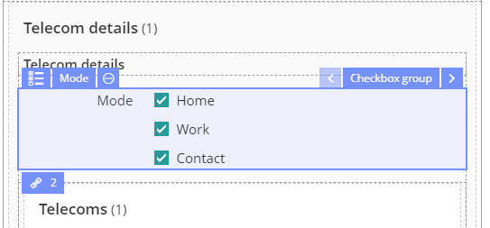
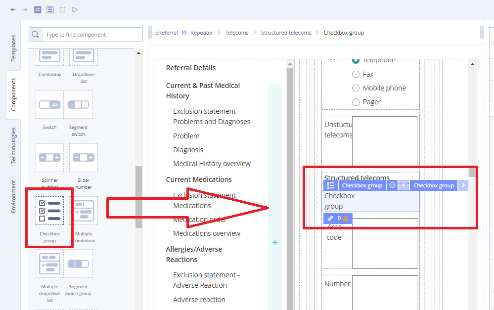
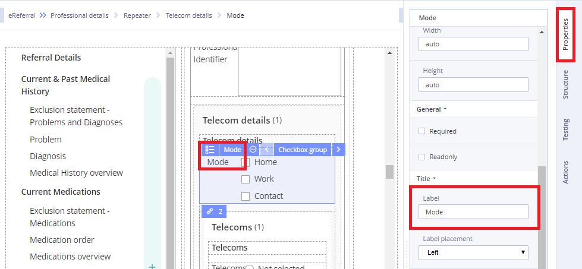
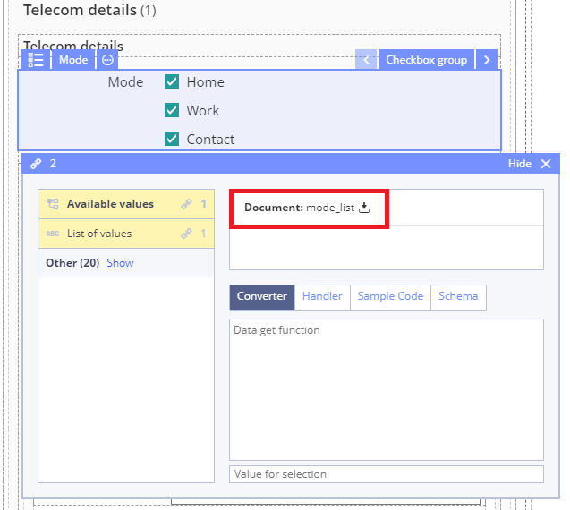

# EHR Forms : Checkbox group

A checkbox is a GUI element that permits the user to make a binary choice, i.e. a choice between one of two possible mutually exclusive options. 

For example, the user may have to answer 'yes' \(checked\) or 'no' \(not checked\) on a simple yes/no question. 

Checkbox group represents a group of components that are called [Checkbox](ehr-forms-checkbox.md), united by meaning with label.

  
Working with Checkbox group:

1\) Go to **Default Library Components** and drag the **Checkbox group** from the **Default Library Components** section

2\) In **Properties** \(on the right\) specify the title in **Label** field

3\) Specify **Available values** property by dragging it from the Template

