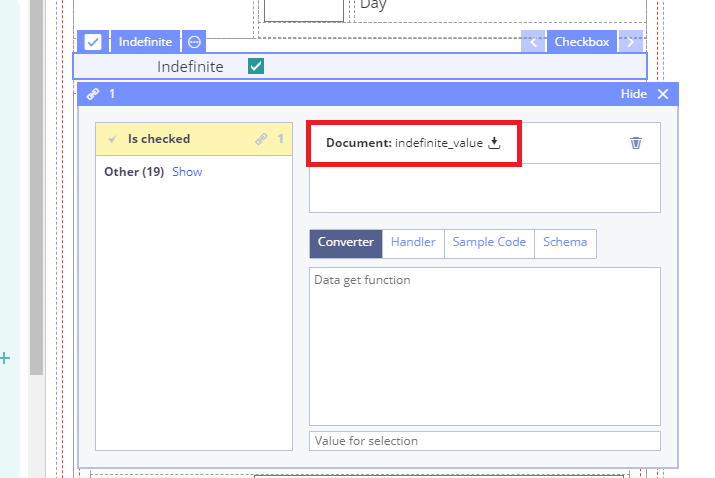

# Checkbox

## Usage 

A checkbox is a GUI element that permits the user to make a binary choice, i.e. a choice between one of two possible mutually exclusive options. For example, the user may have to answer 'yes' \(checked\) or 'no' \(not checked\) on a simple yes/no question.

## Working with Checkbox: 

1\) Go to **Default Library Components** and drag the **Checkbox** from the **Default Library Components** section

2\) In Properties \(on the right\) specify the title in **Label** field

3\) Specify **Is checked** property by dragging it from the **Template**

