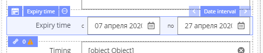
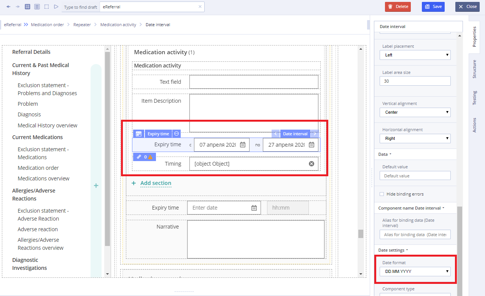
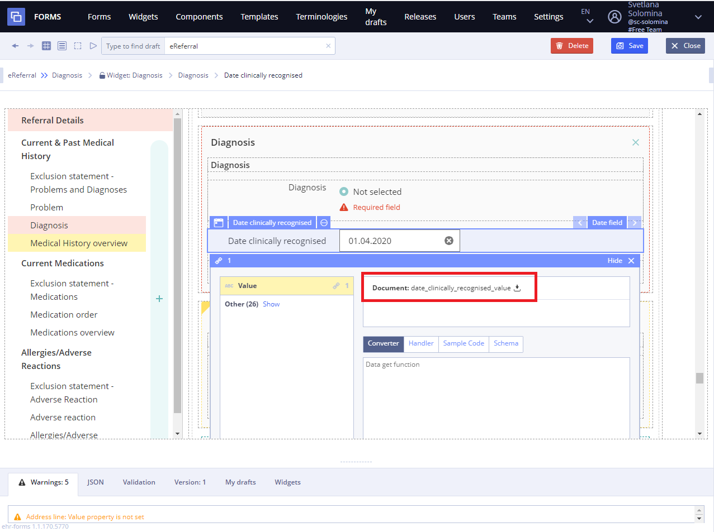

# Date interval

This page is under construction

## Usage 

Graphical user interface component which allows the user to select a date from a calendar and/or time from a time range. The typical practice is to provide a text box field which, when clicked upon to enter a date, pops up a calendar next to or below the field, allowing the user to populate the field with an appropriate date, or provides a text box with an icon of a calendar such that when the icon is clicked on, the calendar \(or time field\) appears, or show calendar directly \(inline\).

## Working with Date interval: 

1\) Set the "Date interval" component and date format DD.MM.YYYY for all input fields with a date

Exception - cases where time is clearly required

2\) Set the maximum / minimum value limits on the calendar type field \(if necessary\).

For example, it is mainly found in sections of the doctor examination protocol:

* "Medical history" -&gt; field "Considers himself ill from", the maximum value is the current date.
* "Interpretation of survey results" -&gt; field "Survey date", the maximum value is the current date.
* "Recommendations" -&gt; subsection "Recommendations for the next appointment" -&gt; field "Estimated date of appearance", the minimum value is the current date

Tip

* if DateINRange 0 - restriction on the maximum date;
* if DateINRange - 0 - restriction on the minimum date.

