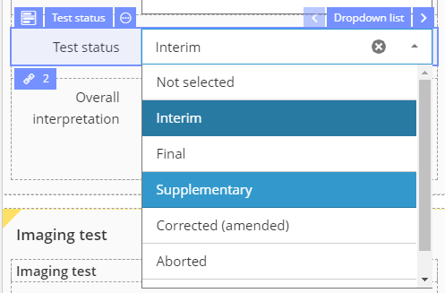
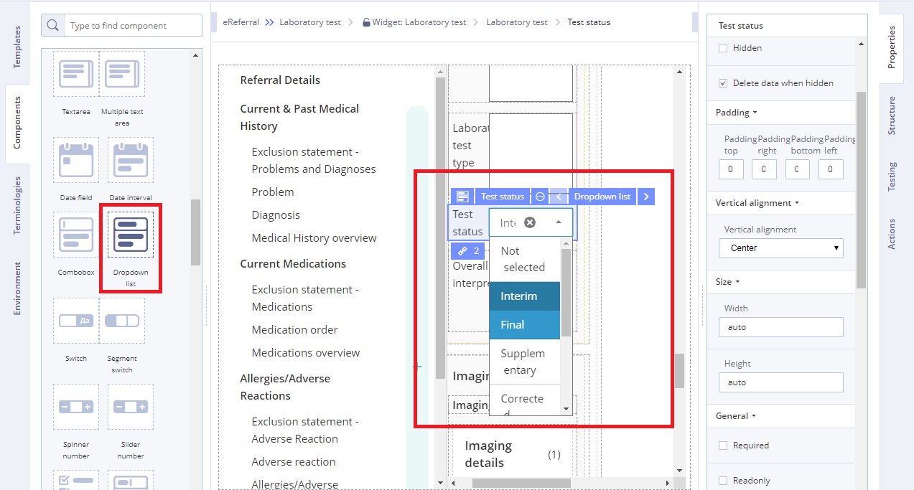
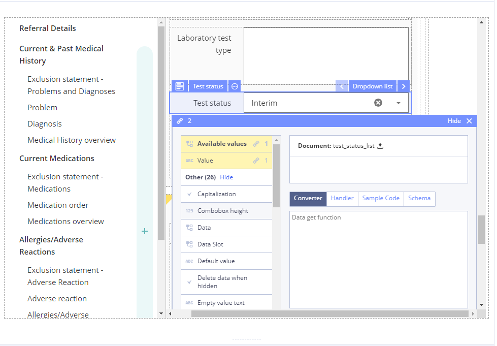

# Dropdown list

## Usage 

A drop-down list \(abbreviated drop-down; also known as a drop-down menu, drop menu, pull-down list, picklist\) is a graphical control element, similar to a list box, that allows the user to choose one value from a list. When a drop-down list is inactive, it displays a single value. When activated, it displays \(drops down\) a list of values, from which the user may select one. When the user selects a new value, the control reverts to its inactive state, displaying the selected value.

## Working with Dropdown list: 

1\) Go to **Default Library Components** and drag the **Dropdown list** from the **Default Library Components** section

2\) In properties which is set using **Chain button** specify the **Available values** using data sources of the Template

3\) Specify **Action** property in **Converter** using JS language if necessary

For more details see [Form creation\#3.2.1WorkingwithConverter](../ehr-forms-forms-in-detail/ehr-forms-form-creation.md#Formcreation-3.2.1WorkingwithConverter)

