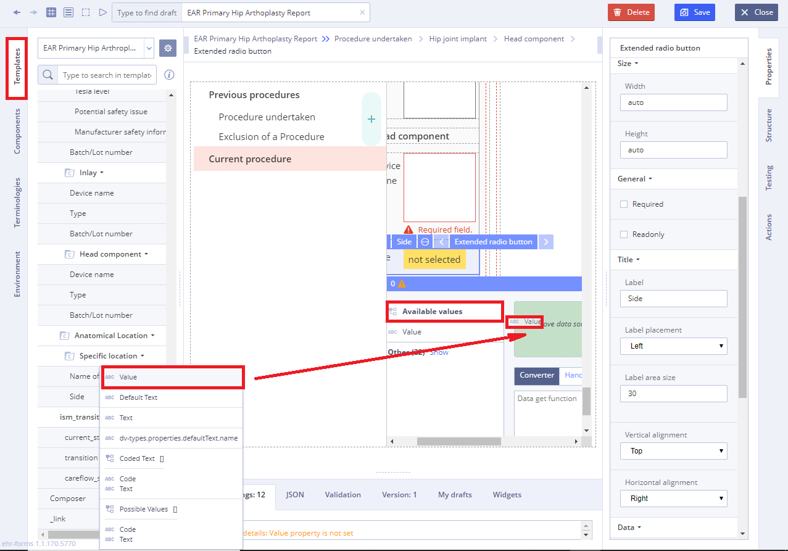

# Extended radio button

Usage

**Extended radio button** is a graphical control element that allows the user to choose only one of a predefined set of mutually exclusive options. The singular property of a radio button makes it distinct from a checkbox, which allows more than one \(or no\) item to be selected and for the unselected state to be restored.

## Working with Radio button: 

1\) Go to **Default Library Components** and drag the **Extended radio button** from the **Default Library Components \(extension\)** section

2\) In **Properties** \(on the right\) specify the title in **Label** field

3\) Specify **Available values** property by dragging it from the **Template**

