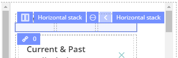
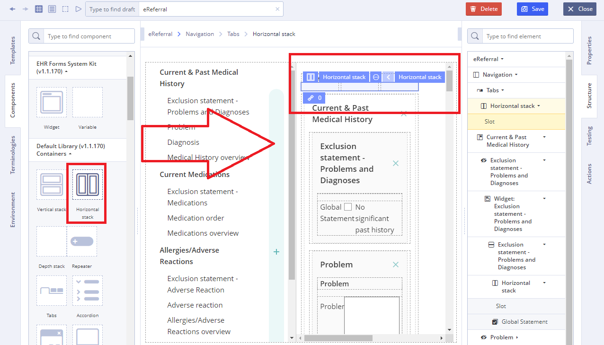
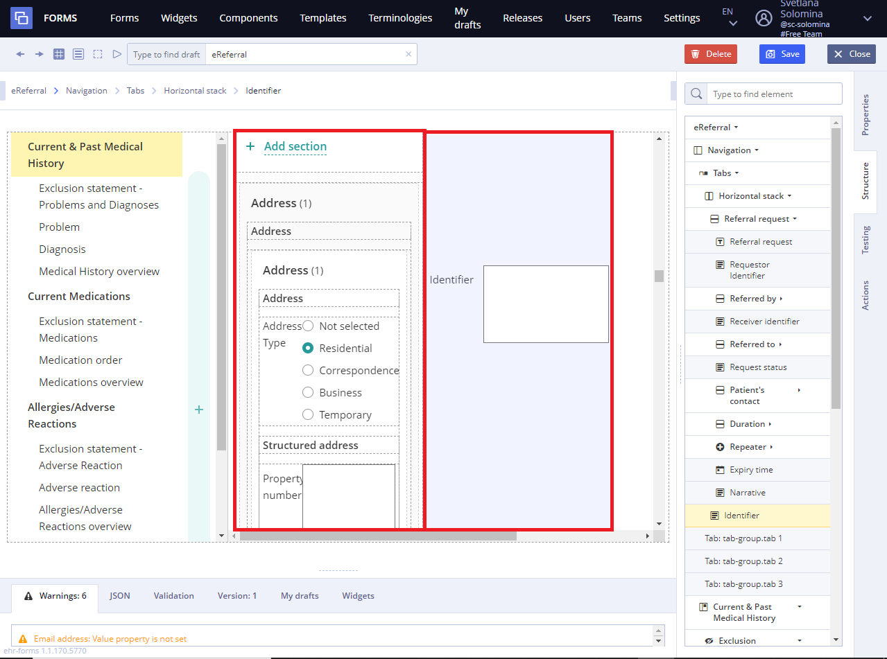

# Horizontal stack

## Usage 

A **Horizontal Stack** is a container component, that displays particular horizontal arrangement of information grouped together for presentation to users on the [Forms](https://wiki.solit-clouds.ru/pages/viewpage.action?pageId=34832642). 

## Working with Horizontal stack: 

1\) Go to **Default Library Components** and drag the **Horizontal stack** from the **Default Library Containers** section

2\) Add another component on **Horizontal stack** using **Default Library Containers** on **Components** **tab**

3\) Specify necessary properties such as **Data** \(which is set using **Chain button**\) using data sources of the Template for this new component 

4\) Specify **Action** property in **Converter** using JS language if necessary

For more details see [Form creation\#3.2.1WorkingwithConverter](https://wiki.solit-clouds.ru/display/EHR/Form+creation#Formcreation-3.2.1WorkingwithConverter)

