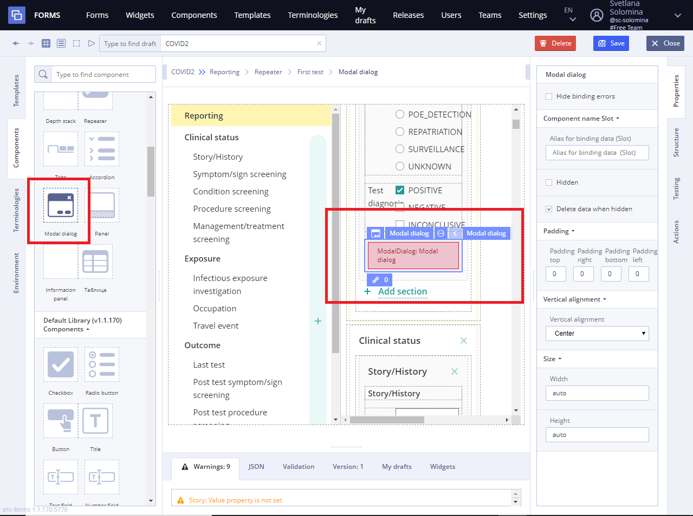

# Modal dialog

 Note

This page is under construction

## **Usage** 

Modal dialog is a graphical control element subordinate to a [Form](../ehr-forms-forms-in-detail/). It creates a mode that disables the [Form](../ehr-forms-forms-in-detail/) but keeps it visible, with the modal dialog as a child window in front of it. Users must interact with the modal dialog before they can return to the parent [Forms](../ehr-forms-forms-in-detail/). This avoids interrupting the workflow on the [Form](../ehr-forms-forms-in-detail/). 

## Working with Modal dialog 

1\) Go to **Default Library Components** and drag the **Modal dialog** from the **Default Library Containers** section

2\) Specify necessary properties such as **Data slot** \(which is set using **Chain button**\) using data sources of the **Template** for this new component 

3\) Specify **Action** property in **Converter** using JS language if necessary

For more details see [Form creation\#3.2.1WorkingwithConverter](https://wiki.solit-clouds.ru/display/EHR/Form+creation#Formcreation-3.2.1WorkingwithConverter)

