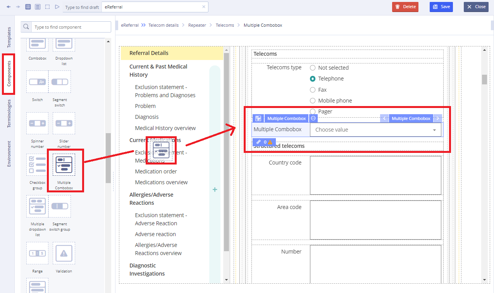
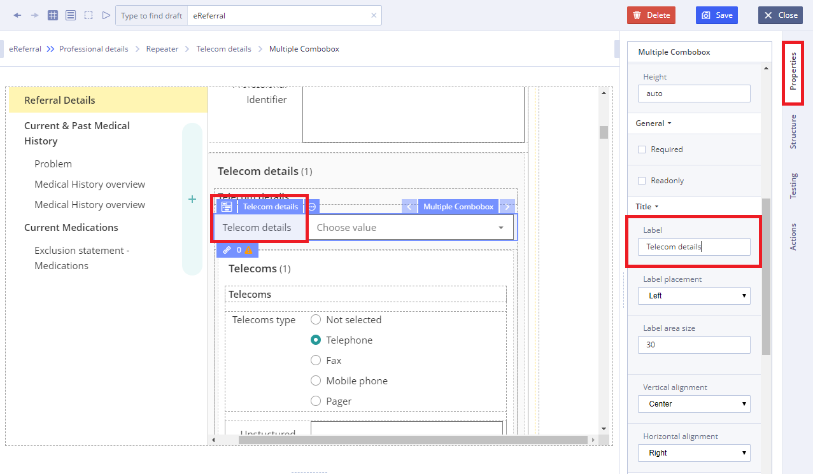
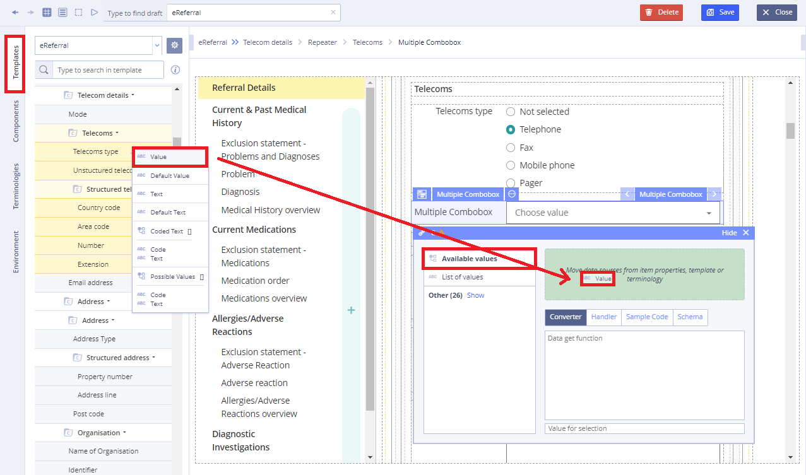

# Multiple combobox

Usage

**Multiple Combobox** is a commonly used graphical user interface control. Traditionally, it is a combination of a drop-down list  and a single-line editable textbox, allowing the user to either type a value directly or select a value from the list. 

## Working with **Multiple Combobox**: 

1\) Go to **Default Library Components** and drag the **Multiple combobox** from the **Default Library Components** section

2\) In **Properties** \(on the right\) specify the title in **Label** field

3\) In properties which is set using **Chain button** specify the **Available values** using data sources of the **Template**

4\) Specify **Action** property in **Converter** using JS language if necessary

For more details see [Form creation\#3.2.1WorkingwithConverter](../ehr-forms-forms-in-detail/ehr-forms-form-creation.md#Formcreation-3.2.1WorkingwithConverter)

