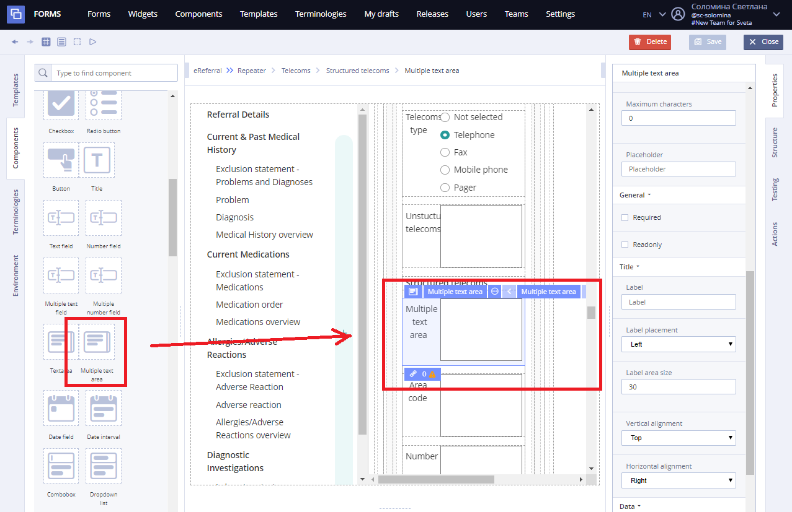

# Multiple text area

## Usage  

**Multiple text area** is a graphical control element intended to enable the user to input text information to be used by the [Forms](../ehr-forms-forms-in-detail/).

## Working with Multiple text area 

1\) Go to **Default Library Components** and drag the **Multiple text area** from the **Default Library Components** section

2\) In **Properties** \(on the right\) specify the title in **Label** field

3\) Specify **Default value** property by dragging it from the **Template**  

4\) Specify **Action** property in **Converter** using JS language

For more details see [Form creation\#3.2.1WorkingwithConverter](../ehr-forms-forms-in-detail/ehr-forms-form-creation.md#Formcreation-3.2.1WorkingwithConverter)

