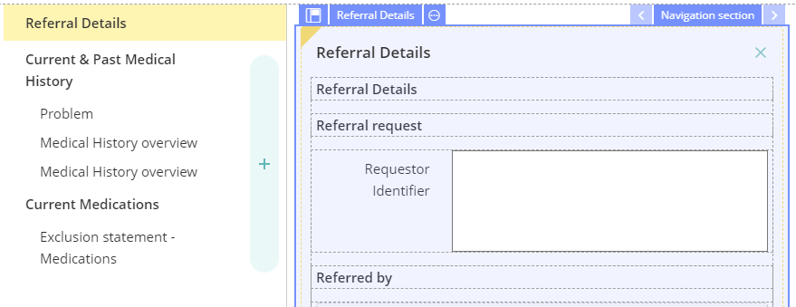
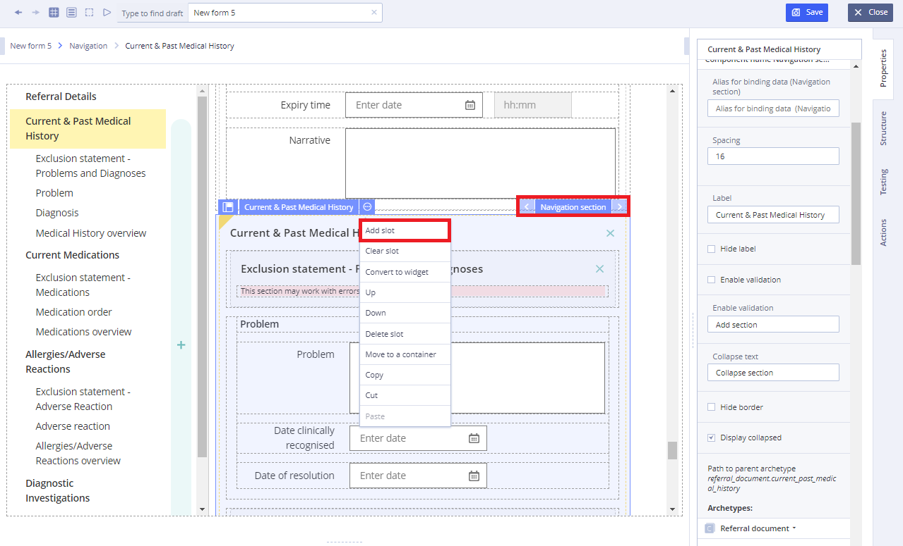
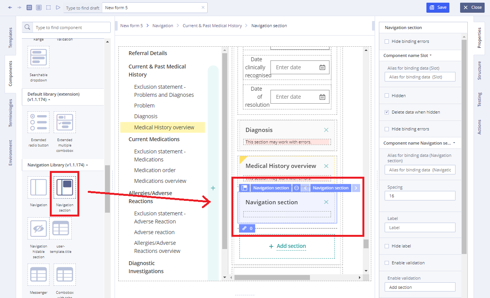
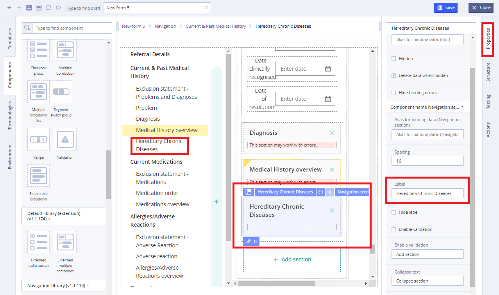
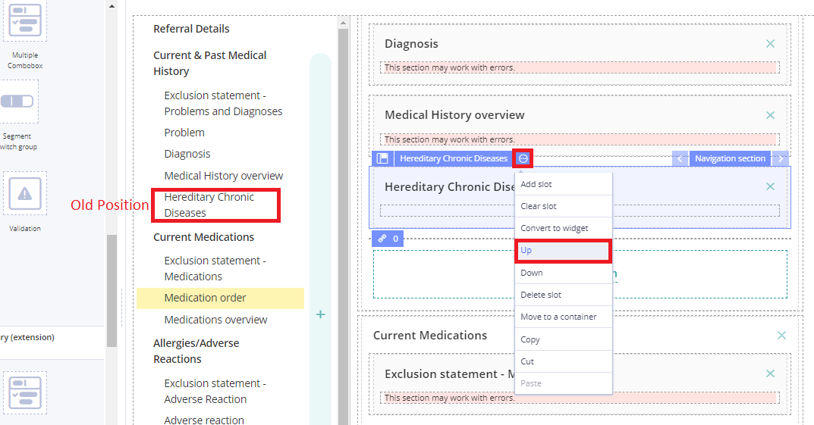
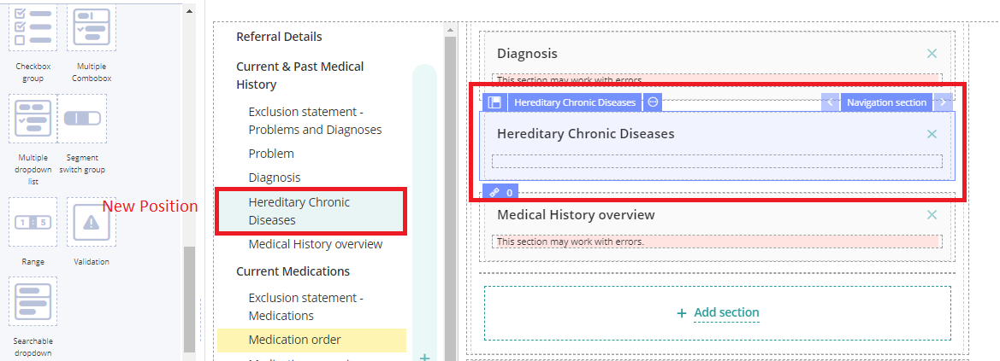
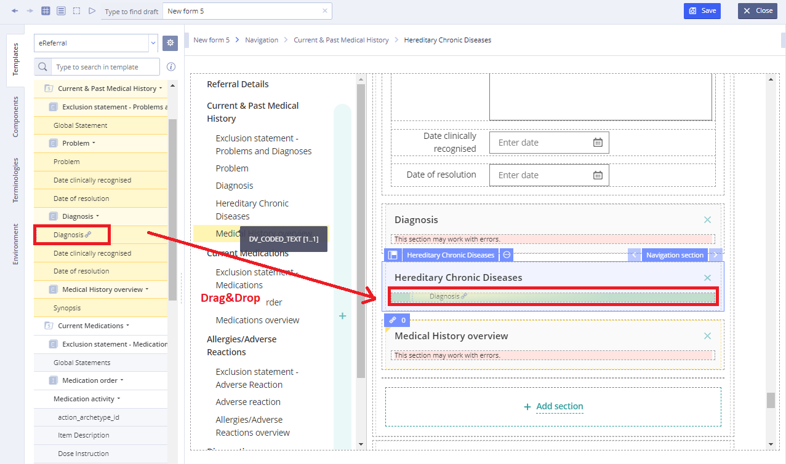
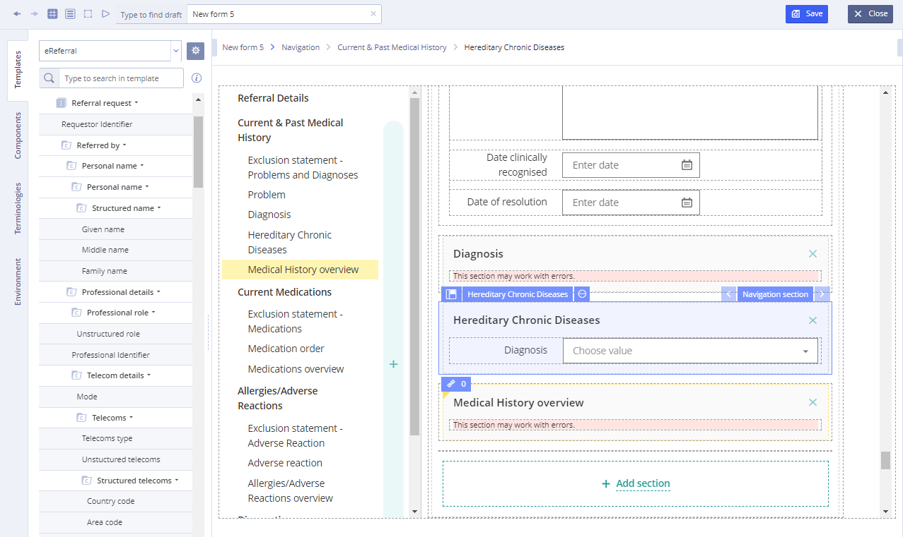

# Navigation section

## Usage 

A navigation section is a section of a graphical user interface intended to aid visitors in accessing information. 

## Working with Navigation section: 

1\) Add a new slot for the section:

2\) Assign **Navigation Section** component to the slot by dragging and dropping from the list of **Navigation Library** components onto an empty slot

3\) Rename and move to the desired protocol area, and set properties if necessary:

User can move the desired **Navigation Section** using **Up** or **Down** menu item

**Result:**

4\) Next, drag the corresponding section of the **Template** archetype to fill the component with content

\(if there is a widget, you can apply it, see [Widget editing](../ehr-forms-widgets-in-detail/ehr-forms-widget-editing.md)\)

Tip

System will show the allowed **Template** archetypes for binding highlighting them green color

**Result:**

