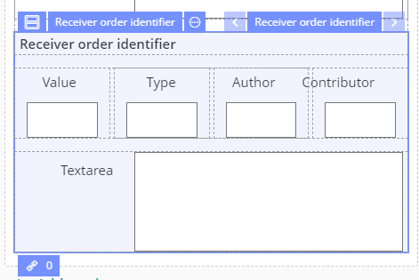
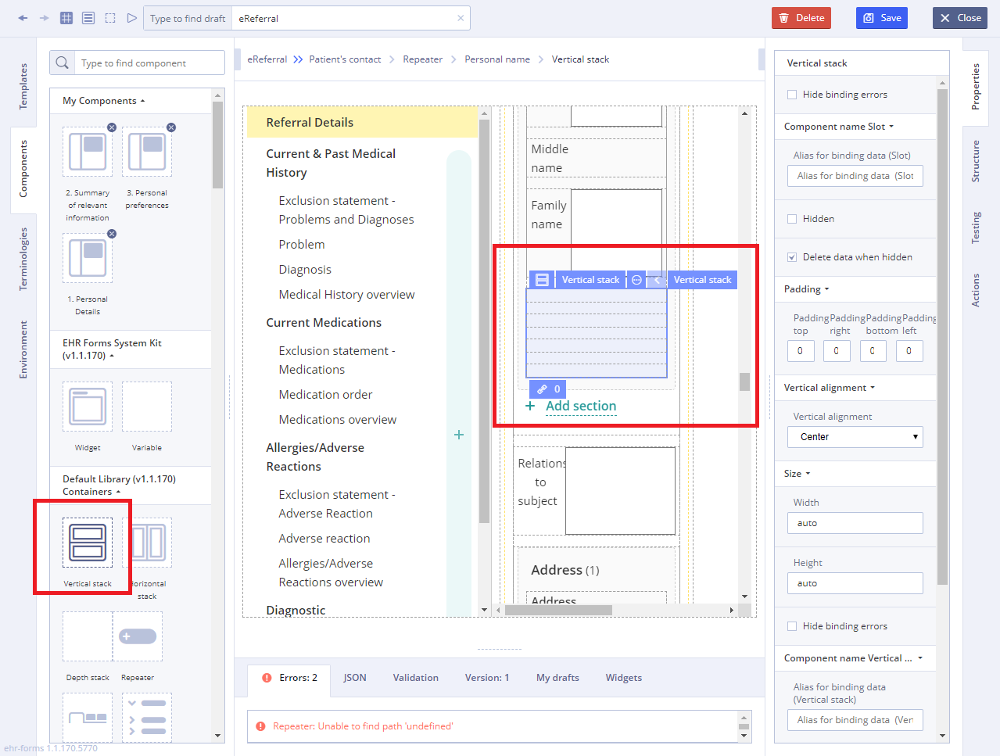
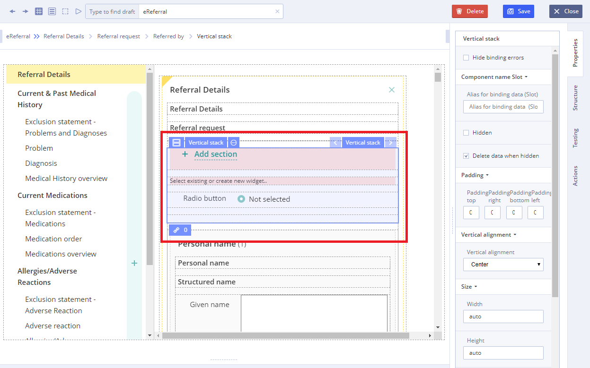

# Vertical stack

## Usage 

A **Vertical Stack** is a container component, that displays particular horizontal arrangement of information grouped together for presentation to users on the [Form](https://wiki.solit-clouds.ru/pages/viewpage.action?pageId=34832642). 

## Working with Vertical stack: 

1\) Go to **Default Library Components** and drag the **Vertical Stack** from the **Default Library Containers** section

2\) Add another component on **Vertical Stack** using **Default Library Containers** on **Components** **tab**

3\) Specify necessary properties such as **Available values** \(which is set using **Chain button**\) using data sources of the Template for this new component 

4\) Specify **Action** property in **Converter** using JS language if necessary

For more details see [Form creation\#3.2.1WorkingwithConverter](https://wiki.solit-clouds.ru/display/EHR/Form+creation#Formcreation-3.2.1WorkingwithConverter)

