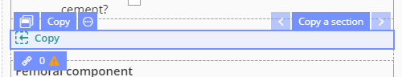
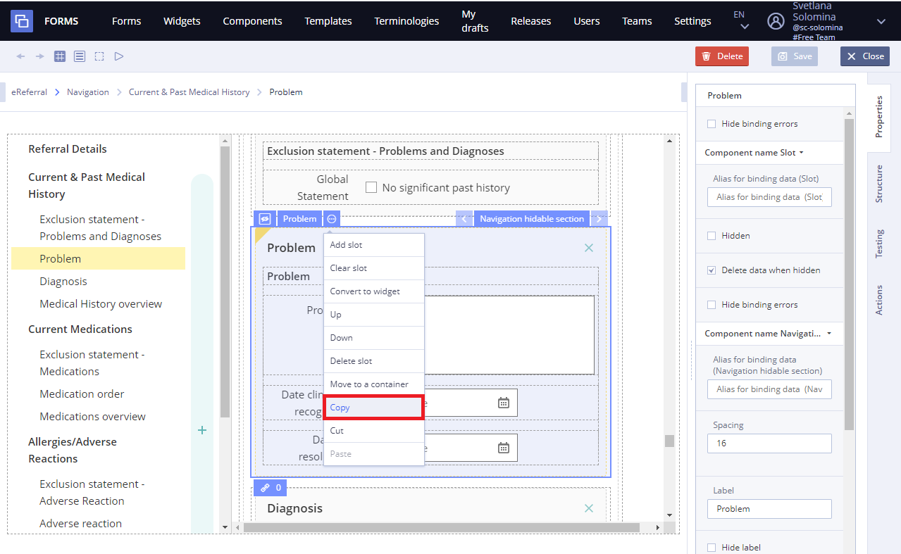
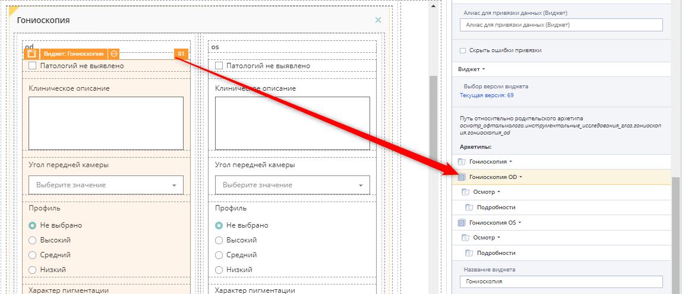
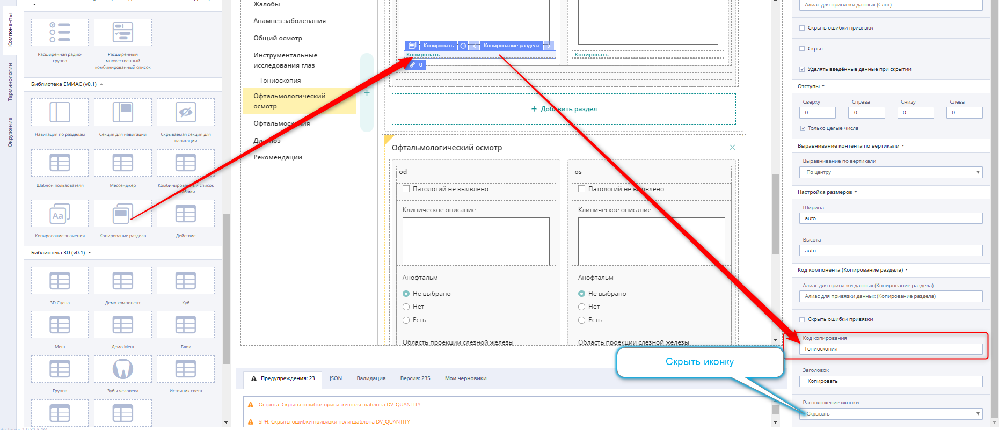
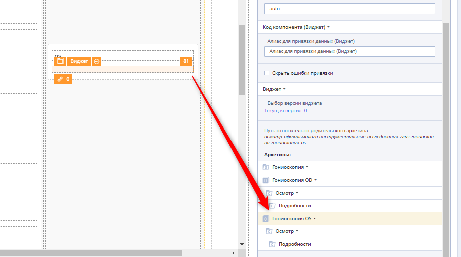

# EHR Forms : Copy a section

**Usage**

**Copy a section** allows you to copy data to a similar sections that having the same archetype. Copying sections only works if both sections are in the same widget.

## Working with Copy section 

1\) Copy the section

2\) Clear slot and add widget to it

3\) Specify the corresponding archetype for the widget \(left or right\)

4\) Add the **Copy section** component to the end of the section and specify the code for it

5\) Specify the widget as public and save the form

6\) Add the widget component for a parallel section and specify the SECOND parallel section as the archetype and select the previously created public widget.

Important

Please note that if you need to make changes to the left and right sections - there is no need to make them in both sections. It is enough to make edits to only one and publish the form. A feature of the widget in this situation is that the same widget on the form will always have the same version and the changes will be transferred to the parallel section.

