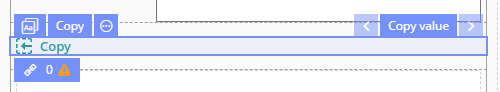

# EHR Forms : Copy value

This page is under construction

Information on this page needs to be rechecked

## Usage 

**Copy value** allows you to copy data to a similar field values that having the same archetype.

## Working with Copy **value**  

1\) Copy the value 

2\) Clear slot and add widget to it

3\) Specify the corresponding archetype for the widget \(left or right\)

4\) Add the **Copy value** component to the end of the section and specify the code for it

5\) Specify the widget as public and save the form

6\) Add the widget component for a parallel section and specify the SECOND parallel section as the archetype and select the previously created public widget.

Important

Please note that if you need to make changes to the left and right sections - there is no need to make them in both sections. It is enough to make edits to only one and publish the form. A feature of the widget in this situation is that the same widget on the form will always have the same version and the changes will be transferred to the parallel section.

