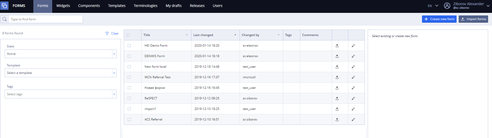
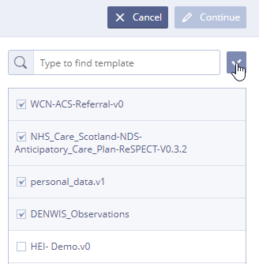
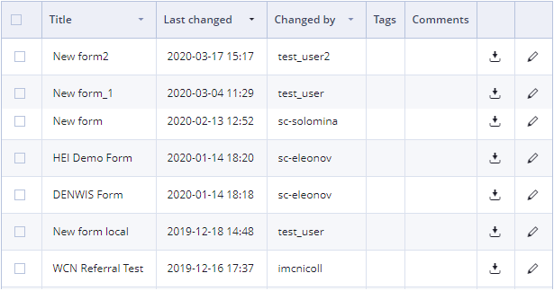
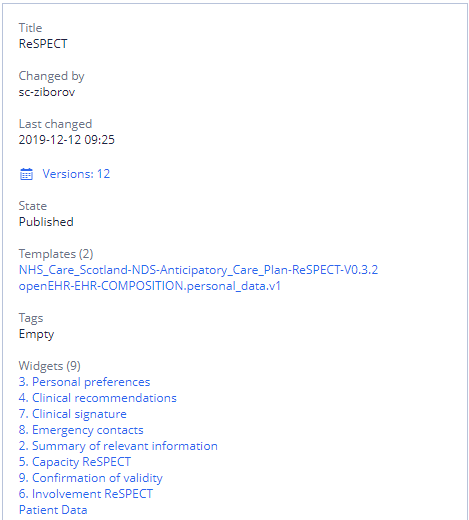
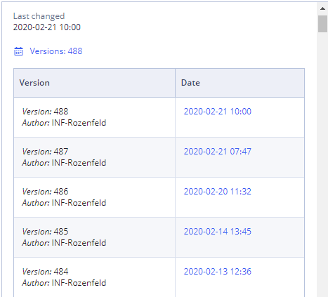

# Forms \(in detail\)

Forms are intended for the following:

* [Form List](./#Forms%28indetail%29-FormList)
* [Form Search](./#Forms%28indetail%29-FormSearch)
* [Form Import and Export](./#Forms%28indetail%29-FormImportandExport)
  * [Import](./#Forms%28indetail%29-Import)
  * [Export](./#Forms%28indetail%29-Export)
* [Form Creation](./#Forms%28indetail%29-FormCreation)
* [Form Editing](./#Forms%28indetail%29-FormEditing)
* [Form Description](./#Forms%28indetail%29-FormDescription)
* 

**Forms tab view**

## Form List 

At the start there the is a list of forms available for your team with forms properties.

* Available actions - export and editing \(last version\). Editing opens form in form builder;

## Form Search 

User may search forms by several properties and their combinations

* By form name - search starts after one symbol;
* By form state - form may be active or inactive, so it is possible to view forms in any state or all at once;
* By template - to get all forms based on specific template;
* By tags - by selecting one or several tags;

All searches work by "and" operator.

"Clear" button clears all currently applied filters.

## Form Import and Export 

### Import 

User can import new forms by clicking  option.

### Export 

 User can export forms by two different ways

*  Export a pack of forms by selecting desirable forms and clicking "Export Forms"
* By clicking on export icon on one form

For more details see  [Form export and import](ehr-forms-form-export-and-import.md)

## Form Creation 

To create a new form user needs to click 

* In the **Form Name**, type the name for  new form.
* Click **Select Template\(s\)**.
* From the list, select one or more openEHR templates and click the **Check button.**

TipUser can use the search box as a filter to limit the templates by name

* Click **Continue**.

For more details see [Form creation](ehr-forms-form-creation.md)

## Form Editing 

To start editing form User should select desirable form in the list and click 

Other way to edit the form is using button, the latest version of the form will be displayed on the screen ready for editing.

For more details see [Form editing](ehr-forms-form-editing/)

## Form Description 

##  

To see form description User need to select form in the list. Description will be shown in the right panel.

It contains:

* **Title** - form name
* **Changed by** - last user who changed the form
* **Versions** - table of versions, containing  Author, number of version and creation date-time. By clicking on date User can open the selected version

* **Templates** - list of templates currently used in form. By clicking on template User goes to the selected template on the Templates tab
* **Tags** - list of form tags
* **Widgets** - list of widgets, currently used in form. Clickable widget link means widget is published \(available for reuse\), when User clicks on it, widget opens in editor
* **Specification button** - creates an html specification of form and opens it in new browser tab 

