# Form editing

This page is under construction

This section of the user guide contains the following:

/\*&lt;!\[CDATA\[\*/  
div.rbtoc1607432782670 {padding: 0px;}  
div.rbtoc1607432782670 ul {list-style: disc;margin-left: 0px;}  
div.rbtoc1607432782670 li {margin-left: 0px;padding-left: 0px;}  
  
/\*\]\]&gt;\*/

* [1. Working with Templates](./#Formediting-1.WorkingwithTemplates)
  * [1.1 Template management](./#Formediting-1.1Templatemanagement)
  * [1.2 Generating the Form from the Selected openEHR Template\(s\)](./#Formediting-1.2GeneratingtheFormfromtheSelectedopenEHRTemplate%28s%29)
* [2. Working with Components](./#Formediting-2.WorkingwithComponents)
  * [2.1 Components ](./#Formediting-2.1Components)
  * [2.2 Adding Visual Components to The Form](./#Formediting-2.2AddingVisualComponentstoTheForm)
  * [2.3 Configuring component settings](./#Formediting-2.3Configuringcomponentsettings)
* [3. Bindings, properties and advanced logic](./#Formediting-3.Bindings,propertiesandadvancedlogic)
  * [3.1 Working on Form Layout](./#Formediting-3.1WorkingonFormLayout)
  * [3.2 Binding External Terminologies to Components](./#Formediting-3.2BindingExternalTerminologiestoComponents)
  * [3.3 Defining Advanced Logic on The Form](./#Formediting-3.3DefiningAdvancedLogiconTheForm)
  * [3.4 Creating Reusable Widgets](./#Formediting-3.4CreatingReusableWidgets)
* [4. Form validation](./#Formediting-4.Formvalidation)
  * [4.1 Section Testing](./#Formediting-4.1SectionTesting)

In the **Form Editor** User can:

* Configure or view “building blocks” and data structures for the form \(openEHR templates and visual components\)
* Automatically generate form from the selected openEHR template\(s\)
* Add or edit visual components
* Configure component settings
* Bind components in the archetype-driven data structure
* Bind external terminologies to components
* Define advanced logic of the form
* Create reusable widgets
* Configure form properties
* Managing the form’s structure
* Test your forms
* Validate your forms
* Export and import forms as JSON files
* Save the form
* Delete the form

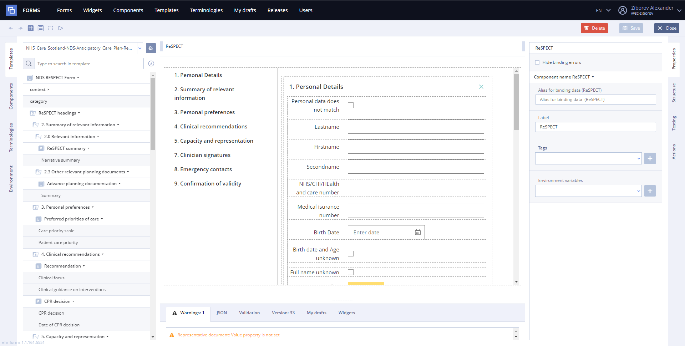

                                                                               **General view**

Form has four main panels in edit mode:

* [Source panel](ehr-forms-source-panel.md) - templates, component libraries, terminologies and environment variables
* [Editor panel](ehr-forms-editor-panel.md) - data representation area where editor itself take place
* [Settings panel](ehr-forms-settings-panel.md) - properties of the selected component, form structure in tree representation, testing and actions.
* [Developer tools panel](ehr-forms-developer-tools-panel.md)- panel with tabs of messages \(like warnings and alerts\), json code and etc.

Quick guide to Form creation contains the following steps:

1. **Form creation** \(for more details see [Form creation](../ehr-forms-form-creation.md)\) 
2. **Filling out the form** using [Editor panel](ehr-forms-editor-panel.md) and templates, component libraries, terminologies and environment variables on [Source panel](ehr-forms-source-panel.md)
3. **Configuring Bindings and Properties** using Properties on [Settings panel](ehr-forms-settings-panel.md) 
4. **Form validation** using [Developer tools panel](ehr-forms-developer-tools-panel.md)
5. **Saving the Form** \(for more details see [Form creation](../ehr-forms-form-creation.md)\)

At points 2,3 and 4 we will dwell in more detail here.

## 1. Working with Templates 

### 1.1 Template management 

It is possible to manage form templates while working with form.

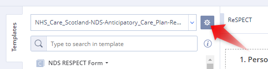

To start working with form templates you need to choose “Add or remove template” button on the template section. You will see templates currently available for use. It is possible to check templates you need to add and uncheck those you don’t need to be used anymore.**Warning**. If you delete template whose fields are currently used on the form this will lead to errors, so all these components should be unbound or deleted from the form

### 1.2 Generating the Form from the Selected openEHR Template\(s\) 

To create the whole form from the template User needs to drag the whole composition on the form, so it’s structure will be generated automatically.

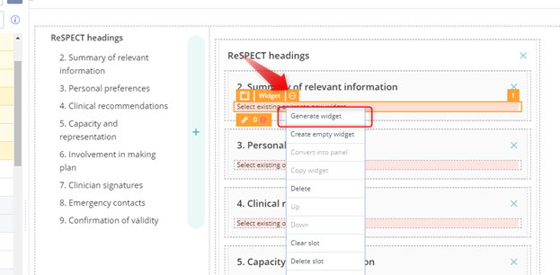

Info

Each section \(SECTION type\) currently is generated as navigation section or hidable navigation sector, that contains widget components. 

## 2. Working with Components 

### 2.1 Components  

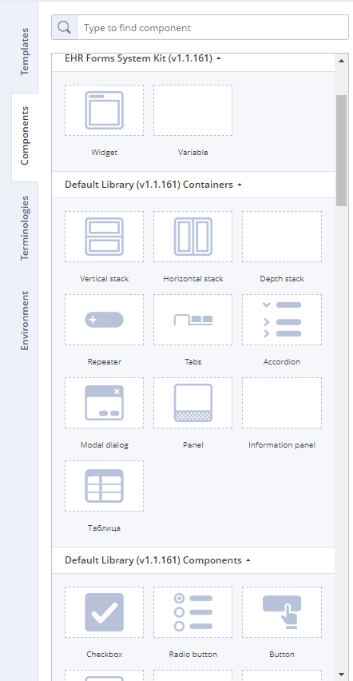

Tab contains usable components from different libraries. Each component has different properties some of which are common and some are unique for this component.

Info

User can add private components to the component list from the form. This feature saves all bindings and properties of the component and it content \(components it contains\)

### 2.2 Adding Visual Components to The Form 

To add a new component on the form you need to drag it into separate slot \(it may be not empty, so everything in it will be overwritten with new component data\).

After that component is ready for tuning and binding.

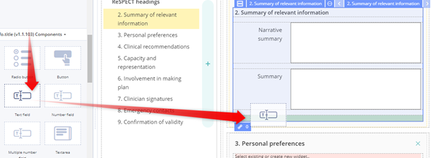

To bind component to template field you need to drag field's **Value** into the component **Value** property.

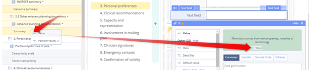

Template fields may have internal terminologies which can be also bound to the component “Available values” property by dragging there “possible values” from the field

### 2.3 Configuring component settings 

There are two ways to configure component properties:

* Using **Properties panel** User can set visual and value influenced parameters such as padding, field size, placeholders or min and max values, hidden, required, read only and so on.  Properties vary for different types of components.

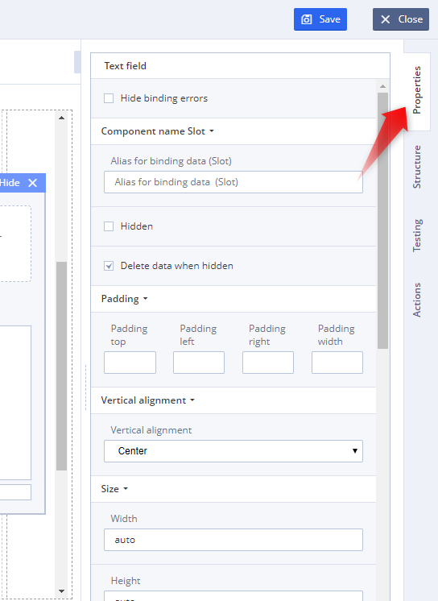

* Other way is working with component properties in **Properties window** which can be opened by left click on chain icon of the component.

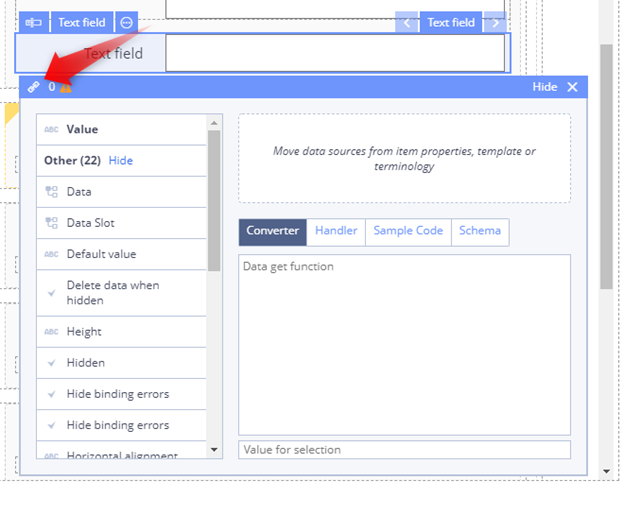

Here you can set properties and their dependencies.

Adding more specific components is being considered in [Component libraries \(in detail\)](../../ehr-forms-component-libraries-in-detail/)

## 3. Bindings, properties and advanced logic 

### 3.1 Working on Form Layout 

User can change component orientation using **Properties** **panel**. 

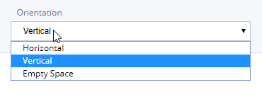

Also User can set alignment, width and height of the selected component manually. 

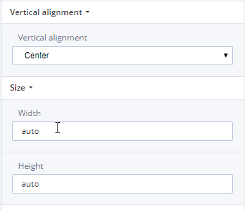

### 3.2 Binding External Terminologies to Components 

_Search and bind as available values_

External terminologies are bound the same way as internal with use of “Terminologies”. You need to select the desirable terminology from the list \(with search by name if necessary\) and drag it to the component “Available values” property.

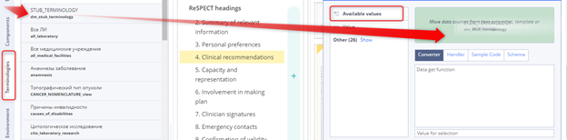

### 3.3 Defining Advanced Logic on The Form 

_Simple scripts, “other” field, dv\_ordinal_

Advanced logic of the form is based on various ways to set dependencies between different components, their values and properties

### 3.4 Creating Reusable Widgets 

For working with widget – generating widget, converting into widget, binding widget to archetype, rules of binding in navigation, rules of class search - see [Widgets](../../ehr-forms-widgets-in-detail/)

## 4. Form validation 

### 4.1 Section Testing 

1\) After adding a section, go to the Testing Tab of the [Settings panel](ehr-forms-settings-panel.md) and click on the 

TipIf nothing happened, then there is a mistake somewhere needed to be fixed

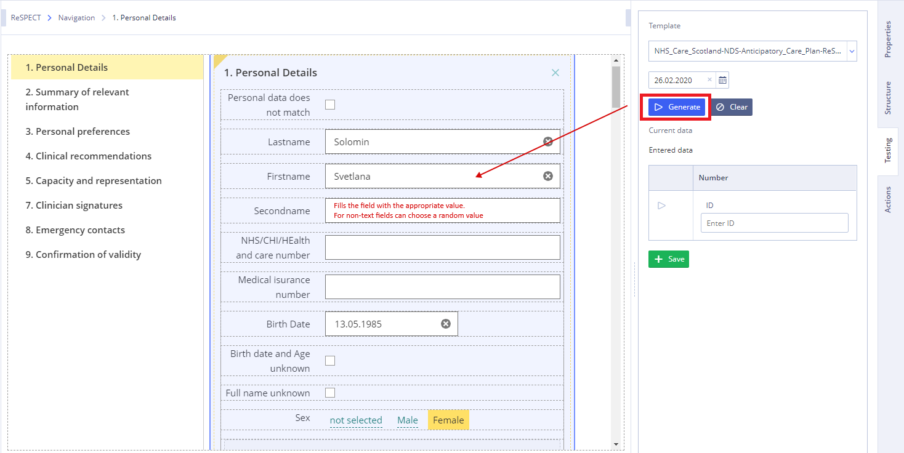

2\) Check the code in **JSON Tab** of [Developer tools panel](ehr-forms-developer-tools-panel.md)

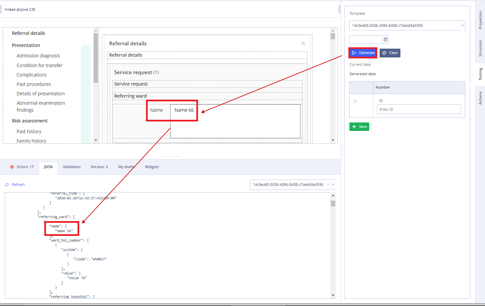

