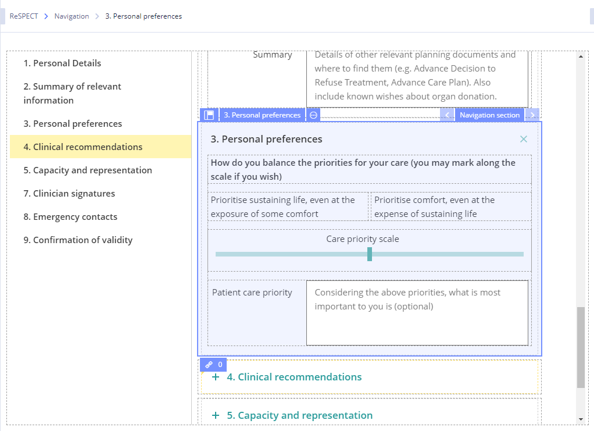
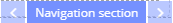
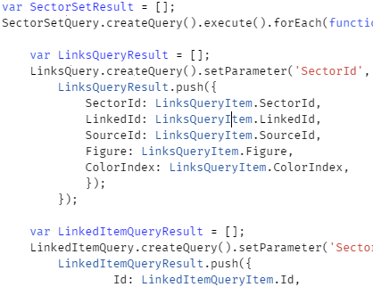
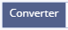
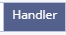

# Editor panel

/\*&lt;!\[CDATA\[\*/  
div.rbtoc1607432784537 {padding: 0px;}  
div.rbtoc1607432784537 ul {list-style: disc;margin-left: 0px;}  
div.rbtoc1607432784537 li {margin-left: 0px;padding-left: 0px;}  
  
/\*\]\]&gt;\*/

* [Editor panel](ehr-forms-editor-panel.md#Editorpanel-Editorpanel)
* [Editor panel description](ehr-forms-editor-panel.md#Editorpanel-Editorpaneldescription)
  * [Slot container](ehr-forms-editor-panel.md#Editorpanel-Slotcontainer)
  * [Slot](ehr-forms-editor-panel.md#Editorpanel-Slot)
    * [Property Binding Window](ehr-forms-editor-panel.md#Editorpanel-PropertyBindingWindow)
  * [Widget](ehr-forms-editor-panel.md#Editorpanel-Widget)

## Editor panel 

## Editor panel description 

<table>
  <thead>
    <tr>
      <th style="text-align:left">&#x41F;&#x43E;&#x43B;&#x435;</th>
      <th style="text-align:left">&#x41E;&#x43F;&#x438;&#x441;&#x430;&#x43D;&#x438;&#x435;</th>
      <th style="text-align:left">&#x41F;&#x440;&#x438;&#x43C;&#x435;&#x440;</th>
    </tr>
  </thead>
  <tbody>
    <tr>
      <td style="text-align:left">Navigation</td>
      <td style="text-align:left">The path to the selected component. When you select an element in the
        Editor, the path to it displayed in the navigation.</td>
      <td style="text-align:left">
        
      </td>
    </tr>
    <tr>
      <td style="text-align:left">Editing area</td>
      <td style="text-align:left">
        
The area in which components and form slots are displayed.

        
In most cases, it consists of a navigation panel and sections with its
          own slots. With a large number of components in the navigation panel, the
          section that is displayed in the area is highlighted in yellow.

        
Workspace where User assemble the form, work with components, their bindings
          and interaction.

      </td>
      <td style="text-align:left">
        
      </td>
    </tr>
    <tr>
      <td style="text-align:left"></td>
      <td style="text-align:left"></td>
      <td style="text-align:left">
        
      </td>
    </tr>
    <tr>
      <td style="text-align:left">Icon</td>
      <td style="text-align:left">
        
Panel drag and drop icon. On hover, the cursor changes its style to Drag&apos;n&apos;Drop.

        
The container icon differs depending on the type of component (input field,
          radio button, checkbox).

      </td>
      <td style="text-align:left">
        
      </td>
    </tr>
    <tr>
      <td style="text-align:left">Name</td>
      <td style="text-align:left">The name of the container.</td>
      <td style="text-align:left">
        
      </td>
    </tr>
    <tr>
      <td style="text-align:left">Component management</td>
      <td style="text-align:left">
        
Container management icon. When you hover, a drop-down menu is displayed
          with the following items:

        <ul>
          <li><b>Add slot</b> - adds a slot to the selected container</li>
          <li><b>Delete</b> - deletes the container and all slots in it</li>
          <li><b>Convert to widget</b> - converts a container to a widget</li>
          <li><b>Up </b>- moves a container above another container</li>
          <li><b>Down </b>- moves a container below another container</li>
          <li><b>Clear slot</b> - cleans the slot inside which the container is located</li>
          <li><b>Delete slot</b> - deletes the slot in which the widget is located (together
            with the widget)</li>
          <li><b>Move to a container</b> - adds a container inside which moves the selected
            container</li>
          <li><b>Copy</b> - copies the container data to the clipboard</li>
          <li><b>Cut</b> - deletes the container and copies the container data to the
            clipboard</li>
          <li><b>Paste</b> - paste data from the clipboard into the selected container.
            Inactive if there is no container data in the clipboard or when the container
            is not empty.</li>
        </ul>
      </td>
      <td style="text-align:left">
        

          
        

        

          
        

      </td>
    </tr>
    <tr>
      <td style="text-align:left">Component Type</td>
      <td style="text-align:left">
        
Component type of the selected panel.

        
When clicking on the arrows, it changes the type of the selected component
          within the &quot;logical group&quot;. When you hover, a drop-down menu
          is displayed with the types of the component.

      </td>
      <td style="text-align:left">
        
      </td>
    </tr>
    <tr>
      <td style="text-align:left">Closing</td>
      <td style="text-align:left">Collapses the selected container.</td>
      <td style="text-align:left">
        

          
        

        
Collapsed container

        

          
        

      </td>
    </tr>
    <tr>
      <td style="text-align:left"></td>
      <td style="text-align:left">
        
Slot is the building element of which the form consists. There are several
          rules for the slot:

        <ul>
          <li>There can be only one component in the slot;</li>
          <li>Slot can&apos;t be set in the other slot.</li>
        </ul>
        
For more details see <a href="https://wiki.solit-clouds.ru/display/EHR/Form+specification">Form specification</a>
        

      </td>
      <td style="text-align:left">
        
      </td>
    </tr>
    <tr>
      <td style="text-align:left">Icon</td>
      <td style="text-align:left">
        
Icon for dragging a component to another section. On hover, the cursor
          changes its appearance to Drag&apos;n&apos;Drop.

        
The slot icon differs depending on the type of component (input field,
          radio button, checkbox, etc.)

      </td>
      <td style="text-align:left">
        
      </td>
    </tr>
    <tr>
      <td style="text-align:left">Slot name</td>
      <td style="text-align:left">Slot name</td>
      <td style="text-align:left">
        
      </td>
    </tr>
    <tr>
      <td style="text-align:left">Slot management</td>
      <td style="text-align:left">
        
Slot management icon. When you hover, a drop-down menu is displayed with
          the following items:

        <ul>
          <li><b>Clear slot</b> - clears the slot of the component assigned to it</li>
          <li><b>Up</b> - moves the slot above the others within the same container</li>
          <li><b>Down </b>- moves the slot below others within the same container</li>
          <li><b>Delete slot</b> - deletes a slot</li>
          <li><b>Move to a container</b> - adds a container into which moves the selected
            slot</li>
          <li><b>Copy </b>- copies slot data to the clipboard</li>
          <li><b>Cut </b>- deletes data from the slot and copies the slot data to the
            clipboard</li>
          <li><b>Paste </b>- paste data from the clipboard into the selected slot. Inactive
            if there is no container data in the clipboard or when the container is
            not empty.</li>
        </ul>
      </td>
      <td style="text-align:left">
        

          
        

        

          
        

      </td>
    </tr>
    <tr>
      <td style="text-align:left">Component Type</td>
      <td style="text-align:left">
        
The component type of the selected slot.

        
When clicking on the arrows, it changes the type of the selected component
          within the &quot;logical group&quot;. When you hover, a drop-down menu
          with component types is displayed.

      </td>
      <td style="text-align:left">
        
      </td>
    </tr>
    <tr>
      <td style="text-align:left">Property Binding</td>
      <td style="text-align:left">Button with the number of binds of the selected slot with the fields of
        the template. Clicking on the icon opens a window with the properties of
        the slot.</td>
      <td style="text-align:left">
        
There are 2 binds

        

          
        

        
No binds

        

          
        

      </td>
    </tr>
    <tr>
      <td style="text-align:left"></td>
      <td style="text-align:left"></td>
      <td style="text-align:left">
        
      </td>
    </tr>
    <tr>
      <td style="text-align:left">
        <ul>
          <li>Hide</li>
        </ul>
      </td>
      <td style="text-align:left">Closes the property binding window</td>
      <td style="text-align:left">
        
      </td>
    </tr>
    <tr>
      <td style="text-align:left">
        <ul>
          <li>Property list</li>
        </ul>
      </td>
      <td style="text-align:left">
        
A panel containing a list of properties of the selected component available
          for binding.

        
The list of properties is determined by the selected components.

      </td>
      <td style="text-align:left">
        
      </td>
    </tr>
    <tr>
      <td style="text-align:left">
        <ul>
          <li>
            <ul>
              <li>Property Type</li>
            </ul>
          </li>
        </ul>
      </td>
      <td style="text-align:left">The icon is determined by the type of property.</td>
      <td style="text-align:left">
        
      </td>
    </tr>
    <tr>
      <td style="text-align:left">
        <ul>
          <li>
            <ul>
              <li>Property Name</li>
            </ul>
          </li>
        </ul>
      </td>
      <td style="text-align:left">When you click on the field of the &quot;Property Name&quot; area, the
        area containing the property is visually selected.</td>
      <td style="text-align:left">
        
      </td>
    </tr>
    <tr>
      <td style="text-align:left">
        <ul>
          <li>
            <ul>
              <li>Binding Conditions</li>
            </ul>
          </li>
        </ul>
      </td>
      <td style="text-align:left">
        
The icon is displayed if the selected property has at least one binding.

        
The quantity is displayed if the selected property has at least one binding.

      </td>
      <td style="text-align:left">
        
      </td>
    </tr>
    <tr>
      <td style="text-align:left">
        <ul>
          <li>
            <ul>
              <li>Other properties</li>
            </ul>
          </li>
        </ul>
      </td>
      <td style="text-align:left">List of other properties. By default collapsed. It is possible to select
        only one property from the list.</td>
      <td style="text-align:left">
        
List collapsed

        

          
        

        
List expanded

        

          
        

      </td>
    </tr>
    <tr>
      <td style="text-align:left">
        <ul>
          <li>Data Source Area</li>
        </ul>
      </td>
      <td style="text-align:left">
        
Source area.

        
If the source is not selected the message is displayed &quot;Move data
          sources from item properties, template or terminology&quot;.

      </td>
      <td style="text-align:left">
        

          
        

        

          
        

      </td>
    </tr>
    <tr>
      <td style="text-align:left">
        <ul>
          <li>
            <ul>
              <li>data source</li>
            </ul>
          </li>
        </ul>
      </td>
      <td style="text-align:left">
        
The data source to which the binding was made.

        
When you hover over a data source, the delete source icon is displayed.

      </td>
      <td style="text-align:left">
        
      </td>
    </tr>
    <tr>
      <td style="text-align:left">
        <ul>
          <li>
            <ul>
              <li>source removal</li>
            </ul>
          </li>
        </ul>
      </td>
      <td style="text-align:left">When you click on the button, the bound property is deleted.</td>
      <td style="text-align:left">
        
      </td>
    </tr>
    <tr>
      <td style="text-align:left">
        <ul>
          <li>Code Entry Area</li>
        </ul>
      </td>
      <td style="text-align:left">The code area of the selected property.</td>
      <td style="text-align:left">
        
      </td>
    </tr>
    <tr>
      <td style="text-align:left">
        <ul>
          <li>Converter</li>
        </ul>
      </td>
      <td style="text-align:left">
        
Switches the code entry area to the state of the converter.

        
Software data acquisition function code:

        

          
        

      </td>
      <td style="text-align:left">
        
      </td>
    </tr>
    <tr>
      <td style="text-align:left">
        <ul>
          <li>Handler</li>
        </ul>
      </td>
      <td style="text-align:left">
        
Switches the code entry area to the handler state.

        
The software installation data function code:

        

          
        

      </td>
      <td style="text-align:left">
        
      </td>
    </tr>
    <tr>
      <td style="text-align:left"></td>
      <td style="text-align:left"></td>
      <td style="text-align:left">
        
      </td>
    </tr>
    <tr>
      <td style="text-align:left">Name</td>
      <td style="text-align:left">
        
Widget name.

        
By default, the name corresponding to the selected (dragged) archetype
          is displayed.

      </td>
      <td style="text-align:left">
        
      </td>
    </tr>
    <tr>
      <td style="text-align:left">Icon</td>
      <td style="text-align:left">
        
Icon to drag the widget to another section. On hover, the cursor changes
          its appearance to Drag&apos;n&apos;Drop.

        
The widget icon differs depending on the type of component.

      </td>
      <td style="text-align:left">
        
      </td>
    </tr>
    <tr>
      <td style="text-align:left">Widget management</td>
      <td style="text-align:left">
        
Widget management icon. When you hover, a drop-down menu is displayed
          with the following items:

        <ul>
          <li><b>Generate widget</b> - generates a widget</li>
          <li><b>Create empty widget </b>- creates an empty widget</li>
          <li><b>Convert into panel</b> - converts a widget into a container</li>
          <li><b>Copy widget</b> - creates a copy of the widget</li>
          <li><b>Delete </b>- deletes the widget</li>
          <li><b>Up </b>- moves the widget above other containers</li>
          <li><b>Down </b>- moves the widget below other containers</li>
          <li><b>Clear slot</b> - removes the slot from the widget assigned to it</li>
          <li><b>Delete slot</b> - deletes the slot in which the widget is located along
            with the widget</li>
          <li><b>Move to a container</b> - adds a container into which the selected widget
            moves</li>
          <li><b>Copy</b> - copies slot data to the clipboard</li>
          <li><b>Cut</b> - removes data from the slot and copies the slot data to the
            clipboard</li>
          <li><b>Paste</b> - inactive for widgets.</li>
          <li><b>Lock / Unlock</b> - changes its state. Blocks components editing in
            the widget.</li>
        </ul>
      </td>
      <td style="text-align:left">
        

          
        

        

          
        

      </td>
    </tr>
  </tbody>
</table>

