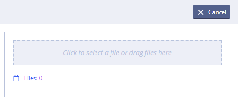
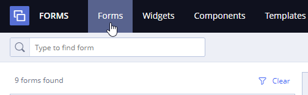
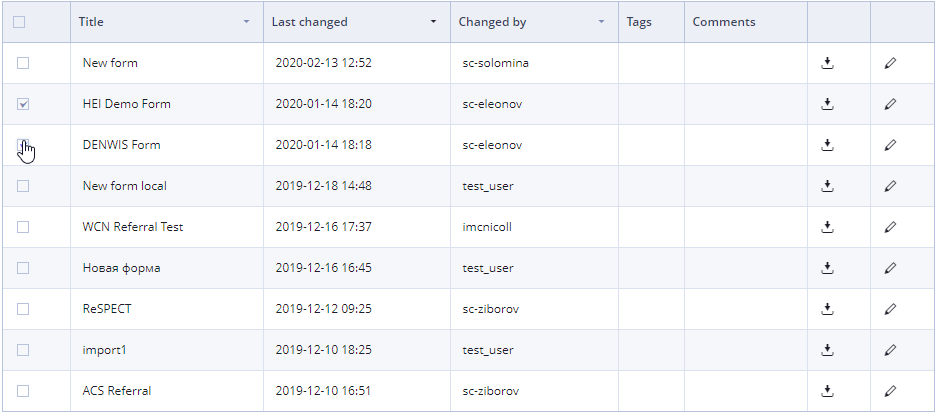
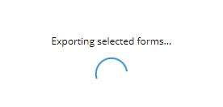

# Form export and import

## To import a form from a file: 

1\) Log in and go to **Forms**

2\) Click 

3\) Click the drop area to select a file or drag files here

## To export one or several of your forms: 

1\) Log in and go to **Forms**

2\) To export the latest version of the form to a file select form in the list and click

3\) To export several forms select one or more forms in the list by using a checkbox next to the form name

4\) Click 

The selected forms will be exported from your account and downloaded to the default folder on local drive. If default folder is not specified, _Windows Explorer window_ will appear to to determine the location and name of the saved file.

