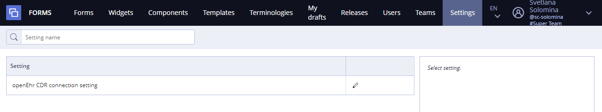

# EHR Forms : General Description

EHR Forms is a tool to create openEHR based UI forms. It is designed to simplify and speed up development of any kind of applications using openEHR as a foundation. Primary goal is to get rid of openEHR template and archetype complicity when creating UI and to bring as much reusability and versatility in the process as possible.  The Tool provide execution of the following functions:

* [Forms \(in detail\)](ehr-forms-forms-in-detail.md)
  * [Form creation](ehr-forms-form-creation.md)
  * [Form editing](ehr-forms-form-editing.md)
    * [Source panel](ehr-forms-source-panel.md)
    * [Editor panel](ehr-forms-editor-panel.md)
    * [Settings panel](ehr-forms-settings-panel.md)
    * [Developer tools panel](ehr-forms-developer-tools-panel.md)
  * [Form export and import](ehr-forms-form-export-and-import.md)
* [Widgets \(in detail\)](ehr-forms-widgets-in-detail.md)
  * [Widget creation](ehr-forms-widget-creation.md)
  * [Widget editing](ehr-forms-widget-editing.md)
  * [Widget export and import](ehr-forms-widget-export-and-import.md)
  * [Widget version control](ehr-forms-widget-version-control.md)
* [Component libraries \(in detail\)](ehr-forms-component-libraries-in-detail.md)
  * [Creating Component Library](ehr-forms-creating-component-library.md)
  * [Accordion](ehr-forms-accordion.md)
  * [Button](ehr-forms-button.md)
  * [Checkbox](ehr-forms-checkbox.md)
  * [Checkbox group](ehr-forms-checkbox-group.md)
  * [Combobox](ehr-forms-combobox.md)
  * [Copy a section](ehr-forms-copy-a-section.md)
  * [Copy value](ehr-forms-copy-value.md)
  * [Date field](ehr-forms-date-field.md)
  * [Date interval](ehr-forms-date-interval.md)
  * [Depth Stack](ehr-forms-depth-stack.md)
  * [Dropdown list](ehr-forms-dropdown-list.md)
  * [Extended multiple combobox](ehr-forms-extended-multiple-combobox.md)
  * [Extended radio button](ehr-forms-extended-radio-button.md)
  * [Horizontal stack](ehr-forms-horizontal-stack.md)
  * [Information panel](ehr-forms-information-panel.md)
  * [Messenger](ehr-forms-messenger.md)
  * [Modal dialog](ehr-forms-modal-dialog.md)
  * [Multiple dropdown list](ehr-forms-multiple-dropdown-list.md)
  * [Multiple combobox](ehr-forms-multiple-combobox.md)
  * [Multiple number field](ehr-forms-multiple-number-field.md)
  * [Multiple text area](ehr-forms-multiple-text-area.md)
  * [Multiple text field](ehr-forms-multiple-text-field.md)
  * [Navigation hidable section](ehr-forms-navigation-hidable-section.md)
  * [Navigation section](ehr-forms-navigation-section.md)
  * [Number field](ehr-forms-number-field.md)
  * [Panel](ehr-forms-panel.md)
  * [Radio button](ehr-forms-radio-button.md)
  * [Range](ehr-forms-range.md)
  * [Repeater](ehr-forms-repeater.md)
  * [Searchable dropdown](ehr-forms-searchable-dropdown.md)
  * [Segment switch](ehr-forms-segment-switch.md)
  * [Segment switch group](ehr-forms-segment-switch-group.md)
  * [Slider number](ehr-forms-slider-number.md)
  * [Spinner number](ehr-forms-spinner-number.md)
  * [Switch](ehr-forms-switch.md)
  * [Tabs](ehr-forms-tabs.md)
  * [Text area](ehr-forms-text-area.md)
  * [Text field](ehr-forms-text-field.md)
  * [Title](ehr-forms-title.md)
  * [Validation](ehr-forms-validation.md)
  * [Variable](ehr-forms-variable.md)
  * [Vertical stack](ehr-forms-vertical-stack.md)
* [Templates \(User uploaded\) \(in detail\)](ehr-forms-templates-user-uploaded-in-detail.md)
  * [Template import](ehr-forms-template-import.md)
* [Terminologies \(in detail\)](ehr-forms-terminologies-in-detail.md)
  * [Add terminology service](ehr-forms-add-terminology-service.md)
* [My drafts \(in detail\)](ehr-forms-my-drafts-in-detail.md)
* [Releases \(in detail\)](ehr-forms-releases-in-detail.md)
  * [Release creation](ehr-forms-release-creation.md)
  * [Release editing](ehr-forms-release-editing.md)
  * [Release import](ehr-forms-release-import.md)
* [Users \(in detail\)](ehr-forms-users-in-detail.md)
* [Teams \(in detail\)](ehr-forms-teams-in-detail.md)
* [Settings \(in detail\)](ehr-forms-settings-in-detail.md)

                                                                                                                                                    **EHR Forms main page \(also Forms tab\)**

## Tool description 

### Authentication 

To log into the system User should enter username and password and press **Login** button.

### Forms 

In **EHR Forms** context **openEHR Template** is a composition of **openEHR Archetypes** represented as a single **OPT file** converted to JSON \(simplified template\).

**Form** can be associated with one or multiple openEHR **templates**, this feature allows user to create multiple **Compositions** \(or multiple exemplars of the same composition\) with use of form or dynamic forms like messengers with templates can be loaded at runtime.

Forms tab \(see picture above\) allows User to view and manage team's account forms. From this page, User can:

* [Form creation](ehr-forms-form-creation.md)
* [Form editing](ehr-forms-form-editing.md)
  * [Source panel](ehr-forms-source-panel.md)
  * [Editor panel](ehr-forms-editor-panel.md)
  * [Settings panel](ehr-forms-settings-panel.md)
  * [Developer tools panel](ehr-forms-developer-tools-panel.md)
* [Form export and import](ehr-forms-form-export-and-import.md)

### Widgets 

**Widget** is a reusable part of a form which is associated with single archetype or a composition of archetypes.

Widgets and archetypes are associated with **Widget class** representation. **Widget class** is a projection of archetypes and archetype slots. **Widget classes** allow to implement a search algorithm which is used to find widgets for a selected archetype and reuse widgets in a form building process.

Widgets page is intended for the following:

* [Widget creation](ehr-forms-widget-creation.md)
* [Widget editing](ehr-forms-widget-editing.md)
* [Widget export and import](ehr-forms-widget-export-and-import.md)
* [Widget version control](ehr-forms-widget-version-control.md)

### Components 

**Components** are small bricks which are used by form modelers to create a form. The result of form building process is stored as a Form Description data object in JSON format.

**Components** are grouped into **Component library**. Component library is a JS library created by software developers.

This tab is available for users with Administrator role and is used to upload and export component libraries. Component libraries are available inside separate teams and not shared between teams except basic set of components.

For more details see [Component libraries](ehr-forms-component-libraries-in-detail.md)

### Templates 

In **EHR Forms** context **openEHR Template** is a composition of **openEHR Archetypes** represented as a single **OPT file** converted to JSON \(simplified template\).

**Form** can be associated with one or multiple openEHR **templates**, this feature allows user to create multiple **Compositions** \(or multiple exemplars of the same composition\) with use of form or dynamic forms like messengers with templates can be loaded at runtime.

The tab is intended for viewing the list of templates available within the team, searching, viewing the structure of the template, importing opt templates and viewing the list of forms connected with the template.

On this page User can manually upload templates:

* [Template import](ehr-forms-template-import.md)

### Terminologies 

The openEHR terminology is an adjunct to the openEHR reference and archetype models, and provides code sets and vocabularies needed by the models which are language independent. It is not a "real-world" ontology of any kind - i.e. it does not contain representation of facts in areas such as diseases or biochemistry - this is the job of much larger terminologies such as ICDx, ICPC and so on.

Terminologies page is intended for the following:

* [Add terminology service](ehr-forms-add-terminology-service.md)

### My drafts 

Drafts allows User to create drafts of forms or widgets before publishing them as a new version. Every published form or widget has a set of versions, it's not allowed to  
publish one version multiple times, new version is always created when user does publish it.

Single user list of drafts available inside separate teams and not shared between teams.

Tip!

Drafts are shareble inside team between users. User can open draft via link.

For more details see [My drafts](ehr-forms-my-drafts-in-detail.md)

### Releases 

In Releases section User can see all product releases that are using existing forms.

In release description User can see the list of forms and their versions that have become the part of the release.

To see this section User must have the Administrator role. 

Realeses have team property, so they are for current team only.

Releases page is intended for the following:

* [Release creation](ehr-forms-release-creation.md)
* [Release editing](ehr-forms-release-editing.md)
* [Release import](ehr-forms-release-import.md)

For more details see [Releases](ehr-forms-releases-in-detail.md)

### Users 

This section is used for managing user accounts. 

To see this section User must have the Administrator role. 

For more details see [Users](https://wiki.solit-clouds.ru/pages/viewpage.action?pageId=34832660)

### Teams 

Teams section is available for super team and is used to manage user groups and content for them.

Team members can view and publish content only within their team, such as:

* Forms
* Widgets
* Templates
* Drafts
* Releases
* Component libraries

For more details see [Teams](ehr-forms-teams-in-detail.md)

### Settings 

Settings section is used for establishing connection with Clinical Data Repository \(CDR\).

To see this section User must have the Administrator role. 

For more details see [Settings](ehr-forms-settings-in-detail.md)

