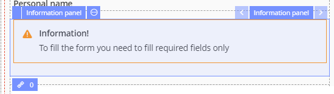
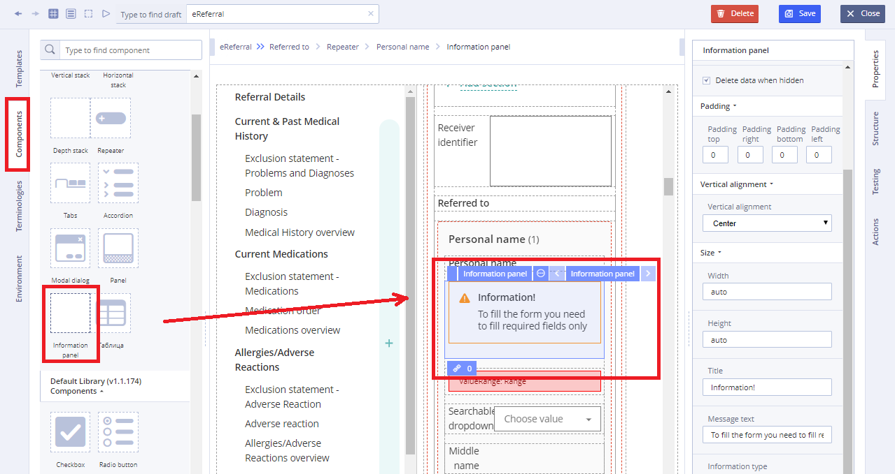
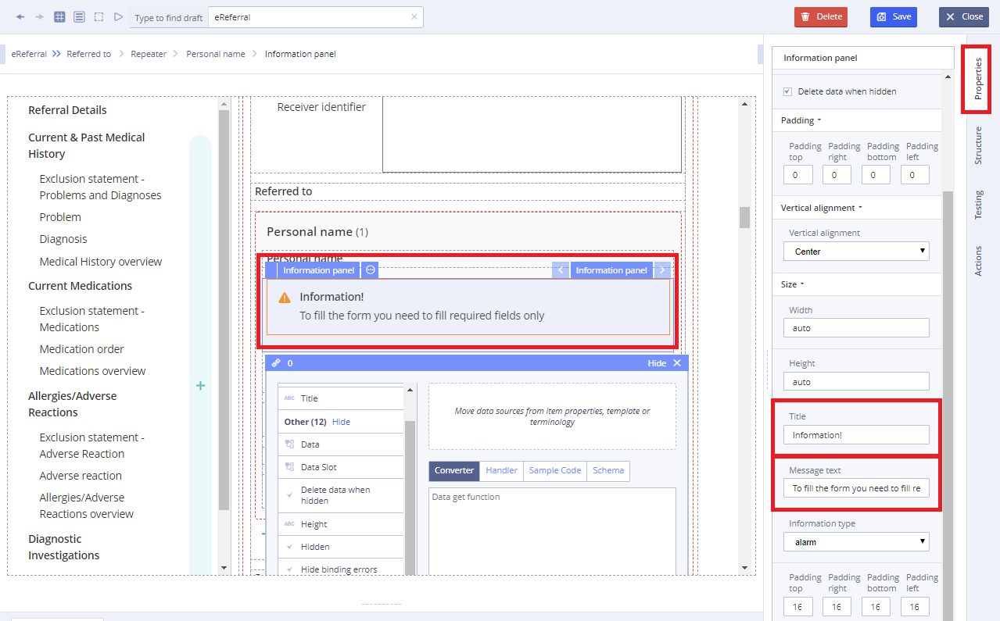

# EHR Forms : Information panel

**Usage**

Information panel is a container component, that displays particular arrangement of information grouped together for presentation to users on the [Forms](ehr-forms-forms-in-detail.md). For example, it can be textual information message like on the picture below:

## Working with Information panel: 

1\) Go to **Default Library Components** and drag the **Information panel**  ****from the **Default Library Components** section

2\) Add text on **Information** **panel** using **Properties tab** \(on the right\)

* Specify **Title** property
* Specify **Message text** property

3\) Specify necessary properties such as **Data** \(which is set using **Chain button**\) using data sources of the **Template** for this new component 

4\) Specify **Action** property in **Converter** using JS language if necessary

For more details see [Form creation\#3.2.1WorkingwithConverter](https://wiki.solit-clouds.ru/display/EHR/Form+creation#Formcreation-3.2.1WorkingwithConverter)

