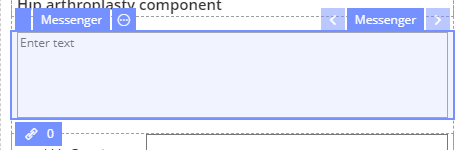
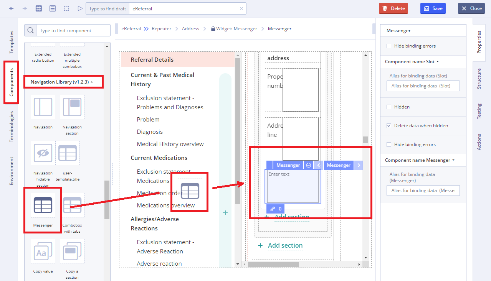

# EHR Forms : Messenger

This page is under construction

## Usage 

Messenger is a multiline edit box in which the User can input text.

## Working with Messenger 

1\) Go to **Default Library Components** and drag the **Messenger** from the **Navigation Library** section

2\) Specify **Data** property by dragging it from the **Template**  

3\) Specify **Action** property in **Converter** using JS language if necessary

For more details see [Form creation\#3.2.1WorkingwithConverter](ehr-forms-form-creation.md#Formcreation-3.2.1WorkingwithConverter)

