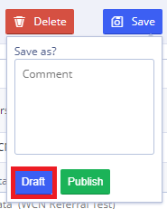
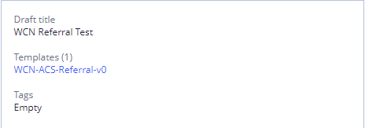
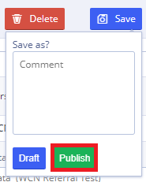

# My drafts \(in detail\)

Drafts allows User to create drafts of forms or widgets before publishing them as a new version. Every published form or widget has a set of versions, it's not allowed to  
publish one version multiple times, new version is always created when user does publish it.

List of drafts available inside separate teams and not shared between teams.

**My drafts tab**

## Drafts list 

At the start User Draft list is empty.

Each time User create form of widget it can be saved as a Draft and displayed in the Draft list.

## Drafts search 

User may search drafts by several criteria and their combinations:

* **By title** - search starts after one symbol;
* **By type** - to search all components use **All**, also User can search only **Forms** or **Widgets** in **Drafts**;
* **By tags** - selecting one or several tags.

All searches are performed by "and" operator.

"Clear" button clears all currently applied filters.

## Draft creation 

To create a new draft User should create and **Save as a Draft** form or widget using  or  button

For more details see [Form creation](ehr-forms-forms-in-detail/ehr-forms-form-creation.md) and [Widget creation](ehr-forms-widgets-in-detail/ehr-forms-widget-creation.md)

## Draft editing 

To start editing draft User should select desirable draft in the list and click 

For more details see [Form editing](ehr-forms-forms-in-detail/ehr-forms-form-editing/)

## Draft description 

##  

To see draft description User need to select draft from the list. Description will be shown in the right panel.

It contains:

* **Title** - draft name
* **Templates** - list of templates currently used in draft. By clicking on template User can open its description in Templates tab
* **Tags** - list of draft's tags

## Draft publishing 

To publish new draft User should use **Publish** button when saving form or widget.

