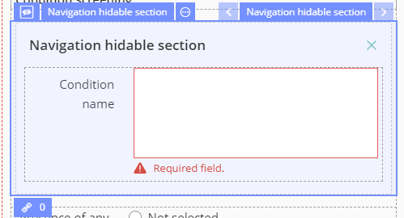
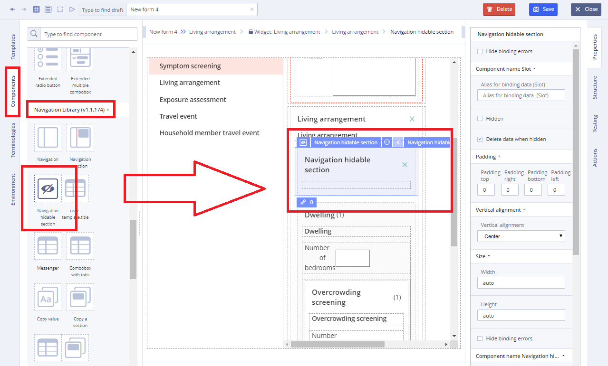
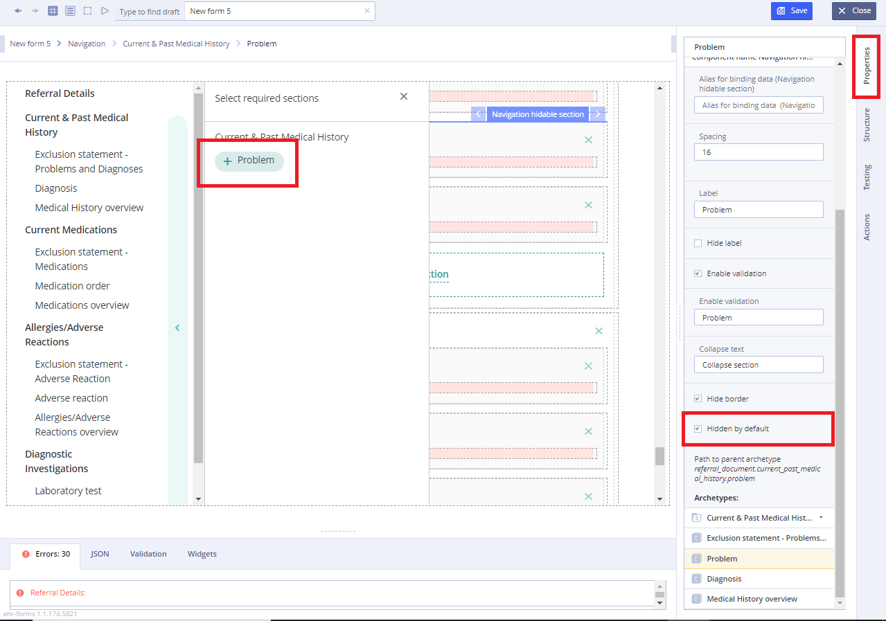
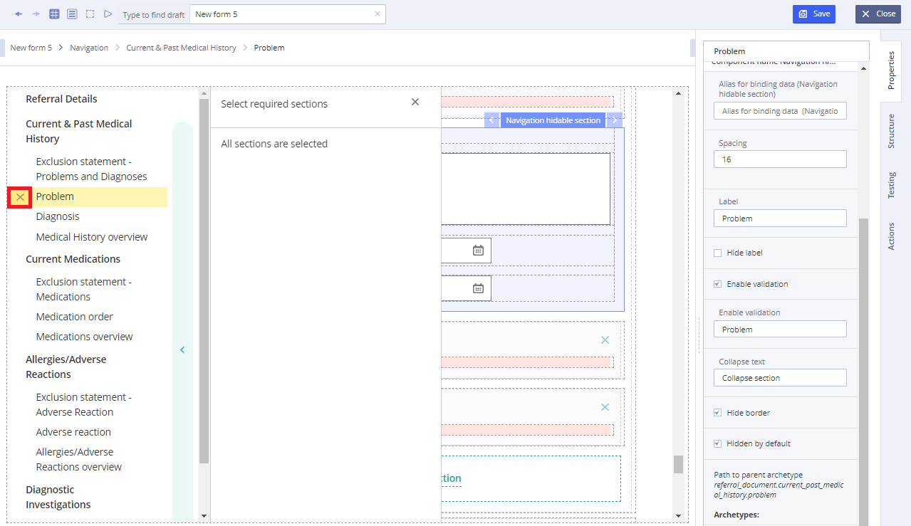

# EHR Forms : Navigation hidable section

## Usage 

A navigation section is a section of a graphical user interface intended to aid visitors in accessing information. Navigation hidable section allows user to hide it using  "Hide in navigation" property.  

## Working with Navigation hidable section: 

To add a second level of navigation and hide it:

* For the component of the second level of navigation, you need to add the element **Hidden section for navigation** to the slot from **Navigation Library**

* In order for the section to be hidden by default and accessible from the list by +, it is necessary for the component to specify **Hidden by default**

* To check the operation of a component and a section, it is necessary to delete the section using the cross button.

