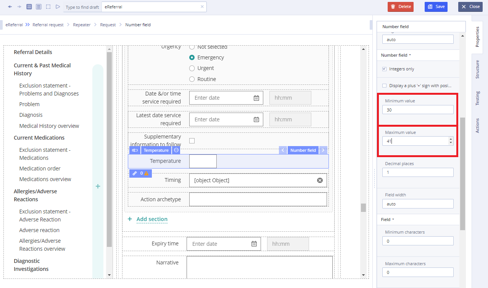

# EHR Forms : Number field

## Usage 

Number field is a graphical control element intended to enable the user to input data in integer and non-integer numbers to be used by the [Form](ehr-forms-forms-in-detail.md).

## Working with Number field: 

1\) Add a slot with a number field

2\) To establish only integer entry, it is necessary to check the checkbox field: **Integers only**

3\) To set the number of decimal places for non-integer fields, select the number of characters in the **Decimal places** property:

4\) Set minimum and maximum values, if necessary

5\) Check the validation on some large number \(for example: 9999\) and, if necessary, remove the binding errors so that extra messages are not displayed:

