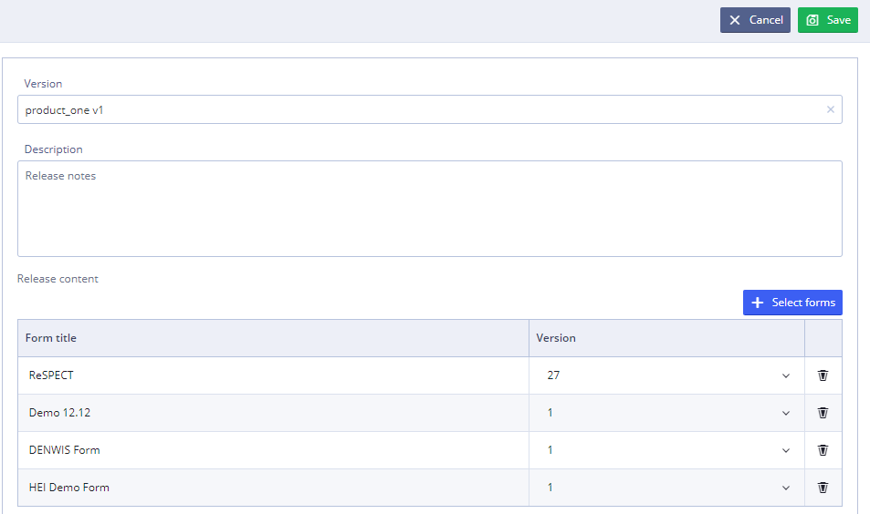
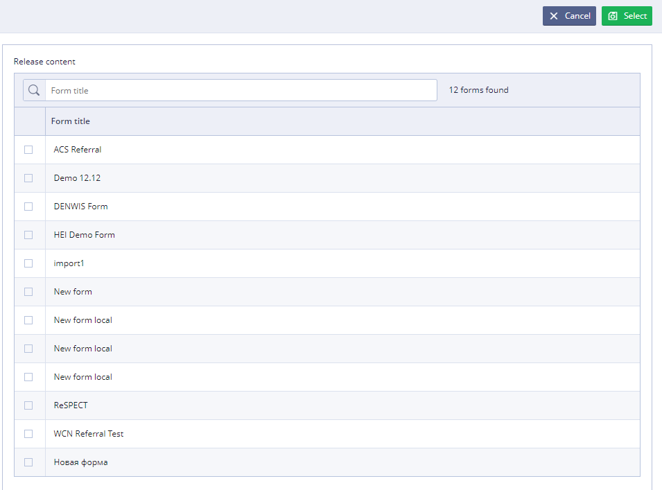

# EHR Forms : Release creation

To create a new release based on a current user needs to select release from the list and click  button

* In the **Version**, type the name for new version of the release
* In the **Description**, type description for new release \(if necessary\).
* Click  to add content of the release. User also can delete forms from the release content using button with the basket image 

* Click 

