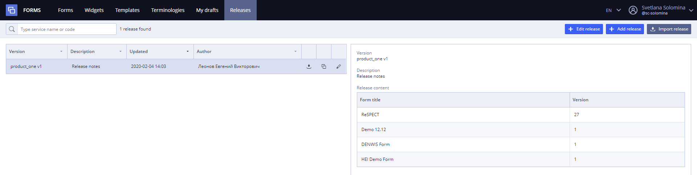
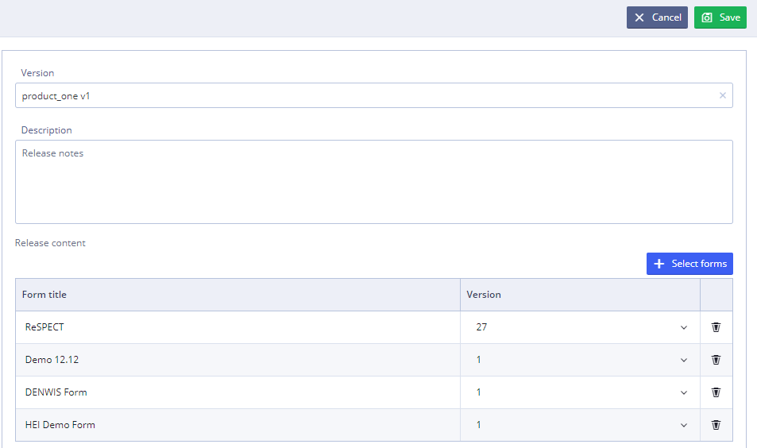
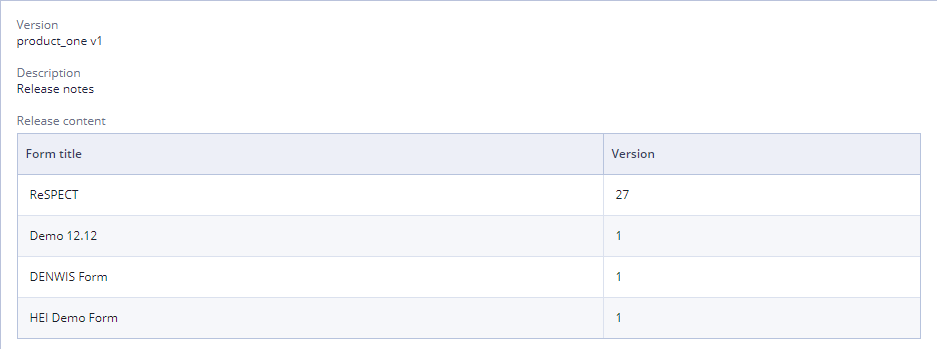

# Releases \(in detail\)

In **Releases section** User can see all product releases that are using existing forms.

In release description User can see the list of forms that have become the part of the release.

To see this section User must have the Administrator role or be the part of the team. 

List of releases available inside separate teams and not shared between teams.

**Releases Tab**

## Releases List 

At the start there is the list of product releases that are using existing forms.

* Available actions - edit, add, import download, create a new release based on a current. 

## Release Search 

User may search releases by several properties and their combinations:

* By name - type service name in search line, search starts after one symbol;
* By code - type service code in search line.

All searches work by "and" operator.

"Clear" button clears all currently applied filters.

## Release Import  

User can import new releases by clicking  option.

For more details see [Release import](ehr-forms-release-import.md)

## Release Creation 

To create a new release based on a current user needs to select release from the list and click  button

* In the **Version**, type the name for new version of the release
* In the **Description**, type description for new release \(if necessary\).
* Click  to add content of the release. User also can delete forms from the release content using button with the basket image 
* Click 

For more details see [Release creation](ehr-forms-release-creation.md)

## Release Editing 

To start editing release User should select desirable release in the list and click 

For more details see [Release editing](ehr-forms-release-editing.md)

## Release Description 

##  

To see release description User need to select release from the list. Description will be shown in the right panel.

It contains:

* **Version** - name of the release version
* **Description** - description for the release
* **Release content** - list of forms that have become the part of the release

