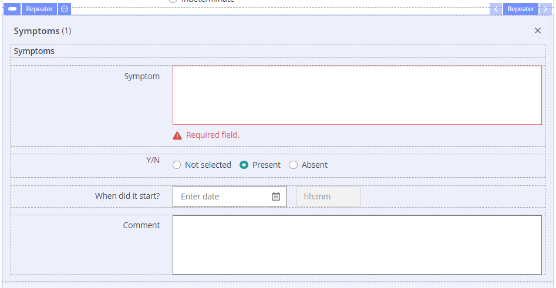
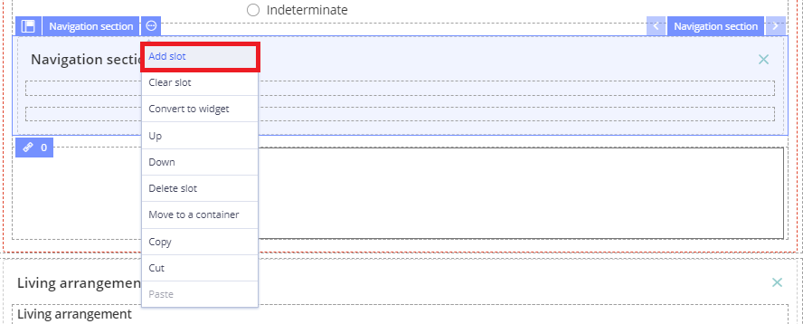
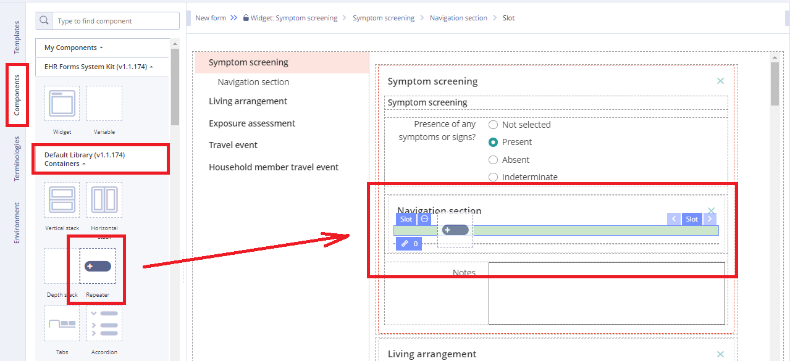
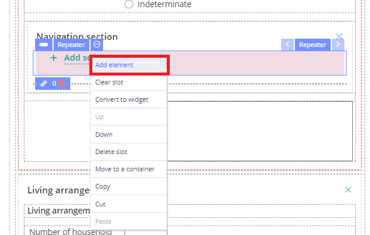
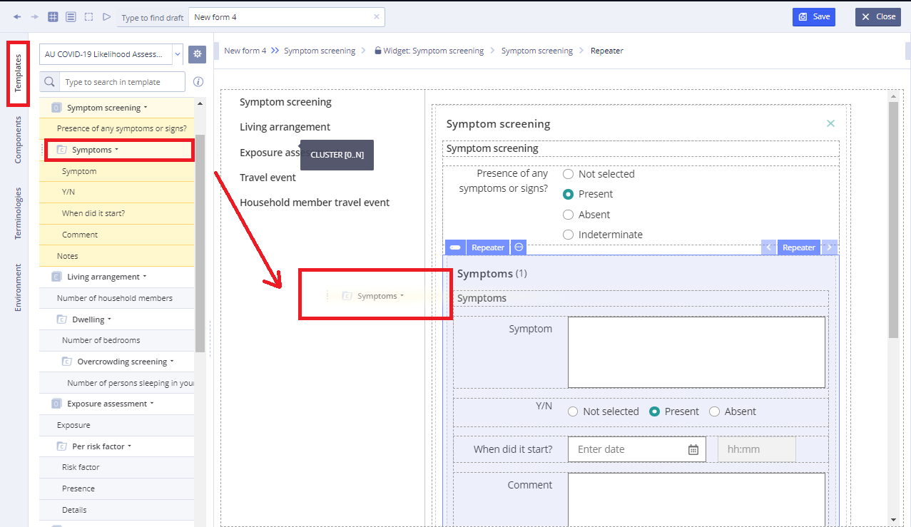
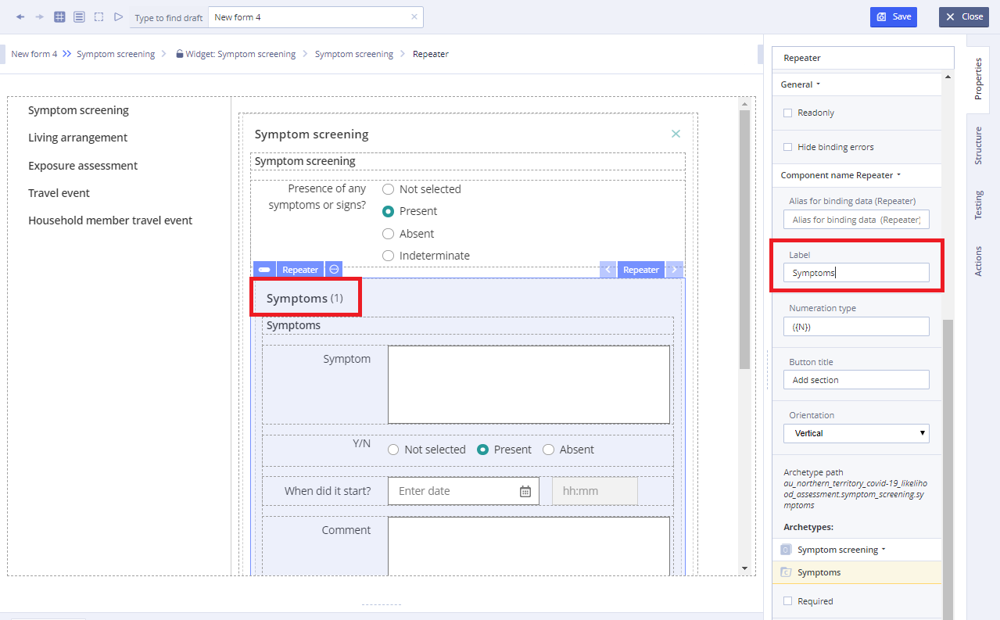

# EHR Forms : Repeater

## Usage 

Repeater is special component that is used for creating repeatable sections which have a multiplicity of 0..N or 1..N, for example, in diagnoses there are auxiliary diagnoses, which may be several.

## Repeater Creation 

1\) Go to **Navigation** **section** and select **Add Slot** from the drop-down menu 

2\) Go to **Default Library Components** and drag the **Repeater** from the **Default Library Containers** section in the added slot

3\) Click three dots button and select **Add element** from the drop-down menu

4\) Copy the element necessary for repetition from the **Template**  
Check element field settings in the repeater

5\) In **Properties** \(on the right\) specify the repeater title

