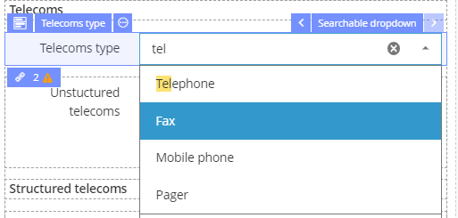
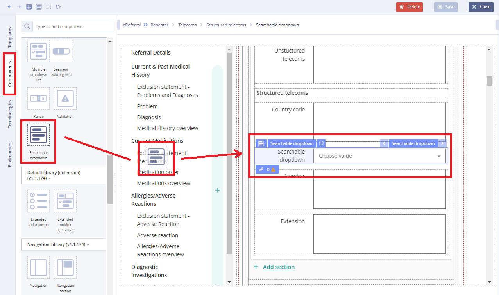
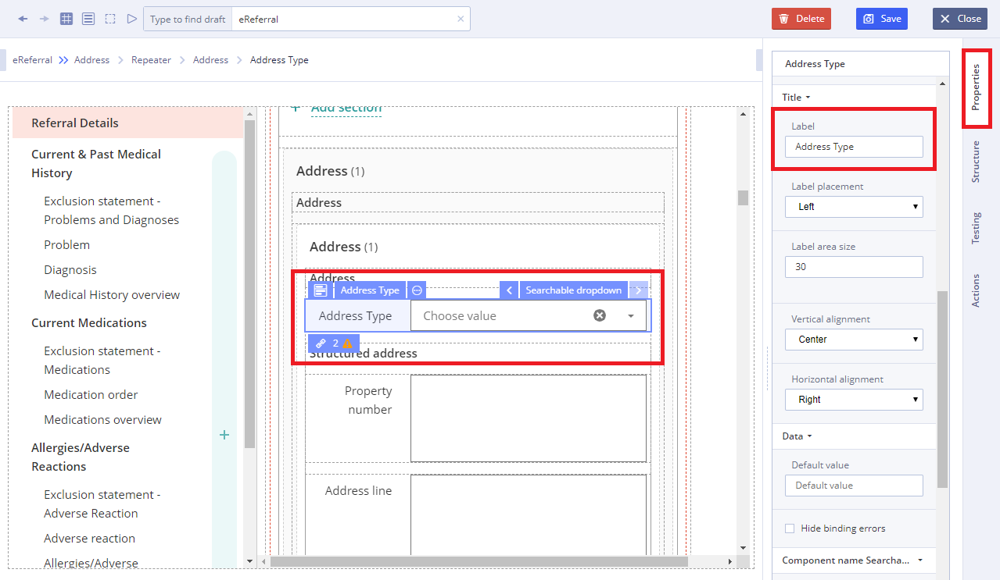
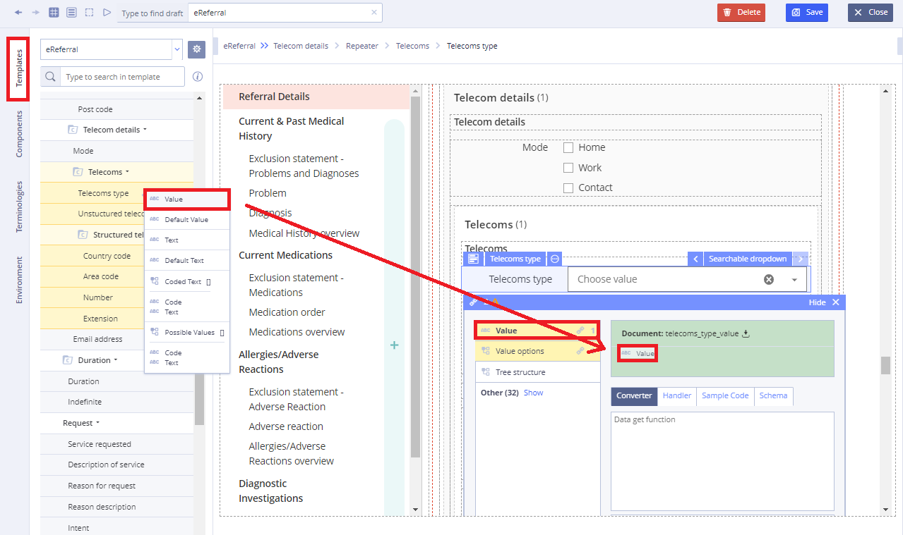

# EHR Forms : Searchable dropdown

## Usage 

**Searchable dropdown** is a graphical control element, similar to a **Dropdown list**, that allows the user to choose one value from the list with the possibility of search in it in the process.

When a drop-down list is inactive, it displays a single value. When activated, it displays \(drops down\) a list of values, from which the user may select one and search.

When the user selects a new value, the control reverts to its inactive state, displaying the selected value.

## Working with Searchable dropdown: 

1\) Go to **Default Library Components** and drag the **Searchable dropdown** from the **Default Library Components** section

2\) In Properties \(on the right\) specify the title in **Label** field

3\) In properties which is set using **Chain button** specify the **Value** using data sources of the Template

4\) Specify **Action** property in **Converter** using JS language if necessary

For more details see [Form creation\#3.2.1WorkingwithConverter](ehr-forms-form-creation.md#Formcreation-3.2.1WorkingwithConverter)

