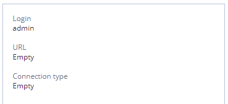

# EHR Forms : Settings \(in detail\)

Settings section is used for establishing connection with Clinical Data Repository \(CDR\).

To see this section User must have the Administrator role. 

Clinical Data Repository \(CDR\) - this is the data warehouse, in our case, for example, this is what is provided by the Marand.

The settings section allows you to make settings for those CDR, providing data warehouse and API for calling methods for working with compositions, as well as a list of templates.

**Settings Tab view**

## Settings List 

At the start there the is a list of settings available.

* Available actions - editing.

## Settings Search 

User may search settings by name - search starts after one symbol;

All searches work by "and" operator.

"Clear" button clears all currently applied filters.

## Settings Editing 

To start editing settings User should select desirable one in the list and click 

Other way to edit the settings is using button, settings panel will be displayed on the screen ready for editing.

## Settings Description 

##  

To see settings description User need to select it in the list. Description will be shown in the right panel.

It contains:

* **Login**- user login for establishing connection to the Clinical Data Repository \(CDR\)
* **URL** - url for establishing connection to the Clinical Data Repository \(CDR\)
* **Connection type** - connection type for establishing connection to the Clinical Data Repository \(CDR\)

