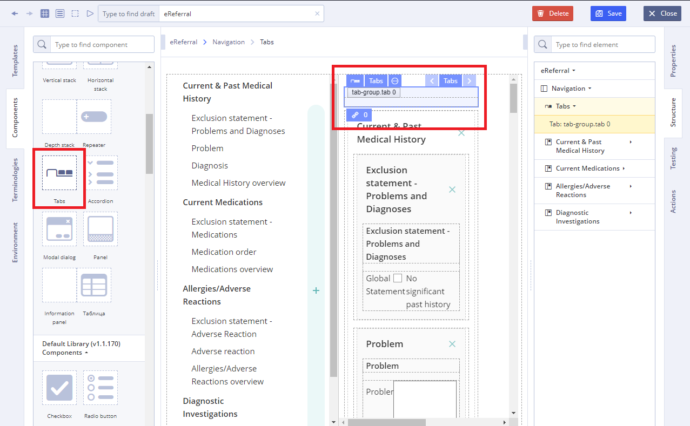
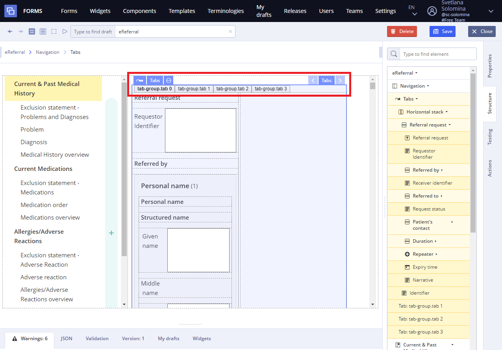

# EHR Forms : Tabs

## Usage 

Tab - is a graphical control element that allows multiple documents or panels to be contained within a single [Form](ehr-forms-forms-in-detail.md), using tabs as a navigation menu for switching between sets of documents.

## **Working with Tabs:** 

1\) Go to **Default Library Components** and drag the **Tab** from the **Default Library Containers** section

2\) Add another component like **Horizontal stack** using **Default Library Containers** on **Components** **tab**

3\) Add slots to create more tabs

4\) User can also specify **Action** property in **Converter** using JS language \(if necessary\)

For more details see [Form creation\#3.2.1WorkingwithConverter](ehr-forms-form-creation.md#Formcreation-3.2.1WorkingwithConverter)

