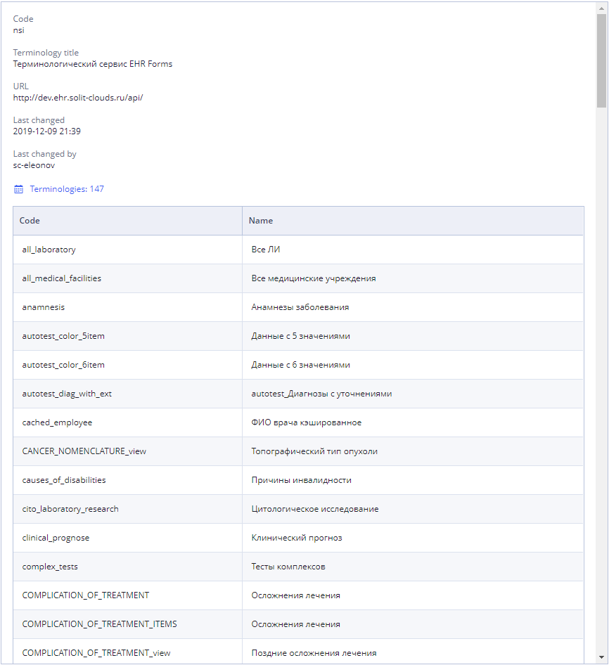

# Terminologies \(in detail\)

The openEHR terminology is an adjunct to the openEHR reference and archetype models, and provides code sets and vocabularies needed by the models which are language independent. It is not a "real-world" ontology of any kind - i.e. it does not contain representation of facts in areas such as diseases or biochemistry - this is the job of much larger terminologies such as ICDx, ICPC and so on.

/\*&lt;!\[CDATA\[\*/  
div.rbtoc1607432803306 {padding: 0px;}  
div.rbtoc1607432803306 ul {list-style: disc;margin-left: 0px;}  
div.rbtoc1607432803306 li {margin-left: 0px;padding-left: 0px;}  
  
/\*\]\]&gt;\*/

* [Terminology list](./#Terminologies%28indetail%29-Terminologylist)
* [Terminology search](./#Terminologies%28indetail%29-Terminologysearch)
* [Add terminology service](./#Terminologies%28indetail%29-Addterminologyservice)
* [Terminology description](./#Terminologies%28indetail%29-Terminologydescription)
* 

**Terminologies tab view**

## Terminology list 

At the start there is the list of terminologies available for your team with parameters.

* Available actions - add and edit terminology service. 

## Terminology search 

User may search terminologies by several criteria and their combinations:

* **By service title**- search starts after one symbol;
* **By service code** - search starts after one symbol.

All searches are performed by "and" operator.

"Clear" button clears all currently applied filters.

## Add terminology service 

User can add new terminology service by clicking 

For more details see [Add terminology service](ehr-forms-add-terminology-service.md)

## Terminology description 

##  

To see terminology description User need to select one from the list. Description will be shown in the right panel.

It contains:

* **Code** - code of the terminology service
* **Terminology title** - name of the terminology service
* **URL** - url path to the terminology service
* **Last changed** - date of the latest applied changes
* **Last changed by** - last user who changed the terminology service
* **Terminologies** - list of the used terminology services

