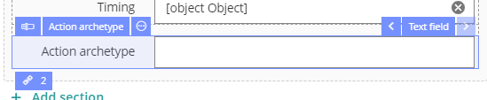
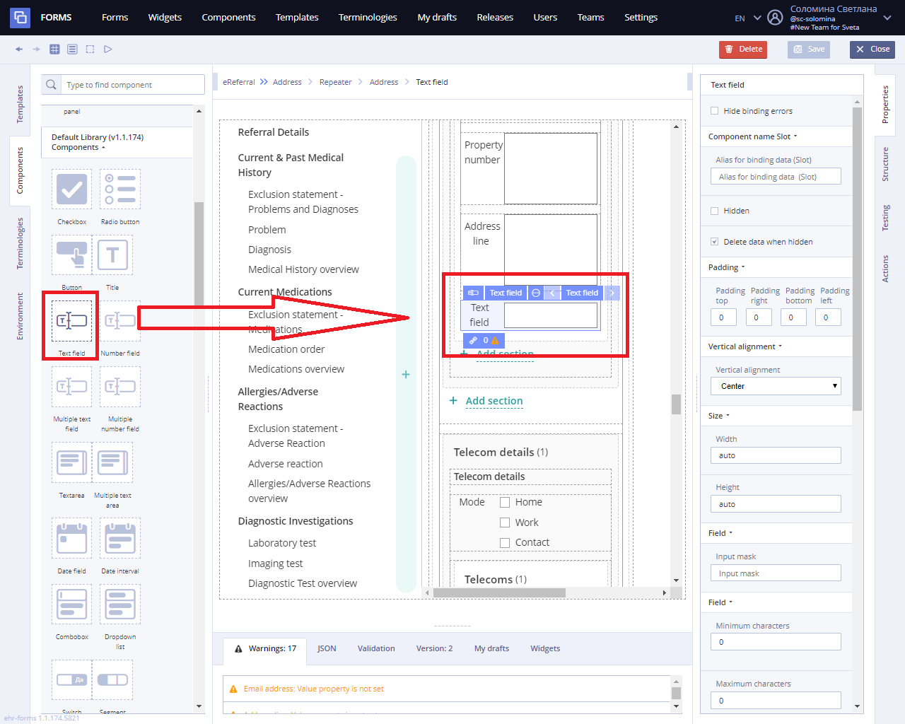
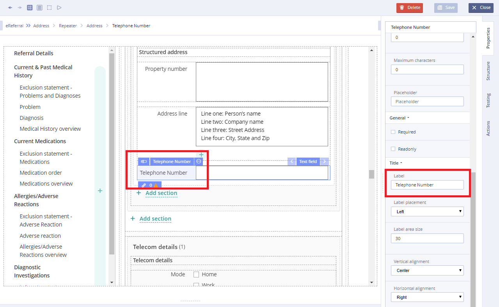
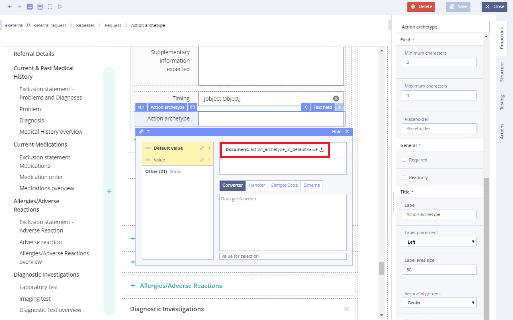

# EHR Forms : Text field

## Usage  

Text field is a graphical control element intended to enable the user to input text information to be used on the [Form](ehr-forms-forms-in-detail.md).

## Working with Text field 

1\) Go to **Default Library Components** and drag the **Text field** from the **Default Library Components** section

2\) In Properties \(on the right\) specify the title in **Label** field

3\) Specify **Default value** property by dragging it from the **Template**  

4\) Specify **Action** property in **Converter** using JS language if necessary

For more details see [Form creation\#3.2.1WorkingwithConverter](ehr-forms-form-creation.md#Formcreation-3.2.1WorkingwithConverter)

