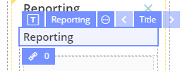

# EHR Forms : Title

## **Usage** 

**Title** is a graphical control element which displays text on a form. It is usually a static control; having no interactivity. A **Title** is generally used to identify a nearby text box or other widget.

## Working with Button: 

1\) Go to **Default Library Components** and drag the **Title** from the **Default Library Components** section

2\) In Properties \(on the right\) specify the title in **Label** field

