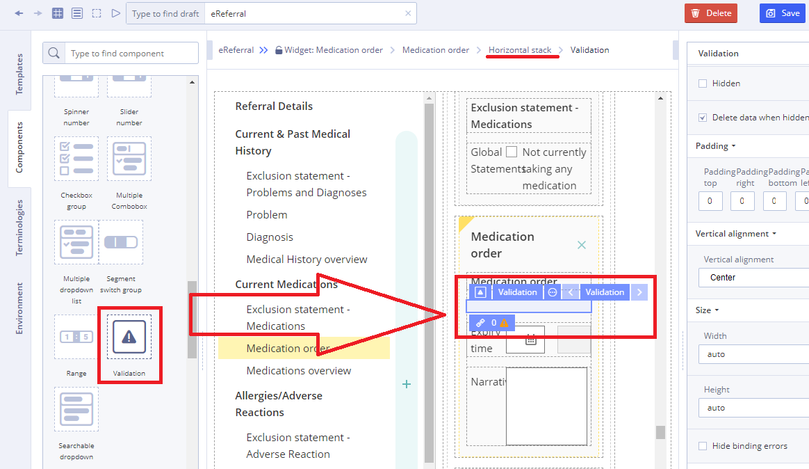
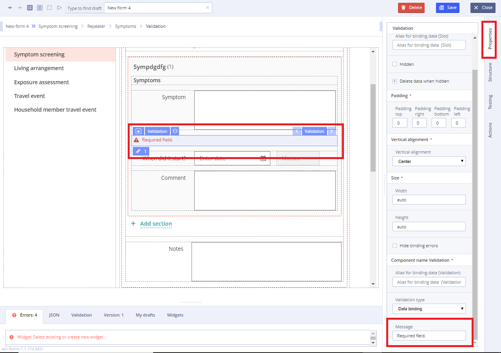
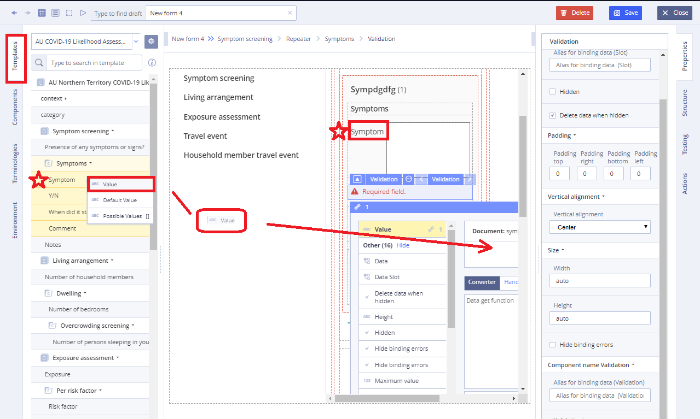

# EHR Forms : Validation

Validation is a special component that is displayed on the Form when user input wrong values in the field. The typical validation dialog provides information near the field to the user, after which the user can only respond in one way: by entering right value. Common message usually looks like the following: "Required field". 

**Working with Validation**

1\) Add **Validation** component to empty slot

If you want the error to be below the field \(not to the left\):

* add the **Horizontal Stack** component to an empty slot
* add another slot to the stack \(total: two slots on the stack\)
* add the **Validation** component to the left
* in the right set the property: Width 30%



2\) In the **Properties** of the slot, adjust the message displayed to the user, if necessary:

TipDo not forget to set the checkbox on the **Hide binding errors** property otherwise the message will be doubled



3\) In the **Value** of the component, add a data source from **Template** the field to be validated

Important

The value binds to the value - where the System allows user to bind. Available values are bind to a list of values if internal terminology is used. The default values from the template are bind to the default values.



4\) In the converter, add a condition for the validity of the value, for example:

```text
symptom_name symptom_name! == ''? 'good': ''
```

