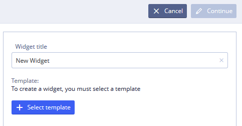

# Widget creation

To create a widget:  
1\) Log in and go to **Widgets**.

2\) Click 

  
3\) In the Widget title field, type the name of your new widget.

4\) Click 

  
5\) From the list, select one openEHR template and click **Check** icon  

User can use the search box as a filter for template list.

  
For filter description click here to expand...

As the user types, the list automatically updates.

If the user types an exact match, the list is filtered for an exact match.

If the user types a partial match, the list is filtered for any template whose name contains the string.

If the user clears the search box, the filter is cleared.

6\) Click  

Your blank widget will be opened in the Builder interface where you can start building.

In widget properties User should select widget archetype, binding widget to archetype.

For more details see [Widget editing](ehr-forms-widget-editing.md)

