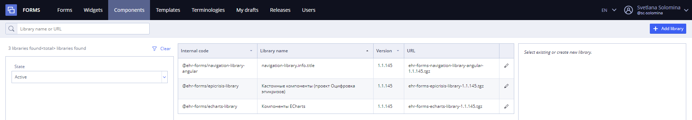
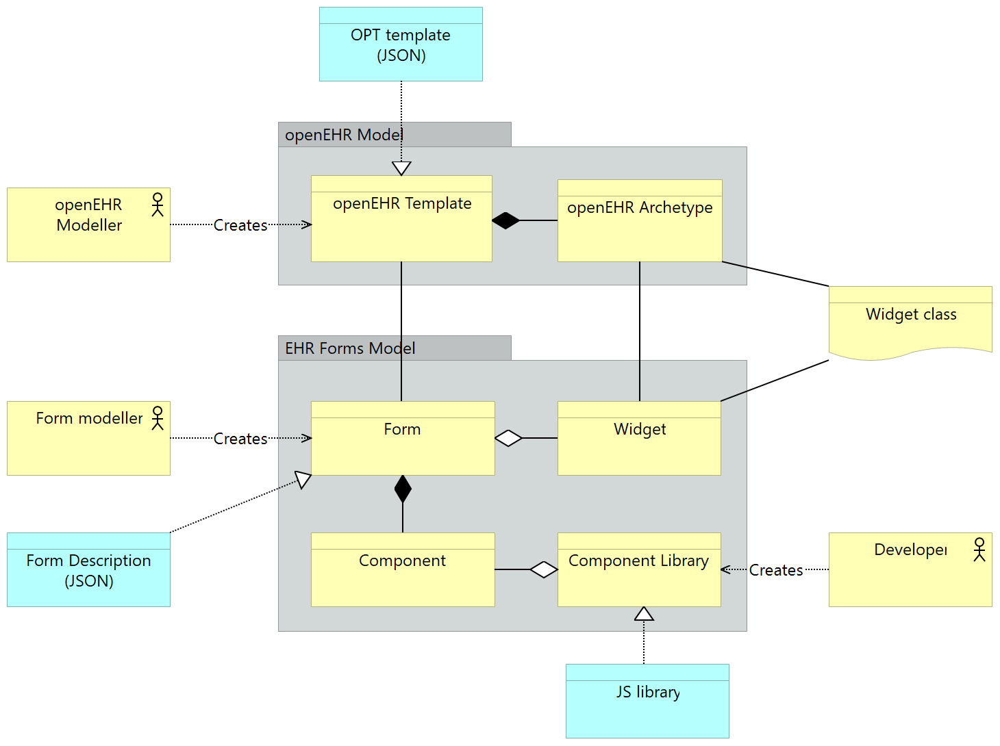
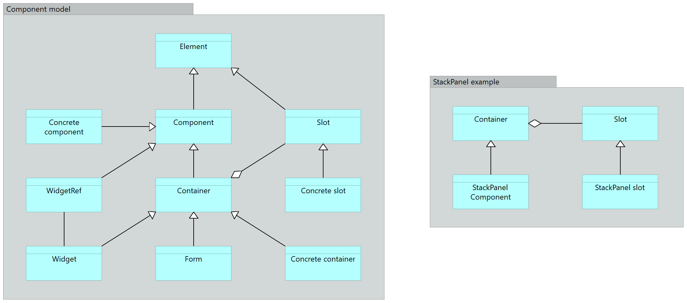
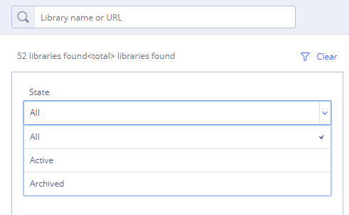
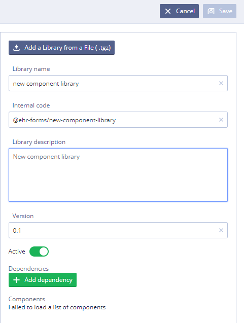
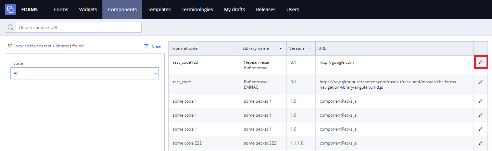
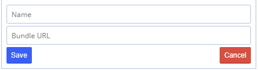
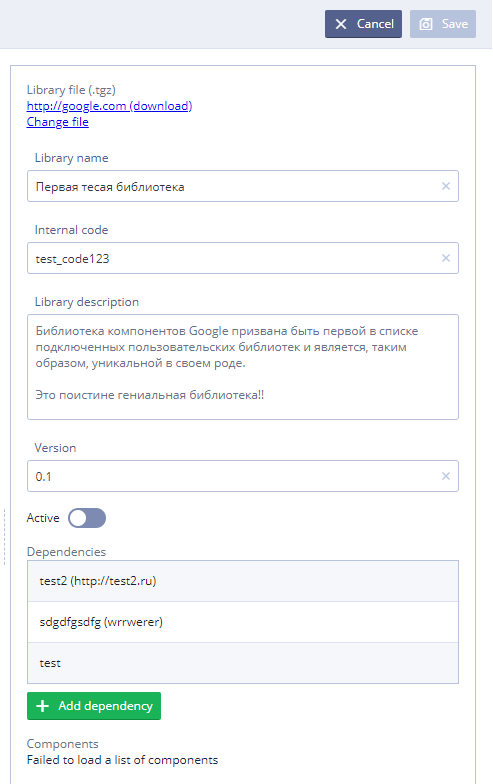

# Component libraries (in detail)

Component management function allows user to upload compiled JS component library developed by third parties. Component libraries allows to extend functionality of EHR Form.

Visual component is not only something simple to be rendered on the screen for input data, it can be a complex application with it’s own backend service.

**Components** tab is available for users with Administrator role and is used to upload and download component libraries. Component libraries are available inside separate teams and not shared between teams except basic set of components.

&#x20;                                                                                                                                                 **Components tab**

## EHR Form model description 

In **EHR Forms** context **openEHR Template** is a composition of **openEHR Archetypes** represented as a single **OPT file** converted to JSON (simplified template).

**Form** can be associated with one or multiple openEHR **templates**, this feature allows user to create single form with multiple **Compositions** or dynamic forms like messengers with templates can be loaded at runtime.

**Widget** is a reusable part of a form which is associated with single archetype or a composition of archetypes.

Widgets and archetypes are associated with **Widget class** representation. **Widget class** is a projection of archetypes and archetype slots. **Widget classes** allow to implement a search algorithm which is used to find widgets for a selected archetype and reuse widgets in a form building process.

**Components** are small bricks which are used by form modelers to create a form. The result of form building process is stored as a Form Description data object in JSON format.

**Components** are grouped into **Component library**. Component library is a JS library created by software developers.

## EHR Forms Component model 

**Element** is a base class for all other classes. **Component** class is derived from **Element**;

**Component** is a brick with a portion of UI that can be added to a form from the toolbar;

**Container** is a special type of component which contains a collection of slots;

**Slot** is a place to add child component of any type;

**Containers** is an element that allows to create forms with complex structure;

**WidgetRef** is a component with a reference to a widget reusable on the form;

There is an example with **StackPanel** **container** and **StackPanel slots**. There are other default containers like Table, Repeater, Tabs, etc.

#### Component Library Search 

User may search component library by several properties and their combinations.

* By name or URL - search starts after one symbol;
* By state - form may be active or inactive, so it is possible to view forms in any state or all at once.

All searches work by "and" operator.

"Clear" button clears all currently applied filters.

#### Creating component library 

The EHR Forms tool allows third-party developers to create their own component libraries, which can then be dynamically connected to the designer and used in the created forms.

Instructions for creating a new component library **(relevant for the version of Angular 7.x)** you can find on the page [Creating Component Library](ehr-forms-creating-component-library.md)

#### Adding component library  

To add new component library user needs to click 

* In the **Library Name**, type the name for new component library
* In the **Internal code**, type internal path for new component library
* In the **Library description**, type description for new component library (if necessary)
* In the **Version** type the version for new component library
* Use toggle switch to activate new component library
* Click  **** to set dependencies&#x20;

User also can add a library from a File using 

If the library was successfully uploaded to the system there would be displayed the list of components in the Components field

#### Editing component library 

1\) To start editing library User should click opposite to desirable item in the list&#x20;

2\) Next, the component library editing panel will open, where User can edit the following:

* **Library file** - component library file \*.tgz format
* **Library name** - name of the component library
* **Internal code** - code name of the component library
* **Library description** - description for the component library
* **Version** - version of the component library
* **State** - can be active or inactive, User can activate new component library using toggle switch&#x20;
* **Dependencies** - list of component library dependencies

To add new dependency User should do the following:

* click   and fill the new loaded fields **Name** and **Bundle URL**
* click 

* **Components** - list of components of the component library

4\) To save all performed changes User should click 

### Library contains 

| [Accordion](https://app.gitbook.com/display/EHR/Accordion)                     | [Button](https://app.gitbook.com/display/EHR/Button)                                         | [Checkbox](https://app.gitbook.com/display/EHR/Checkbox)                     | [Checkbox group](https://app.gitbook.com/display/EHR/Checkbox+group)             | [Combobox](https://app.gitbook.com/display/EHR/Combobox)                                     | [Copy a section](https://app.gitbook.com/display/EHR/Copy+a+section)               | [Copy value](https://app.gitbook.com/display/EHR/Copy+value)                 |
| ------------------------------------------------------------------------------ | -------------------------------------------------------------------------------------------- | ---------------------------------------------------------------------------- | -------------------------------------------------------------------------------- | -------------------------------------------------------------------------------------------- | ---------------------------------------------------------------------------------- | ---------------------------------------------------------------------------- |
| [Date field](https://app.gitbook.com/display/EHR/Date+field)                   | [Date interval](https://app.gitbook.com/display/EHR/Date+interval)                           | [Depth Stack](https://app.gitbook.com/display/EHR/Depth+Stack)               | [Dropdown list](https://app.gitbook.com/display/EHR/Dropdown+list)               | [Extended multiple combobox](https://app.gitbook.com/display/EHR/Extended+multiple+combobox) | [Extended radio button](https://app.gitbook.com/display/EHR/Extended+radio+button) | [Horizontal stack](https://app.gitbook.com/display/EHR/Horizontal+stack)     |
| [Information panel](https://app.gitbook.com/display/EHR/Information+panel)     | [Messenger](https://app.gitbook.com/display/EHR/Messenger)                                   | [Modal dialog](https://app.gitbook.com/display/EHR/Modal+dialog)             | [Multiple combobox](https://app.gitbook.com/display/EHR/Multiple+combobox)       | [Multiple dropdown list](https://app.gitbook.com/display/EHR/Multiple+dropdown+list)         | [Multiple number field](https://app.gitbook.com/display/EHR/Multiple+number+field) | [Multiple text area](https://app.gitbook.com/display/EHR/Multiple+text+area) |
| [Multiple text field](https://app.gitbook.com/display/EHR/Multiple+text+field) | [Navigation hidable section](https://app.gitbook.com/display/EHR/Navigation+hidable+section) | [Navigation section](https://app.gitbook.com/display/EHR/Navigation+section) | [Number field](https://app.gitbook.com/display/EHR/Number+field)                 | [Panel](https://app.gitbook.com/display/EHR/Panel)                                           | [Radio button](https://app.gitbook.com/display/EHR/Radio+button)                   | [Range](https://app.gitbook.com/display/EHR/Range)                           |
| [Repeater](https://app.gitbook.com/display/EHR/Repeater)                       | [Searchable dropdown](https://app.gitbook.com/display/EHR/Searchable+dropdown)               | [Segment switch](https://app.gitbook.com/display/EHR/Segment+switch)         | [Segment switch group](https://app.gitbook.com/display/EHR/Segment+switch+group) | [Slider number](https://app.gitbook.com/display/EHR/Slider+number)                           | [Spinner number](https://app.gitbook.com/display/EHR/Spinner+number)               | [Switch](https://app.gitbook.com/display/EHR/Switch)                         |
| [Tabs](https://app.gitbook.com/display/EHR/Tabs)                               | [Text area](https://app.gitbook.com/display/EHR/Text+area)                                   | [Text field](https://app.gitbook.com/display/EHR/Text+field)                 | [Title](https://app.gitbook.com/display/EHR/Title)                               | [Validation](https://app.gitbook.com/display/EHR/Validation)                                 | [Variable](https://app.gitbook.com/display/EHR/Variable)                           | [Vertical stack](https://app.gitbook.com/display/EHR/Vertical+stack)         |
