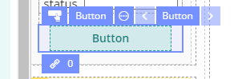
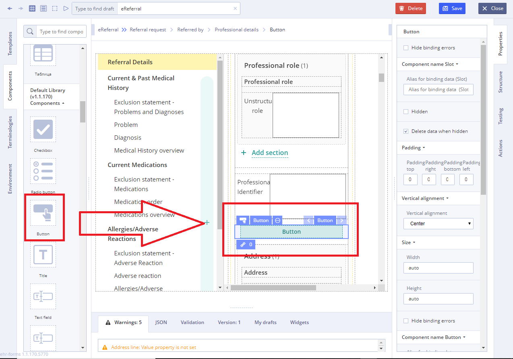
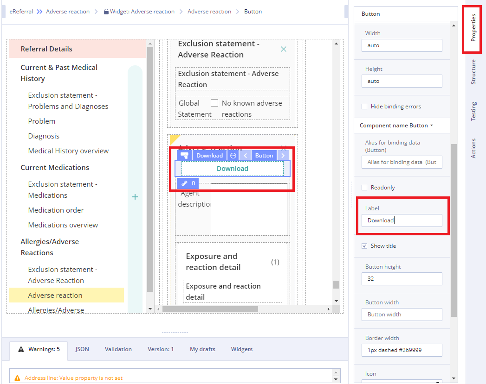
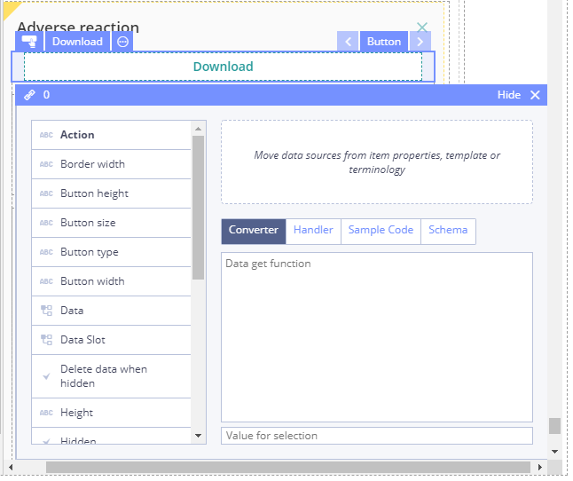

# Button

## Usage 

Graphical control element that appears as element of the [Form](../ehr-forms-forms-in-detail/) to carry out actions such as clearing user input or submitting the form contents to the server.

## Working with Button: 

1\) Go to **Default Library Components** and drag the **Button** from the **Default Library Components** section

2\) In Properties \(on the right\) specify the button title in **Label** field

3\) Specify **Action** property in **Converter** using JS language

For more details see [Form creation\#3.2.1WorkingwithConverter](../ehr-forms-forms-in-detail/ehr-forms-form-creation.md#Formcreation-3.2.1WorkingwithConverter)

