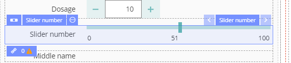
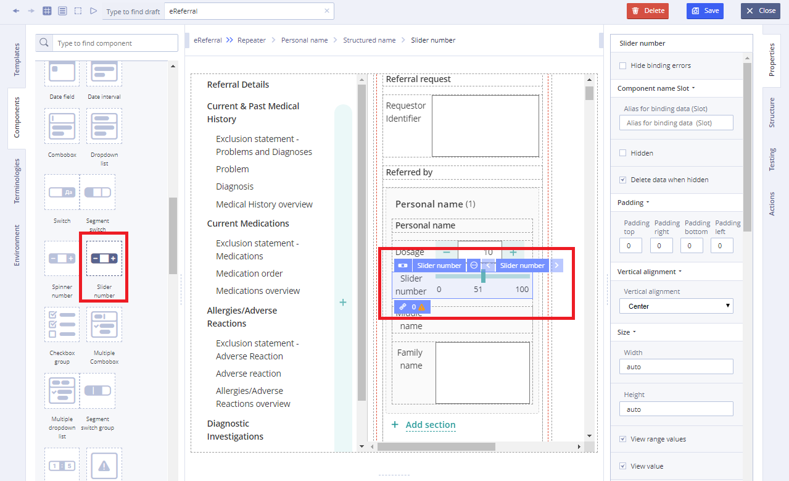
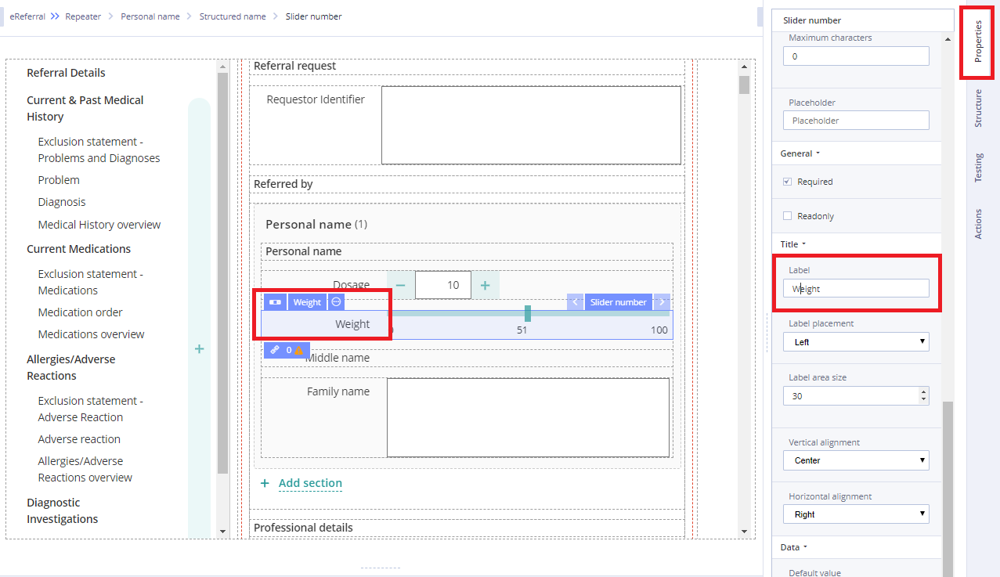
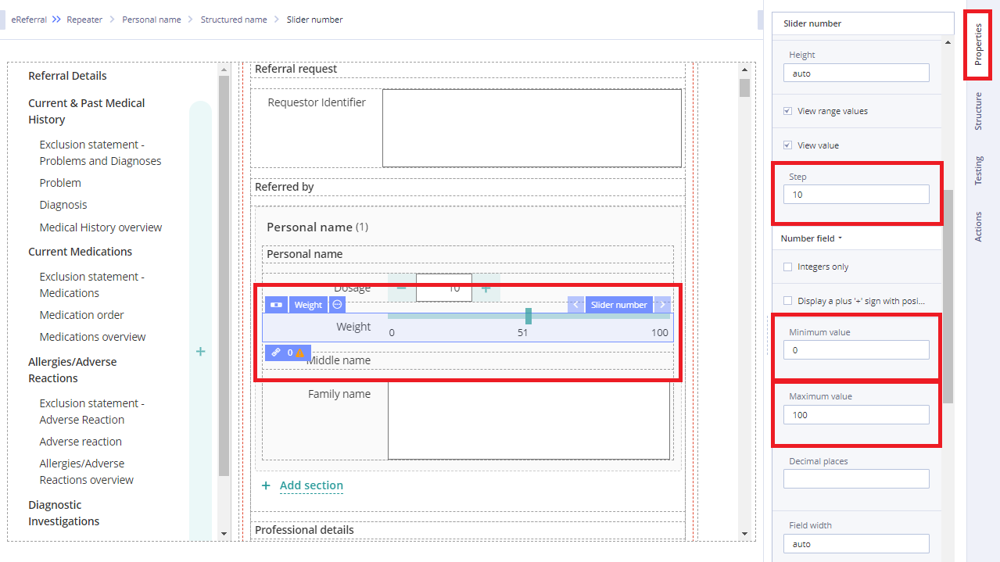

# Slider number

## Usage 

**Sliders** allow users to make selections from a range of values. The basic slider is horizontal and has a single handle that can be moved with the mouse or by using the arrow keys.

## Working with Slider number: 

1\) Go to **Default Library Components** and drag the **Slider number** from the **Default Library Components** section

2\) In **Properties** \(on the right\) specify:

* the **Slider number** title in **Label** field

* the **Slider number** step in **Step** field
* Maximum and minimum value of the **Slider number** in corresponding ****fields

3\) Specify **Value** property by dragging it from the Template  

4\) Specify **Action** property in **Converter** using JS language if necessary

For more details see [Form creation\#3.2.1WorkingwithConverter](../ehr-forms-forms-in-detail/ehr-forms-form-creation.md#Formcreation-3.2.1WorkingwithConverter)

