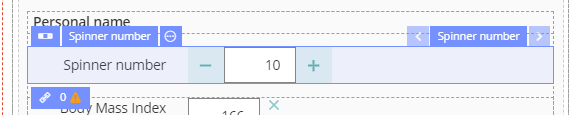
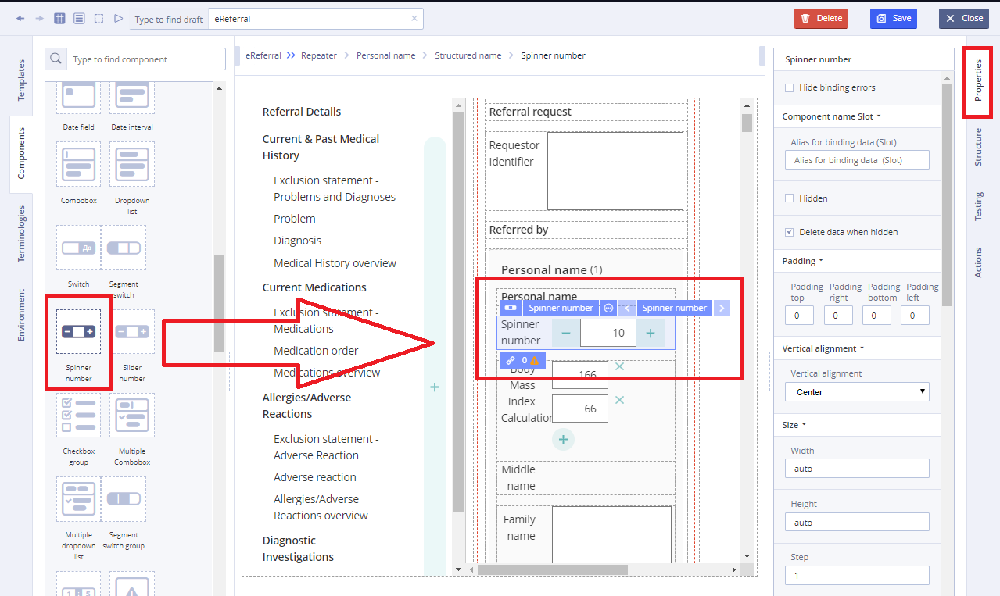
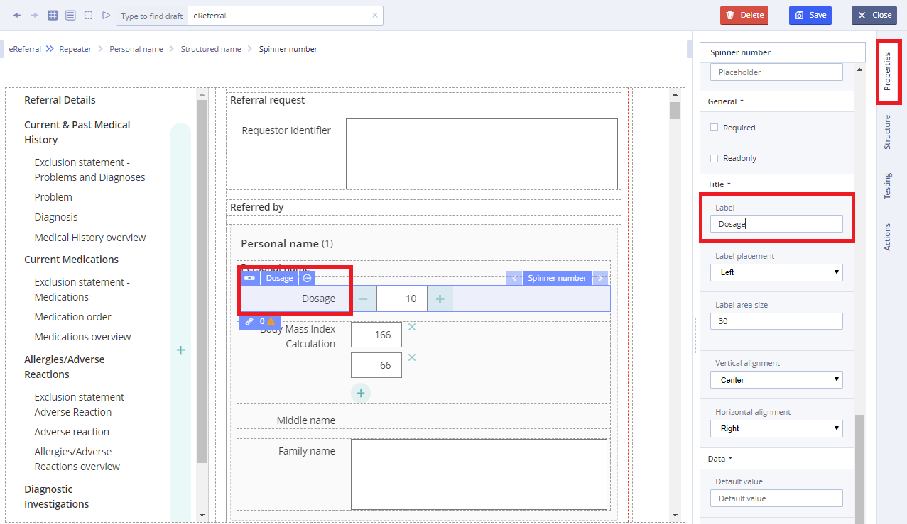

# Spinner number

## Usage 

The Spinner, or number stepper, is perfect for handling all kinds of numeric input. It allows users to type a value directly, or modify an existing value by spinning with the keyboard, mouse or scrollwheel. Spinner wraps a text input with two buttons to increment and decrement the current value.

## Working with Spinner number: 

1\) Go to **Default Library Components** and drag the **Spinner number** from the **Default Library Components** section

2\) In **Properties** \(on the right\) specify the **Spinner number** title in **Label** field

3\) Specify **Value** property by dragging it from the **Template**  

4\) Specify **Action** property in **Converter** using JS language if necessary

For more details see [Form creation\#3.2.1WorkingwithConverter](../ehr-forms-forms-in-detail/ehr-forms-form-creation.md#Formcreation-3.2.1WorkingwithConverter)

