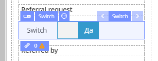
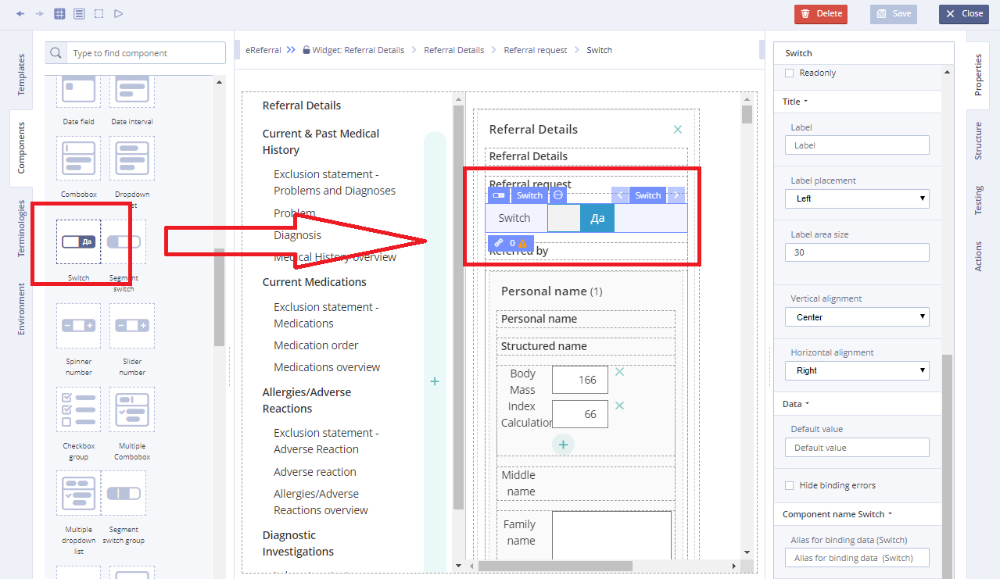
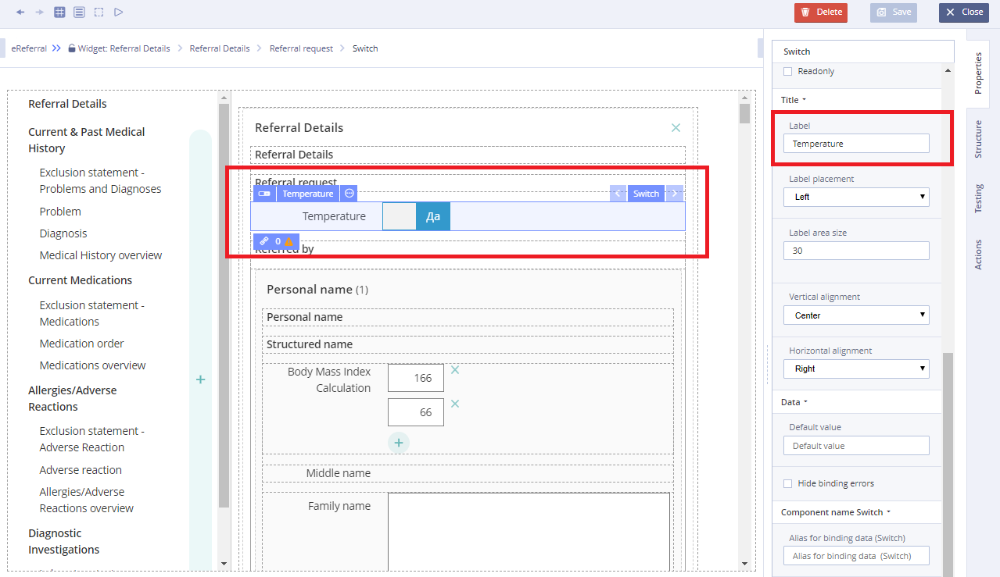

# Switch

## Usage 

Toggle switches are digital on/off switches. They prompt users to choose between two mutually exclusive options and always have a default value. Toggles should provide immediate results, giving users the freedom to control their preferences as needed.

## Working with Switch: 

1\) Go to **Default Library Components** and drag the **Switch** from the **Default Library Components** section

2\) In **Properties** \(on the right\) specify the title in **Label** field

3\) Specify **Action** property in **Converter** using JS language

For more details see [Form creation\#3.2.1WorkingwithConverter](../ehr-forms-forms-in-detail/ehr-forms-form-creation.md#Formcreation-3.2.1WorkingwithConverter)

