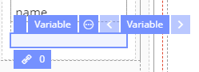
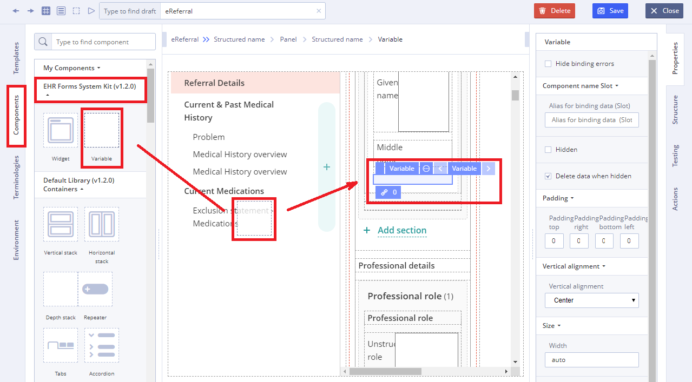
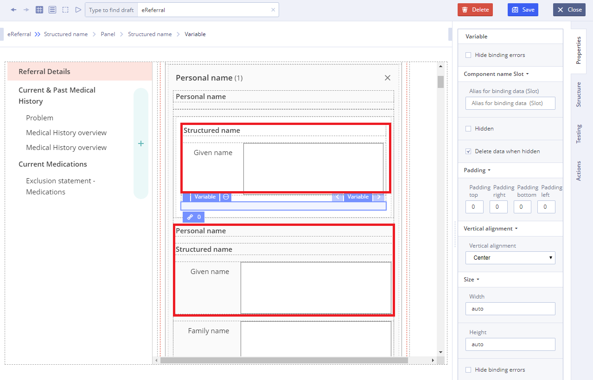

# Variable

Usage

**Variable** **** is a container component, that is used like component separator that helps to display particular arrangement of information grouped together for presentation to users on the [Form](https://wiki.solit-clouds.ru/pages/viewpage.action?pageId=34832642).&#x20;

## Working with Variable: 

1\) Go to **Default Library Components** and drag the**Variable** from the **EHR Forms System Kit** section

2\) Add another component near **Variable** using **EHR Forms System Kit** on **Components** **tab**

3\) Specify necessary properties such as **Data** (which is set using **Chain button**) using data sources of the Template for this new component&#x20;

4\) Specify **Action** property in **Converter** using JS language if necessary

For more details see [Form creation#3.2.1WorkingwithConverter](https://wiki.solit-clouds.ru/display/EHR/Form+creation#Formcreation-3.2.1WorkingwithConverter)
