# Form creation

Quick guide to Form creation contains the following steps:

/\*&lt;!\[CDATA\[\*/  
div.rbtoc1607432782177 {padding: 0px;}  
div.rbtoc1607432782177 ul {list-style: disc;margin-left: 0px;}  
div.rbtoc1607432782177 li {margin-left: 0px;padding-left: 0px;}  
  
/\*\]\]&gt;\*/

* [1. Form creation](ehr-forms-form-creation.md#Formcreation-1.Formcreation)
  * [1.1 Creating new Form](ehr-forms-form-creation.md#Formcreation-1.1CreatingnewForm)
* [2. Filling out the form](ehr-forms-form-creation.md#Formcreation-2.Fillingouttheform)
  * [2.1 Generating the Form from the selected Template\(s\)](ehr-forms-form-creation.md#Formcreation-2.1GeneratingtheFormfromtheselectedTemplate%28s%29)
  * [2.2 Adding Templates to the Form](ehr-forms-form-creation.md#Formcreation-2.2AddingTemplatestotheForm)
  * [2.3 Drag-and-drop to fill the Form](ehr-forms-form-creation.md#Formcreation-2.3Drag-and-droptofilltheForm)
* [3. Configuring Bindings and Properties](ehr-forms-form-creation.md#Formcreation-3.ConfiguringBindingsandProperties)
  * [3.1 Binding components to the selected Template](ehr-forms-form-creation.md#Formcreation-3.1BindingcomponentstotheselectedTemplate)
  * [3.2 Configuring component settings](ehr-forms-form-creation.md#Formcreation-3.2Configuringcomponentsettings)
    * [Configuring component settings using Settings panel](ehr-forms-form-creation.md#Formcreation-ConfiguringcomponentsettingsusingSettingspanel)
    * [Configuring component settings using Component properties](ehr-forms-form-creation.md#Formcreation-ConfiguringcomponentsettingsusingComponentproperties)
  * [3.2.1 Working with Converter](ehr-forms-form-creation.md#Formcreation-3.2.1WorkingwithConverter)
  * [3.2.2 Working with Handler](ehr-forms-form-creation.md#Formcreation-3.2.2WorkingwithHandler)
  * [3.3 Binding External Terminologies to Components](ehr-forms-form-creation.md#Formcreation-3.3BindingExternalTerminologiestoComponents)
* [4. Form validation](ehr-forms-form-creation.md#Formcreation-4.Formvalidation)
* [5. Saving the Form ](ehr-forms-form-creation.md#Formcreation-5.SavingtheForm)

For more details see [Form editing](https://wiki.solit-clouds.ru/display/EHR/Form+editing)

## 1. Form creation <a id="Formcreation-1.Formcreation"></a>

### 1.1 Creating new Form <a id="Formcreation-1.1CreatingnewForm"></a>

To create a new form user needs to click 

* In the **Form Name**, type the name for  new form.
* Click **Select Template\(s\)**.
* From the list, select one or more openEHR templates and click **Check** icon**.** User can use the search box as a filter to limit the templates by name;
* Click **Continue**.

New blank form will be opened in the Form Editor interface where User can start assemble form from components and configuring its properties.

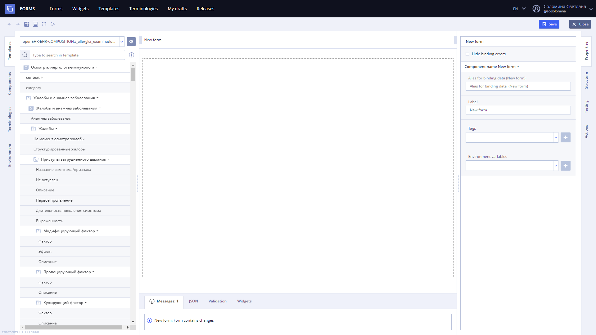

## 2. Filling out the form <a id="Formcreation-2.Fillingouttheform"></a>

### 2.1 Generating the Form from the selected Template\(s\) <a id="Formcreation-2.1GeneratingtheFormfromtheselectedTemplate(s)"></a>

User can drag-and-drop whole composition onto the form, generating each widget:

* Go to **Templates** tab
* Select the upper level template **Composition icon** that is shown on the picture below.
* Drag the template onto the form, so it’s structure will be generated automatically.

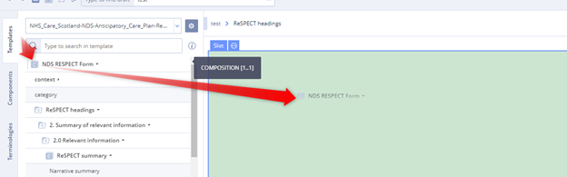

### 2.2 Adding Templates to the Form <a id="Formcreation-2.2AddingTemplatestotheForm"></a>

It is possible to manage form templates while working with form:

* Click on **Add or remove template** button on the **Templates** tab.

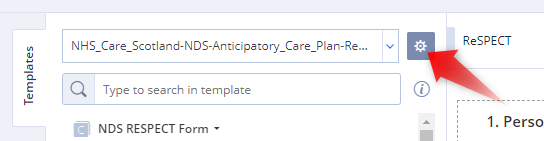

**Tip.** User can use search line below to search within the template archetypes and element groups

* **Check\uncheck** templates from the list that will be used on the form.

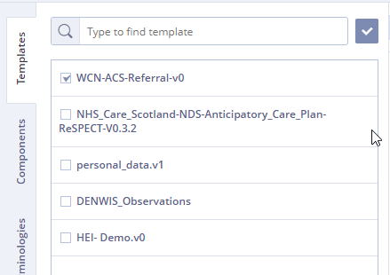

**Warning.** If you delete template with any bindings to the form this will led to errors, so any components should be unbound or deleted from the form before template deleting.

### 2.3 Drag-and-drop to fill the Form <a id="Formcreation-2.3Drag-and-droptofilltheForm"></a>

User can add components from component libraries, available to the user's team, to the form on-the-fly:

* Go to **Components** tab
* Select the component in the **Components library**
* Drag it onto the form

**Tip.** The area where it is allowed to drop will be highlighted in green \(see picture below\)

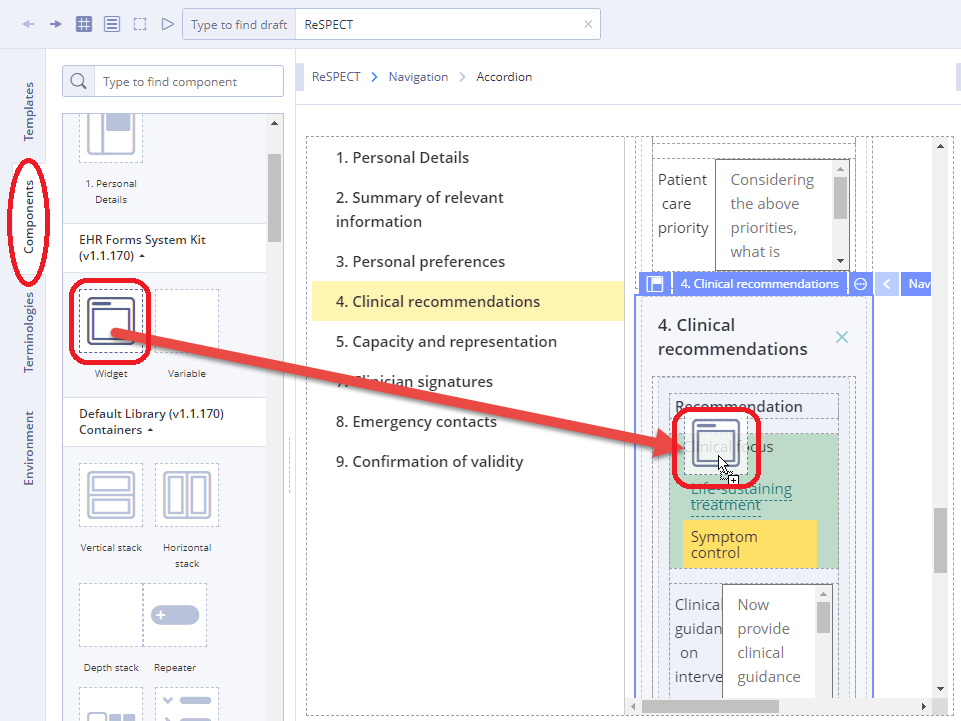

**Tip.** Same drag-and-drop way User can add components to the **My Components library** \(see picture below\). Currently this components are saved locally.

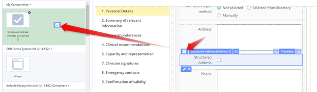

## 3. Configuring Bindings and Properties <a id="Formcreation-3.ConfiguringBindingsandProperties"></a>

### 3.1 Binding components to the selected Template <a id="Formcreation-3.1BindingcomponentstotheselectedTemplate"></a>

To bind component to template field you need to drag field's **Value** into the component's **Value** property.

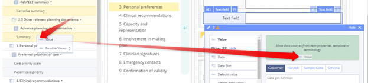

Same way User can bind different template fields to different properties of the component

If the binding is made to a different level of nesting, an error may occur. In a field located in the third level of nesting, you cannot bind a field from the first level, while vice versa it is allowed.

It is possible to bind different component properties to each other

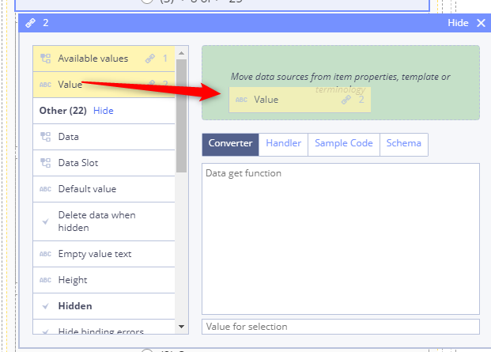

Important

The value binds to the value - where the System allows you to bind. Available values are bind to a list of values if we use internal terminology. The default values from the template are bind to the default values.

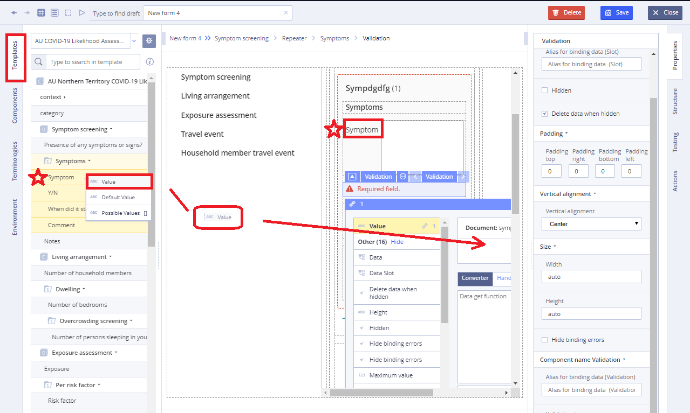

### 3.2 Configuring component settings <a id="Formcreation-3.2Configuringcomponentsettings"></a>

There are two ways to configure component properties:

1. Using [Settings panel](ehr-forms-form-editing/ehr-forms-settings-panel.md)
2. Using component properties

#### Configuring component settings using Settings panel <a id="Formcreation-ConfiguringcomponentsettingsusingSettingspanel"></a>

* Go to [Settings panel](ehr-forms-form-editing/ehr-forms-settings-panel.md)
* Set required parameters

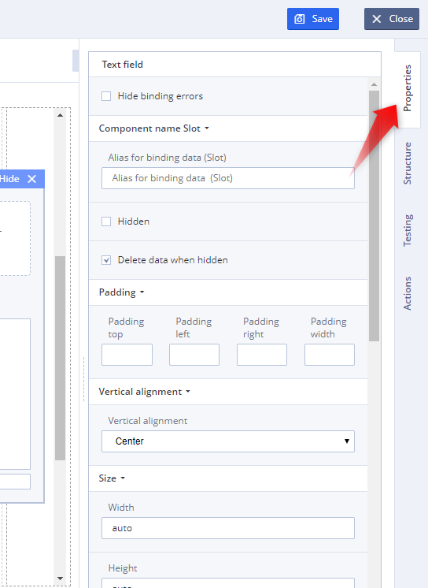

Using **Properties Tab** quick settings can be made such as: padding, alignment, hiding binding errors and other restrictions

For more details see [Settings panel](ehr-forms-form-editing/ehr-forms-settings-panel.md)

#### Configuring component settings using Component properties <a id="Formcreation-ConfiguringcomponentsettingsusingComponentproperties"></a>

* Go to component properties by left click on **Chain icon** of the component
* Set properties and their dependencies

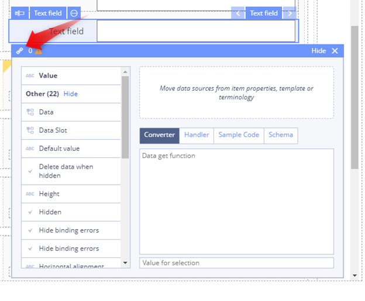

Using **Сomponent properties** User can establish bindings between values, write code in JS for **Converter** and **Handler** for pre and post component processing**.** 

There you need to write JS code, which is executed according to the following rules:

* **The GET function \(converter\)** is called each time the values in the bindings are changed, the result of this function is displayed on the form.
* **The SET function \(handler\)** is called each time the user changes the field, the result of this function is written to the document.

### 3.2.1 Working with Converter <a id="Formcreation-3.2.1WorkingwithConverter"></a>

In the converter, the code must necessarily return a value \(via the **return** keyword\).  
For instance,

```text
return 2 + 3
```

\(property gets value 5\)

or

```text
const result = field1_value + field2_value;
return result
```

\(where **field1\_value** and **field2\_value** are the names of the fields in the binding window above\)

If the converter does not have the word **return**, then this word is automatically substituted before the start of the code.  
For example, if you write in the converter:

```text
2 + 3
```

That the system will automatically substitute return and the property will receive the value 5.  
But if you write in the converter:

```text
const result = field1_value + field2_value;
```

Then, after the automatic substitution of return, the execution of the function will fail, as the resulting construction:

```text
return const result = field1_value + field2_value;
```

not valid in terms of the JS language.If a field with the name **field1\_value** is attached in the binding window and it comes first in the list of bindings, then an empty converter window is equivalent to the code written in it:  
**return field1\_value**

### 3.2.2 Working with Handler <a id="Formcreation-3.2.2WorkingwithHandler"></a>

The handler code already contains the keyword **value**, which contains the value of the component.  
if nothing is written in the handler, and the field with the name **field1\_value** is the first in the binding window, then the following code will be automatically executed in the handler:

```text
field1_value.setValue (value)
```

If you write your own code in the handler, then as a rule, it should contain a call to the **setValue \(\)** function, passing there the value that the property needs to be set.  
For instance,

```text
field1_value.setValue (value);
field2_value.setValue (value + 1)
```

when setting the value to the property where this handler is defined, it will write the value **value** in the **field1\_value** field that corresponds to the value set in the property, then the **value + 1** will be set in the **field2\_value** field.**Important!** If the code above DO NOT contain the string **field1\_value.setValue \(value\)**, then the value in the field **field1\_value** will NOT be set, even if this field is the first in the binding window.

If a field with the name **field1\_value** is attached in the binding window and it comes first in the list of bindings, then an empty handler window is equivalent to the code written in it:  
**field1\_value.setValue \(value\);**

### 3.3 Binding External Terminologies to Components <a id="Formcreation-3.3BindingExternalTerminologiestoComponents"></a>

Select the desirable terminology from the list and drag it to the to the component's **Available values** property.

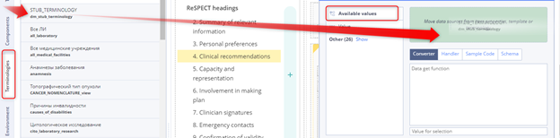

## 4. Form validation <a id="Formcreation-4.Formvalidation"></a>

The system offers various error messages and warnings of various types.

This list contains warnings and errors. By clicking on the error, a transition is made to the field / section containing it \(provided that it is not hidden / minimized now\).

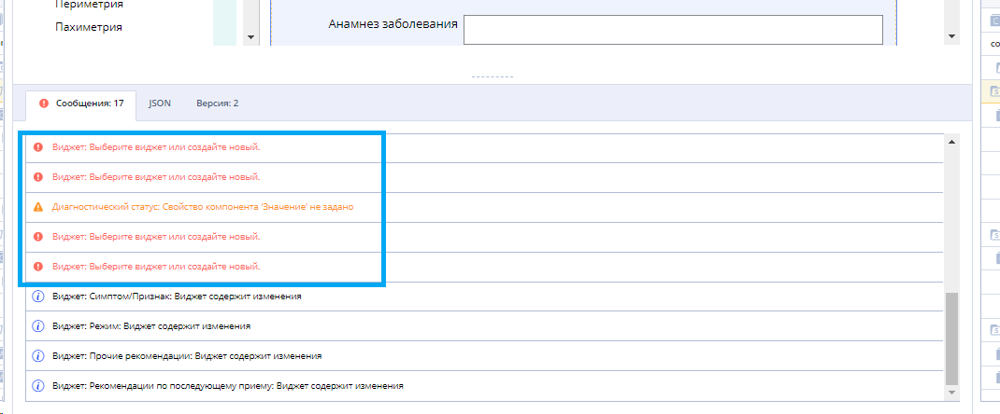

At the same time, for the field / section with an error / warning, the corresponding icons appear:

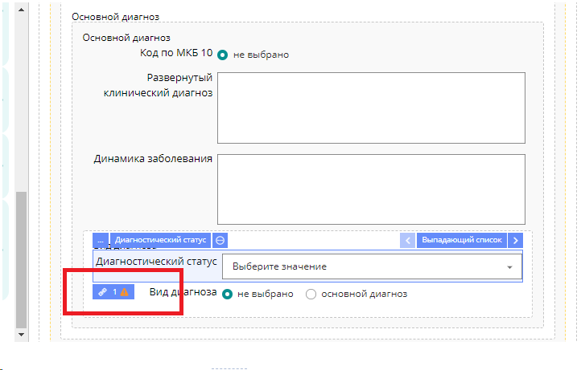

For more details see [Form editing](ehr-forms-form-editing/)

## 5. Saving the Form  <a id="Formcreation-5.SavingtheForm"></a>

To save the filled form User should press 

User can save form as a or completed version that will be available for team work. 

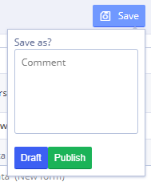

Adding special types of components is being considered in [Form editing](ehr-forms-form-editing/)

