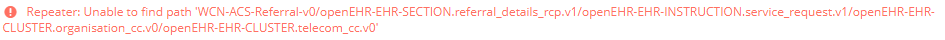

# Developer tools panel

/\*&lt;!\[CDATA\[\*/  
div.rbtoc1607432788995 {padding: 0px;}  
div.rbtoc1607432788995 ul {list-style: disc;margin-left: 0px;}  
div.rbtoc1607432788995 li {margin-left: 0px;padding-left: 0px;}  
  
/\*\]\]&gt;\*/

* [Developer tools panel description](ehr-forms-developer-tools-panel.md#Developertoolspanel-Developertoolspaneldescription)
  * [Messages Tab](ehr-forms-developer-tools-panel.md#Developertoolspanel-MessagesTab)
  * [JSON Tab](ehr-forms-developer-tools-panel.md#Developertoolspanel-JSONTab)
  * [Validation Tab](ehr-forms-developer-tools-panel.md#Developertoolspanel-ValidationTab)
  * [Version Tab](ehr-forms-developer-tools-panel.md#Developertoolspanel-VersionTab)
  * [My drafts Tab](ehr-forms-developer-tools-panel.md#Developertoolspanel-MydraftsTab)
  * [Widgets Tab](ehr-forms-developer-tools-panel.md#Developertoolspanel-WidgetsTab)

| Messages Tab |  |
| :--- | :--- |
| JSON Tab |  |
| Validation Tab |  |
| Version Tab |  |
| My drafts Tab |  |
| Widgets Tab |  |

## Developer tools panel description 

<table>
  <thead>
    <tr>
      <th style="text-align:left">Field</th>
      <th style="text-align:left">Description</th>
      <th style="text-align:left">Example</th>
    </tr>
  </thead>
  <tbody>
    <tr>
      <td style="text-align:left"></td>
      <td style="text-align:left"></td>
      <td style="text-align:left"></td>
    </tr>
    <tr>
      <td style="text-align:left">Tab</td>
      <td style="text-align:left">
        
When you click on a text element, a detailed list of errors and form messages
          is displayed.

        
It can be in several states:

        
<b>Warnings</b> 
          - if there are warnings and no errors in the message list.

        
<b>Errors</b> 
          - if there is at least one error in the message list.

        
<b>Messages</b> 
          - if there are no errors or warnings in the message list.

      </td>
      <td style="text-align:left">
        

          
        

        

          
        

      </td>
    </tr>
    <tr>
      <td style="text-align:left"></td>
      <td style="text-align:left"></td>
      <td style="text-align:left"></td>
    </tr>
    <tr>
      <td style="text-align:left">Refresh</td>
      <td style="text-align:left">Click on this button updates the &quot;Code&quot; field.</td>
      <td style="text-align:left">
        
      </td>
    </tr>
    <tr>
      <td style="text-align:left">Template</td>
      <td style="text-align:left">A drop-down list containing templates to display in JSON format. By default,
        the template selected for the current form is displayed in the Templates
        panel.</td>
      <td style="text-align:left">
        
      </td>
    </tr>
    <tr>
      <td style="text-align:left">Code</td>
      <td style="text-align:left">A text field displaying the form code in JSON format corresponding to
        the selected template in the drop-down list.</td>
      <td style="text-align:left">
        
      </td>
    </tr>
    <tr>
      <td style="text-align:left"></td>
      <td style="text-align:left"></td>
      <td style="text-align:left"></td>
    </tr>
    <tr>
      <td style="text-align:left">Validate</td>
      <td style="text-align:left">Click on this button starting validation process</td>
      <td style="text-align:left">
        
      </td>
    </tr>
    <tr>
      <td style="text-align:left">Validation Error</td>
      <td style="text-align:left">Validation Error Message</td>
      <td style="text-align:left">
        
      </td>
    </tr>
    <tr>
      <td style="text-align:left"></td>
      <td style="text-align:left"></td>
      <td style="text-align:left"></td>
    </tr>
    <tr>
      <td style="text-align:left">Version table</td>
      <td style="text-align:left">Form version table</td>
      <td style="text-align:left">
        
      </td>
    </tr>
    <tr>
      <td style="text-align:left">
        <ul>
          <li>Number</li>
        </ul>
      </td>
      <td style="text-align:left">Version number. Click on this button starting form editing process for
        the selected version.</td>
      <td style="text-align:left">
        
      </td>
    </tr>
    <tr>
      <td style="text-align:left">
        <ul>
          <li>Author</li>
        </ul>
      </td>
      <td style="text-align:left">Version Author</td>
      <td style="text-align:left">
        
      </td>
    </tr>
    <tr>
      <td style="text-align:left">
        <ul>
          <li>Date</li>
        </ul>
      </td>
      <td style="text-align:left">Version creation date. Date format YYYY-MM-DD HH: MM.</td>
      <td style="text-align:left">
        
      </td>
    </tr>
    <tr>
      <td style="text-align:left">
        <ul>
          <li>Comment</li>
        </ul>
      </td>
      <td style="text-align:left">In this field displays the comment which was specified when saving the
        version. If there are no comments for the selected form, the field is empty.</td>
      <td
      style="text-align:left"></td>
    </tr>
    <tr>
      <td style="text-align:left">
        <ul>
          <li>Open in Editor</li>
        </ul>
      </td>
      <td style="text-align:left">Click on this button starting form editing process for the selected version.</td>
      <td
      style="text-align:left">
        
        </td>
    </tr>
    <tr>
      <td style="text-align:left">
        <ul>
          <li>Export</li>
        </ul>
      </td>
      <td style="text-align:left">Click on this button starting exporting form process for the selected
        version.</td>
      <td style="text-align:left">
        
      </td>
    </tr>
    <tr>
      <td style="text-align:left"></td>
      <td style="text-align:left"></td>
      <td style="text-align:left"></td>
    </tr>
    <tr>
      <td style="text-align:left">Draft table</td>
      <td style="text-align:left">Draft table. If there are no drafts for the selected form created by the
        current user, the message &quot;No drafts found&quot; is displayed.</td>
      <td
      style="text-align:left">
        
        </td>
    </tr>
    <tr>
      <td style="text-align:left">
        <ul>
          <li>Date</li>
        </ul>
      </td>
      <td style="text-align:left">The date the draft was last modified.</td>
      <td style="text-align:left">
        
      </td>
    </tr>
    <tr>
      <td style="text-align:left">
        <ul>
          <li>Title</li>
        </ul>
      </td>
      <td style="text-align:left">The name of the draft.</td>
      <td style="text-align:left">
        
      </td>
    </tr>
    <tr>
      <td style="text-align:left">
        <ul>
          <li>Comment</li>
        </ul>
      </td>
      <td style="text-align:left">In this field displays the comment which was specified when saving the
        version. If there are no comments, the field is empty.</td>
      <td style="text-align:left"></td>
    </tr>
    <tr>
      <td style="text-align:left">
        <ul>
          <li>Open in Editor</li>
        </ul>
      </td>
      <td style="text-align:left">Click on this button starting form editing process for the selected version.</td>
      <td
      style="text-align:left">
        
        </td>
    </tr>
    <tr>
      <td style="text-align:left"></td>
      <td style="text-align:left"></td>
      <td style="text-align:left"></td>
    </tr>
    <tr>
      <td style="text-align:left">Widgets table</td>
      <td style="text-align:left">Widgets table. If there are no widgets for the selected form, the message
        &quot;No widgets found&quot; is displayed.</td>
      <td style="text-align:left">
        
      </td>
    </tr>
    <tr>
      <td style="text-align:left">
        <ul>
          <li>Widget</li>
        </ul>
      </td>
      <td style="text-align:left">The name of the widget.</td>
      <td style="text-align:left">
        
      </td>
    </tr>
    <tr>
      <td style="text-align:left">
        <ul>
          <li>Open in Editor</li>
        </ul>
      </td>
      <td style="text-align:left">Click on this button starting widget editing process for the selected
        version.</td>
      <td style="text-align:left">
        
      </td>
    </tr>
    <tr>
      <td style="text-align:left">
        <ul>
          <li>Current version</li>
        </ul>
      </td>
      <td style="text-align:left">Widget version number.</td>
      <td style="text-align:left">
        
      </td>
    </tr>
    <tr>
      <td style="text-align:left">
        <ul>
          <li>Update to</li>
        </ul>
      </td>
      <td style="text-align:left">A drop-down list containing the versions of the widget. By default, the
        latest version of the specified widget is selected. If it differs from
        the current version of the widget, then the &quot;&#x2191;&quot; button
        appears on the right - the new version is larger than the current one or
        &quot;&#x2193;&quot; the new version is smaller than the current.</td>
      <td
      style="text-align:left">
        
        </td>
    </tr>
    <tr>
      <td style="text-align:left">
        <ul>
          <li>Refresh</li>
        </ul>
      </td>
      <td style="text-align:left">Click on this button updates the &quot;Update to&quot; field.</td>
      <td
      style="text-align:left">
        
        </td>
    </tr>
  </tbody>
</table>

