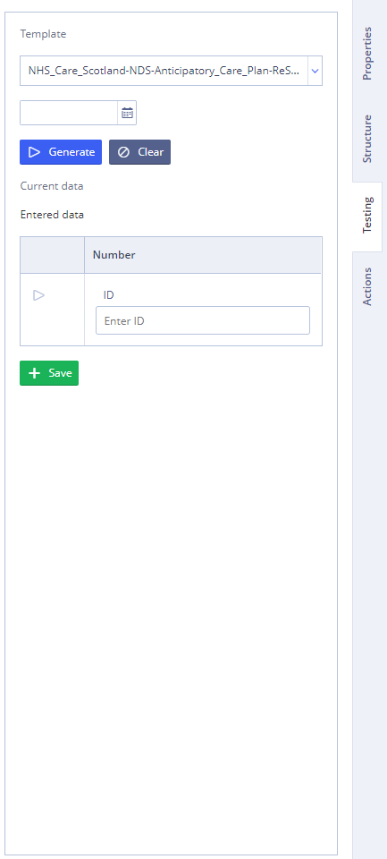

# Settings panel

| Form Properties Tab | Slot Properties Tab | Structure Tab | Testing Tab | Actions Tab |
| :--- | :--- | :--- | :--- | :--- |
|  |  |  |  |  |

## Settings panel description 

<table>
  <thead>
    <tr>
      <th style="text-align:left">Field</th>
      <th style="text-align:left">Description</th>
      <th style="text-align:left">Example</th>
    </tr>
  </thead>
  <tbody>
    <tr>
      <td style="text-align:left">Hide / show the panel</td>
      <td style="text-align:left">Button to hide the panel. When User hover over, it resizes. When clicked,
        hides / opens the navigation bar</td>
      <td style="text-align:left">
        
No cursor

        

          
        

        
On hover

        

          
        

      </td>
    </tr>
    <tr>
      <td style="text-align:left"></td>
      <td style="text-align:left"></td>
      <td style="text-align:left"></td>
    </tr>
    <tr>
      <td style="text-align:left">Form name</td>
      <td style="text-align:left">Form name</td>
      <td style="text-align:left">
        
      </td>
    </tr>
    <tr>
      <td style="text-align:left">Alias for binding data</td>
      <td style="text-align:left"></td>
      <td style="text-align:left">
        
      </td>
    </tr>
    <tr>
      <td style="text-align:left">Hide Binding Errors</td>
      <td style="text-align:left">Can be used for hiding binding errors</td>
      <td style="text-align:left">
        
      </td>
    </tr>
    <tr>
      <td style="text-align:left">Label</td>
      <td style="text-align:left">Form label</td>
      <td style="text-align:left">
        
      </td>
    </tr>
    <tr>
      <td style="text-align:left">Tags</td>
      <td style="text-align:left">Tags</td>
      <td style="text-align:left">
        
      </td>
    </tr>
    <tr>
      <td style="text-align:left">Multiple combo boxes for choosing tag options</td>
      <td style="text-align:left"></td>
      <td style="text-align:left"></td>
    </tr>
    <tr>
      <td style="text-align:left">Tag display area</td>
      <td style="text-align:left"></td>
      <td style="text-align:left"></td>
    </tr>
    <tr>
      <td style="text-align:left">The text of the selected tag</td>
      <td style="text-align:left"></td>
      <td style="text-align:left"></td>
    </tr>
    <tr>
      <td style="text-align:left">Removes the tag. When you hover over the button area of the block, the
        cursor changes to pointer
        , there is a visual selection of the button area
        
      </td>
      <td style="text-align:left"></td>
      <td style="text-align:left"></td>
    </tr>
    <tr>
      <td style="text-align:left">Environment variables</td>
      <td style="text-align:left">The text of the selected tag</td>
      <td style="text-align:left">
        
      </td>
    </tr>
    <tr>
      <td style="text-align:left">Multiple combo boxes for variables options</td>
      <td style="text-align:left"></td>
      <td style="text-align:left"></td>
    </tr>
    <tr>
      <td style="text-align:left">Tag display area</td>
      <td style="text-align:left"></td>
      <td style="text-align:left"></td>
    </tr>
    <tr>
      <td style="text-align:left">The text of the selected tag</td>
      <td style="text-align:left"></td>
      <td style="text-align:left"></td>
    </tr>
    <tr>
      <td style="text-align:left">Removes the tag. When you hover over the button area of the block, the
        cursor changes to pointer
        , there is a visual selection of the button area
        .</td>
      <td style="text-align:left"></td>
      <td style="text-align:left"></td>
    </tr>
    <tr>
      <td style="text-align:left"></td>
      <td style="text-align:left"></td>
      <td style="text-align:left"></td>
    </tr>
    <tr>
      <td style="text-align:left">Slot name</td>
      <td style="text-align:left">Name of the selected slot</td>
      <td style="text-align:left">
        
      </td>
    </tr>
    <tr>
      <td style="text-align:left"></td>
      <td style="text-align:left">The name of the property section. Depending on the type of slot, a slot
        may have a different set of partitions.</td>
      <td style="text-align:left">
        

          
        

        

          
        

      </td>
    </tr>
    <tr>
      <td style="text-align:left">Property</td>
      <td style="text-align:left">Depending on the type of slot, there may be a different set of properties
        for the selected slot</td>
      <td style="text-align:left">
        

          
        

        

          
        

        

          
        

      </td>
    </tr>
    <tr>
      <td style="text-align:left">Overridden values</td>
      <td style="text-align:left">By clicking displays a modal window for overriding values</td>
      <td style="text-align:left">
        
      </td>
    </tr>
    <tr>
      <td style="text-align:left"></td>
      <td style="text-align:left"></td>
      <td style="text-align:left"></td>
    </tr>
    <tr>
      <td style="text-align:left">Element search</td>
      <td style="text-align:left">
        
Searches for structural elements.

        
If no value is entered, the prompt &quot;Find item&quot; is displayed.

      </td>
      <td style="text-align:left">
        
      </td>
    </tr>
    <tr>
      <td style="text-align:left"><b>Component group</b>
      </td>
      <td style="text-align:left"></td>
      <td style="text-align:left">
        
      </td>
    </tr>
    <tr>
      <td style="text-align:left">
        <ul>
          <li>Icon</li>
        </ul>
      </td>
      <td style="text-align:left">The icon is determined by the type of this component.</td>
      <td style="text-align:left">
        
        
      </td>
    </tr>
    <tr>
      <td style="text-align:left">
        <ul>
          <li>Name</li>
        </ul>
      </td>
      <td style="text-align:left">
        
The name of the component block. By click:

        <ul>
          <li>highlights the component block and all components inside with color</li>
          <li>selects the corresponding panel in the workspace</li>
        </ul>
        
When you click on the selected group again, collapses / expands the group.

      </td>
      <td style="text-align:left">
        
Group

        

          
        

        
Selected group

        

          
        

      </td>
    </tr>
    <tr>
      <td style="text-align:left">Possible actions</td>
      <td style="text-align:left">Appears when you hover over a component.</td>
      <td style="text-align:left">
        
      </td>
    </tr>
    <tr>
      <td style="text-align:left">List of possible actions</td>
      <td style="text-align:left">
        
Possible actions:

        <ul>
          <li><b>Clear</b> - removes all components from the group</li>
          <li><b>Delete</b> - deletes a component group</li>
          <li><b>Move up</b> - transfers a group of components above another</li>
          <li><b>Move down</b> - transfers a group of components below another</li>
        </ul>
      </td>
      <td style="text-align:left">
        
      </td>
    </tr>
    <tr>
      <td style="text-align:left"><b>Component</b>
      </td>
      <td style="text-align:left"></td>
      <td style="text-align:left">
        
      </td>
    </tr>
    <tr>
      <td style="text-align:left">
        <ul>
          <li>Icon</li>
        </ul>
      </td>
      <td style="text-align:left">The icon is determined by the type of this component.</td>
      <td style="text-align:left">
        
      </td>
    </tr>
    <tr>
      <td style="text-align:left">
        <ul>
          <li>Name</li>
        </ul>
      </td>
      <td style="text-align:left">
        
The name of the component. By click:

        <ul>
          <li>highlights component</li>
          <li>selects the corresponding panel in the workspace of <b>Editor panel</b>
          </li>
        </ul>
      </td>
      <td style="text-align:left">
        
      </td>
    </tr>
    <tr>
      <td style="text-align:left">
        <ul>
          <li>Possible actions</li>
        </ul>
      </td>
      <td style="text-align:left">Appears when you hover over a component group.</td>
      <td style="text-align:left">
        
      </td>
    </tr>
    <tr>
      <td style="text-align:left">
        <ul>
          <li>List of possible actions</li>
        </ul>
      </td>
      <td style="text-align:left">
        
Possible actions:

        <ul>
          <li><b>Clear</b> - deletes all component values</li>
          <li><b>Delete</b> - removes the component</li>
          <li><b>Above</b> - transfers a component above another</li>
          <li><b>Below</b> - transfers component below another</li>
        </ul>
      </td>
      <td style="text-align:left">
        
      </td>
    </tr>
    <tr>
      <td style="text-align:left"></td>
      <td style="text-align:left"></td>
      <td style="text-align:left"></td>
    </tr>
    <tr>
      <td style="text-align:left">Template</td>
      <td style="text-align:left">Selecting the template for testing</td>
      <td style="text-align:left">
        
      </td>
    </tr>
    <tr>
      <td style="text-align:left">Date</td>
      <td style="text-align:left">Selecting the date of the template</td>
      <td style="text-align:left">
        
      </td>
    </tr>
    <tr>
      <td style="text-align:left">Generate</td>
      <td style="text-align:left">Generates values in the components of the form. Generates data according
        to the template and fills form fields with them.</td>
      <td style="text-align:left">
        
      </td>
    </tr>
    <tr>
      <td style="text-align:left">Clear</td>
      <td style="text-align:left">Clears all values in the components of the form</td>
      <td style="text-align:left">
        
      </td>
    </tr>
    <tr>
      <td style="text-align:left">Current data</td>
      <td style="text-align:left">
        
Displays the input source. Shows how the data was received.

        
May take values:

        <ul>
          <li>Entered data</li>
          <li>Generated data</li>
          <li>Document data</li>
        </ul>
        
The <b>GET</b> function is called each time the values in the bindings are
          changed, the result of this function is displayed on the form.
           The <b>SET</b> function is called every time the user changes the field,
          the result of this function is written to the document.

      </td>
      <td style="text-align:left">
        
        
        
      </td>
    </tr>
    <tr>
      <td style="text-align:left">Table of saved template filling tests</td>
      <td style="text-align:left"></td>
      <td style="text-align:left">
        
      </td>
    </tr>
    <tr>
      <td style="text-align:left">
        <ul>
          <li>Retrieve</li>
        </ul>
      </td>
      <td style="text-align:left">Retrieves data from a saved example that was saved using the <b>Save</b> button.</td>
      <td
      style="text-align:left">
        
        </td>
    </tr>
    <tr>
      <td style="text-align:left">
        <ul>
          <li>Identifier</li>
        </ul>
      </td>
      <td style="text-align:left">Identifier of the example of the template filling test.</td>
      <td style="text-align:left">
        
      </td>
    </tr>
    <tr>
      <td style="text-align:left">Save</td>
      <td style="text-align:left">Saves the template filling test</td>
      <td style="text-align:left">
        
      </td>
    </tr>
    <tr>
      <td style="text-align:left"></td>
      <td style="text-align:left"></td>
      <td style="text-align:left"></td>
    </tr>
    <tr>
      <td style="text-align:left">Data</td>
      <td style="text-align:left">
        
User Actions Log, which contains:

        <ul>
          <li><b>Action</b> - name of the logged action</li>
          <li><b>Value</b> - indicates the value entered into the component</li>
          <li><b>Component</b> - name of the component, where action was made</li>
          <li><b>Field name</b> - name of the field, where action was made</li>
          <li><b>Path</b> - the path to the component</li>
          <li><b>Time</b> - time and date of the logged action</li>
        </ul>
        
Clicking on the
          button generates new<b> User Actions Log</b>.

      </td>
      <td style="text-align:left">
        
      </td>
    </tr>
    <tr>
      <td style="text-align:left">Export</td>
      <td style="text-align:left">Exports <b>User Actions Log</b> to the JSON file</td>
      <td style="text-align:left">
        
      </td>
    </tr>
    <tr>
      <td style="text-align:left">Import</td>
      <td style="text-align:left">Imports <b>User Actions Log</b> to the JSON file</td>
      <td style="text-align:left">
        
      </td>
    </tr>
  </tbody>
</table>

