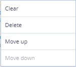
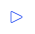

# Settings panel

| Form Properties Tab                        | Slot Properties Tab                        | Structure Tab                              | Testing Tab                                | Actions Tab                                |
| ------------------------------------------ | ------------------------------------------ | ------------------------------------------ | ------------------------------------------ | ------------------------------------------ |
|  |  |  |  |  |

## Settings panel description 

| Field                                                                                                                                                                                                                                   | Description                                                                                                                                                                                                                                                                                                                                                                                                                                                                                                                                                                                                                        | Example                                                                                                                                                                                       |
| --------------------------------------------------------------------------------------------------------------------------------------------------------------------------------------------------------------------------------------- | ---------------------------------------------------------------------------------------------------------------------------------------------------------------------------------------------------------------------------------------------------------------------------------------------------------------------------------------------------------------------------------------------------------------------------------------------------------------------------------------------------------------------------------------------------------------------------------------------------------------------------------- | --------------------------------------------------------------------------------------------------------------------------------------------------------------------------------------------- |
| Hide / show the panel                                                                                                                                                                                                                   | Button to hide the panel. When User hover over, it resizes. When clicked, hides / opens the navigation bar                                                                                                                                                                                                                                                                                                                                                                                                                                                                                                                         | 
No cursor

On hover

                                 |
|                                                                                                                                                                                                                                         |                                                                                                                                                                                                                                                                                                                                                                                                                                                                                                                                                                                                                                    |                                                                                                                                                                                               |
| Form name                                                                                                                                                                                                                               | Form name                                                                                                                                                                                                                                                                                                                                                                                                                                                                                                                                                                                                                          |                                                                                                                                                     |
| Alias for binding data                                                                                                                                                                                                                  |                                                                                                                                                                                                                                                                                                                                                                                                                                                                                                                                                                                                                                    |                                                                                                                                                     |
| Hide Binding Errors                                                                                                                                                                                                                     | Can be used for hiding binding errors                                                                                                                                                                                                                                                                                                                                                                                                                                                                                                                                                                                              |                                                                                                                                                     |
| Label                                                                                                                                                                                                                                   | Form label                                                                                                                                                                                                                                                                                                                                                                                                                                                                                                                                                                                                                         |                                                                                                                                                     |
| Tags                                                                                                                                                                                                                                    | Tags                                                                                                                                                                                                                                                                                                                                                                                                                                                                                                                                                                                                                               |                                                                                                                                                     |
| Multiple combo boxes for choosing tag options                                                                                                                                                                                           |                                                                                                                                                                                                                                                                                                                                                                                                                                                                                                                                                                                                                                    |                                                                                                                                                                                               |
| Tag display area                                                                                                                                                                                                                        |                                                                                                                                                                                                                                                                                                                                                                                                                                                                                                                                                                                                                                    |                                                                                                                                                                                               |
| The text of the selected tag                                                                                                                                                                                                            |                                                                                                                                                                                                                                                                                                                                                                                                                                                                                                                                                                                                                                    |                                                                                                                                                                                               |
| Removes the tag. When you hover over the button area of the block, the cursor changes to pointer , there is a visual selection of the button area   |                                                                                                                                                                                                                                                                                                                                                                                                                                                                                                                                                                                                                                    |                                                                                                                                                                                               |
| Environment variables                                                                                                                                                                                                                   | The text of the selected tag                                                                                                                                                                                                                                                                                                                                                                                                                                                                                                                                                                                                       |                                                                                                                                                     |
| Multiple combo boxes for variables options                                                                                                                                                                                              |                                                                                                                                                                                                                                                                                                                                                                                                                                                                                                                                                                                                                                    |                                                                                                                                                                                               |
| Tag display area                                                                                                                                                                                                                        |                                                                                                                                                                                                                                                                                                                                                                                                                                                                                                                                                                                                                                    |                                                                                                                                                                                               |
| The text of the selected tag                                                                                                                                                                                                            |                                                                                                                                                                                                                                                                                                                                                                                                                                                                                                                                                                                                                                    |                                                                                                                                                                                               |
| Removes the tag. When you hover over the button area of the block, the cursor changes to pointer , there is a visual selection of the button area . |                                                                                                                                                                                                                                                                                                                                                                                                                                                                                                                                                                                                                                    |                                                                                                                                                                                               |
|                                                                                                                                                                                                                                         |                                                                                                                                                                                                                                                                                                                                                                                                                                                                                                                                                                                                                                    |                                                                                                                                                                                               |
| Slot name                                                                                                                                                                                                                               | Name of the selected slot                                                                                                                                                                                                                                                                                                                                                                                                                                                                                                                                                                                                          |                                                                                                                                                     |
|                                                                                                                                                                                                                                         | The name of the property section. Depending on the type of slot, a slot may have a different set of partitions.                                                                                                                                                                                                                                                                                                                                                                                                                                                                                                                    | 

                                                                |
| Property                                                                                                                                                                                                                                | Depending on the type of slot, there may be a different set of properties for the selected slot                                                                                                                                                                                                                                                                                                                                                                                                                                                                                                                                    | 

 |
| Overridden values                                                                                                                                                                                                                       | By clicking displays a modal window for overriding values                                                                                                                                                                                                                                                                                                                                                                                                                                                                                                                                                                          |                                                                                                                                                     |
|                                                                                                                                                                                                                                         |                                                                                                                                                                                                                                                                                                                                                                                                                                                                                                                                                                                                                                    |                                                                                                                                                                                               |
| Element search                                                                                                                                                                                                                          | 
Searches for structural elements.

If no value is entered, the prompt "Find item" is displayed.
                                                                                                                                                                                                                                                                                                                                                                                                                                                                                                                        |                                                                                                                                                     |
| **Component group**                                                                                                                                                                                                                     |                                                                                                                                                                                                                                                                                                                                                                                                                                                                                                                                                                                                                                    |                                                                                                                                                     |
| <ul><li>Icon</li></ul>                                                                                                                                                                                                                  | The icon is determined by the type of this component.                                                                                                                                                                                                                                                                                                                                                                                                                                                                                                                                                                              |                                                                                                           |
| <ul><li>Name</li></ul>                                                                                                                                                                                                                  | 
The name of the component block. By click:
<ul><li>highlights the component block and all components inside with color</li><li>selects the corresponding panel in the workspace</li></ul>
When you click on the selected group again, collapses / expands the group.
                                                                                                                                                                                                                                                                                                                                                   | 
Group

Selected group

                               |
| Possible actions                                                                                                                                                                                                                        | Appears when you hover over a component.                                                                                                                                                                                                                                                                                                                                                                                                                                                                                                                                                                                           |                                                                                                                                                     |
| List of possible actions                                                                                                                                                                                                                | 
Possible actions:
<ul><li><strong>Clear</strong> - removes all components from the group</li><li><strong>Delete</strong> - deletes a component group</li><li><strong>Move up</strong> - transfers a group of components above another</li><li><strong>Move down</strong> - transfers a group of components below another</li></ul>                                                                                                                                                                                                                                                                                           |                                                                                                                                                     |
| **Component**                                                                                                                                                                                                                           |                                                                                                                                                                                                                                                                                                                                                                                                                                                                                                                                                                                                                                    |                                                                                                                                                     |
| <ul><li>Icon</li></ul>                                                                                                                                                                                                                  | The icon is determined by the type of this component.                                                                                                                                                                                                                                                                                                                                                                                                                                                                                                                                                                              |                                                                                                                                                     |
| <ul><li>Name</li></ul>                                                                                                                                                                                                                  | 
The name of the component. By click:
<ul><li>highlights component</li><li>selects the corresponding panel in the workspace of <strong>Editor panel</strong></li></ul>                                                                                                                                                                                                                                                                                                                                                                                                                                                        |                                                                                                                                                     |
| <ul><li>Possible actions</li></ul>                                                                                                                                                                                                      | Appears when you hover over a component group.                                                                                                                                                                                                                                                                                                                                                                                                                                                                                                                                                                                     |                                                                                                                                                     |
| <ul><li>List of possible actions</li></ul>                                                                                                                                                                                              | 
Possible actions:
<ul><li><strong>Clear</strong> - deletes all component values</li><li><strong>Delete</strong> - removes the component</li><li><strong>Above</strong> - transfers a component above another</li><li><strong>Below</strong> - transfers component below another</li></ul>                                                                                                                                                                                                                                                                                                                                    |                                                                                                                                                     |
|                                                                                                                                                                                                                                         |                                                                                                                                                                                                                                                                                                                                                                                                                                                                                                                                                                                                                                    |                                                                                                                                                                                               |
| Template                                                                                                                                                                                                                                | Selecting the template for testing                                                                                                                                                                                                                                                                                                                                                                                                                                                                                                                                                                                                 |                                                                                                                                                     |
| Date                                                                                                                                                                                                                                    | Selecting the date of the template                                                                                                                                                                                                                                                                                                                                                                                                                                                                                                                                                                                                 |                                                                                                                                                     |
| Generate                                                                                                                                                                                                                                | Generates values in the components of the form. Generates data according to the template and fills form fields with them.                                                                                                                                                                                                                                                                                                                                                                                                                                                                                                          |                                                                                                                                                     |
| Clear                                                                                                                                                                                                                                   | Clears all values in the components of the form                                                                                                                                                                                                                                                                                                                                                                                                                                                                                                                                                                                    |                                                                                                                                                     |
| Current data                                                                                                                                                                                                                            | 
Displays the input source. Shows how the data was received.

May take values:
<ul><li>Entered data</li><li>Generated data</li><li>Document data</li></ul>
The <strong>GET</strong> function is called each time the values in the bindings are changed, the result of this function is displayed on the form. The <strong>SET</strong> function is called every time the user changes the field, the result of this function is written to the document.
                                                                                                                                                       |                                                                 |
| Table of saved template filling tests                                                                                                                                                                                                   |                                                                                                                                                                                                                                                                                                                                                                                                                                                                                                                                                                                                                                    |                                                                                                                                                     |
| <ul><li>Retrieve</li></ul>                                                                                                                                                                                                              | Retrieves data from a saved example that was saved using the **Save** button.                                                                                                                                                                                                                                                                                                                                                                                                                                                                                                                                                      |                                                                                                                                                     |
| <ul><li>Identifier</li></ul>                                                                                                                                                                                                            | Identifier of the example of the template filling test.                                                                                                                                                                                                                                                                                                                                                                                                                                                                                                                                                                            |                                                                                                                                                     |
| Save                                                                                                                                                                                                                                    | Saves the template filling test                                                                                                                                                                                                                                                                                                                                                                                                                                                                                                                                                                                                    |                                                                                                                                                     |
|                                                                                                                                                                                                                                         |                                                                                                                                                                                                                                                                                                                                                                                                                                                                                                                                                                                                                                    |                                                                                                                                                                                               |
| Data                                                                                                                                                                                                                                    | 
User Actions Log, which contains:
<ul><li><strong>Action</strong> - name of the logged action</li><li><strong>Value</strong> - indicates the value entered into the component </li><li><strong>Component</strong> - name of the component, where action was made</li><li><strong>Field name</strong> - name of the field, where action was made</li><li><strong>Path</strong> - the path to the component</li><li><strong>Time</strong> - time and date of the logged action</li></ul>
Clicking on the button generates new <strong>User Actions Log</strong>.
 |                                                                                                                                                     |
| Export                                                                                                                                                                                                                                  | Exports **User Actions Log** to the JSON file                                                                                                                                                                                                                                                                                                                                                                                                                                                                                                                                                                                      |                                                                                                                                                     |
| Import                                                                                                                                                                                                                                  | Imports **User Actions Log** to the JSON file                                                                                                                                                                                                                                                                                                                                                                                                                                                                                                                                                                                      |                                                                                                                                                     |
