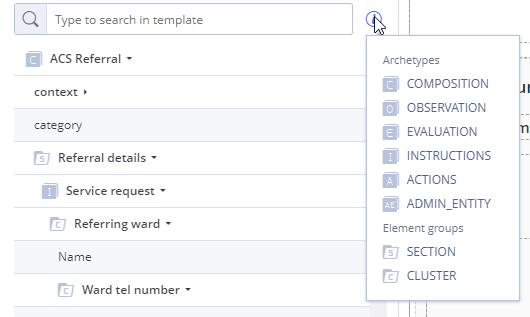

# Source panel

## Source panel 

| Templates Tab | Components Tab | Terminologies Tab | Environment Tab |
| :--- | :--- | :--- | :--- |
|  |  |  |  |

## Source panel description 

<table>
  <thead>
    <tr>
      <th style="text-align:left">Field</th>
      <th style="text-align:left">Description</th>
      <th style="text-align:left">Example</th>
    </tr>
  </thead>
  <tbody>
    <tr>
      <td style="text-align:left">Hide / show the panel</td>
      <td style="text-align:left">Button to hide/show the panel. When user hovers over, it resizes. When
        clicked, hides/opens the source bar.</td>
      <td style="text-align:left">
        
No cursor

        

          
        

        
Cursor is on the button

        

          
        

      </td>
    </tr>
    <tr>
      <td style="text-align:left"></td>
      <td style="text-align:left"></td>
      <td style="text-align:left"></td>
    </tr>
    <tr>
      <td style="text-align:left">Template</td>
      <td style="text-align:left">List of openEHR templates. When user select a template, template structure
        of the selected template displaying on the Templates panel.</td>
      <td style="text-align:left">
        
      </td>
    </tr>
    <tr>
      <td style="text-align:left">Add or remove template</td>
      <td style="text-align:left">
        
Opens a search in the list of templates.

        
When hovering, displays the hint: &quot;Add or remove template&quot;

      </td>
      <td style="text-align:left">
        
      </td>
    </tr>
    <tr>
      <td style="text-align:left">Search in the template</td>
      <td style="text-align:left">Type to search in the template</td>
      <td style="text-align:left">
        
      </td>
    </tr>
    <tr>
      <td style="text-align:left">
        <ul>
          <li>Search line</li>
        </ul>
      </td>
      <td style="text-align:left">Search in the template structure. When User enters the first character
        in the list, elements that match the search conditions remain. In this
        case, matching characters in the search line and in the name of the template
        are highlighted in yellow.</td>
      <td style="text-align:left">
        
      </td>
    </tr>
    <tr>
      <td style="text-align:left">
        <ul>
          <li>Confirmation button</li>
        </ul>
      </td>
      <td style="text-align:left">Confirmation button for selected templates. Button initiates the method <em>Obtaining a template by identifier</em> execution
        for the selected templates and closes the search for templates.</td>
      <td
      style="text-align:left">
        
        </td>
    </tr>
    <tr>
      <td style="text-align:left">
        <ul>
          <li>List of templates</li>
        </ul>
      </td>
      <td style="text-align:left">Drop-down list of templates. User can select multiple templates using
        check-boxes.</td>
      <td style="text-align:left">
        
      </td>
    </tr>
    <tr>
      <td style="text-align:left">Information icon</td>
      <td style="text-align:left">When hovering, the &#x201C;Template Legend&#x201D; pop-up panel is displayed.</td>
      <td
      style="text-align:left">
        
        </td>
    </tr>
    <tr>
      <td style="text-align:left">Template Legend</td>
      <td style="text-align:left">Template legend with a list of archetypes and groups of elements of selected
        templates. Each legend item has a component name and an icon determined
        by the type of this component.</td>
      <td style="text-align:left">
        
      </td>
    </tr>
    <tr>
      <td style="text-align:left">Template structure</td>
      <td style="text-align:left">
        
List of archetypes and archetype fields. On hover:

        <ul>
          <li>A tooltip is displayed with the name and plurality of the field in openEHR
            format</li>
          <li>Pointer style changes to Drag&apos;n&apos;Drop. User can drag an item
            into the form editing area.</li>
          <li>(for fields only) Icon
            is displayed . By clicking opens a drop-down list with the properties
            of the element.</li>
          <li>If the element is not located last in the tree, then when User clicks
            on triangle button near it, the tree collapses.</li>
        </ul>
        
By default, all elements of the template are expanded.

      </td>
      <td style="text-align:left">
        
      </td>
    </tr>
    <tr>
      <td style="text-align:left">
        <ul>
          <li>
            <ul>
              <li>&quot;Element Properties&quot; drop-down list</li>
            </ul>
          </li>
        </ul>
      </td>
      <td style="text-align:left">
        
The name and the value of the property.

        
When User hover over a block element, pointer style changes to Drag&apos;n&apos;Drop.
          User can drag a block element to the toolbar in the <b>Editor panel</b>.

      </td>
      <td style="text-align:left">
        
      </td>
    </tr>
    <tr>
      <td style="text-align:left"></td>
      <td style="text-align:left"></td>
      <td style="text-align:left"></td>
    </tr>
    <tr>
      <td style="text-align:left">Search</td>
      <td style="text-align:left">Search in the list of components. When User enter a value in the list
        of components, only components that match under the search conditions are
        displayed.</td>
      <td style="text-align:left">
        
      </td>
    </tr>
    <tr>
      <td style="text-align:left">Component library name</td>
      <td style="text-align:left">By clicking collapses / expands the component library</td>
      <td style="text-align:left">
        
      </td>
    </tr>
    <tr>
      <td style="text-align:left">Component</td>
      <td style="text-align:left">On hover pointer style changes to Drag&apos;n&apos;Drop. The component
        can be placed in the draft editing area.</td>
      <td style="text-align:left">
        
      </td>
    </tr>
    <tr>
      <td style="text-align:left"></td>
      <td style="text-align:left"></td>
      <td style="text-align:left"></td>
    </tr>
    <tr>
      <td style="text-align:left">Search</td>
      <td style="text-align:left">Search through a list of terminologies. When User enters a value in the
        terminology list, only terminologies that match under the search conditions
        are displayed.</td>
      <td style="text-align:left">
        
      </td>
    </tr>
    <tr>
      <td style="text-align:left">Refresh</td>
      <td style="text-align:left">Button initialises the method <em>Getting a list of terminological services</em> by
        the terminology service code execution to obtain a list of terminologies.</td>
      <td
      style="text-align:left">
        
        </td>
    </tr>
    <tr>
      <td style="text-align:left">Terminology service</td>
      <td style="text-align:left">Name of terminological service. By clicking on a line collapses / expands
        the list of terminologies.</td>
      <td style="text-align:left">
        
      </td>
    </tr>
    <tr>
      <td style="text-align:left">Terminology</td>
      <td style="text-align:left">Name of terminology. When User hover over the cursor, the style of the
        pointer changes to Drag&apos;n&apos;Drop. You can drag the terminology
        into the slot data source.</td>
      <td style="text-align:left">
        
      </td>
    </tr>
    <tr>
      <td style="text-align:left"></td>
      <td style="text-align:left"></td>
      <td style="text-align:left"></td>
    </tr>
    <tr>
      <td style="text-align:left">Search</td>
      <td style="text-align:left">Search through a list of environment variables. When User enter a value
        in the environment list, only environment variables for the search conditions
        are displayed.</td>
      <td style="text-align:left">
        
      </td>
    </tr>
    <tr>
      <td style="text-align:left">Environment variable</td>
      <td style="text-align:left">The name of the environment variable. On hover the style of the pointer
        changes to Drag&apos;n&apos;Drop. The environment variable can be dragged
        into the slot data source.</td>
      <td style="text-align:left">
        
      </td>
    </tr>
  </tbody>
</table>

