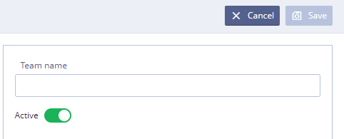
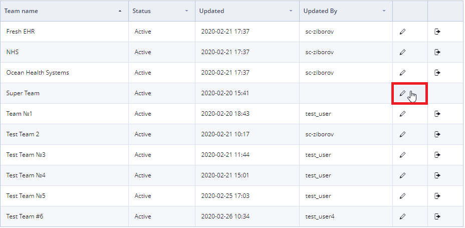
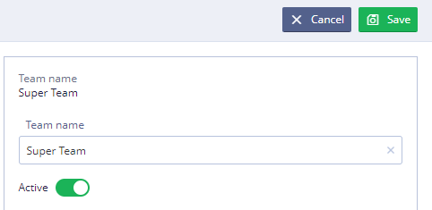
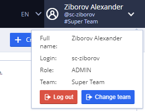
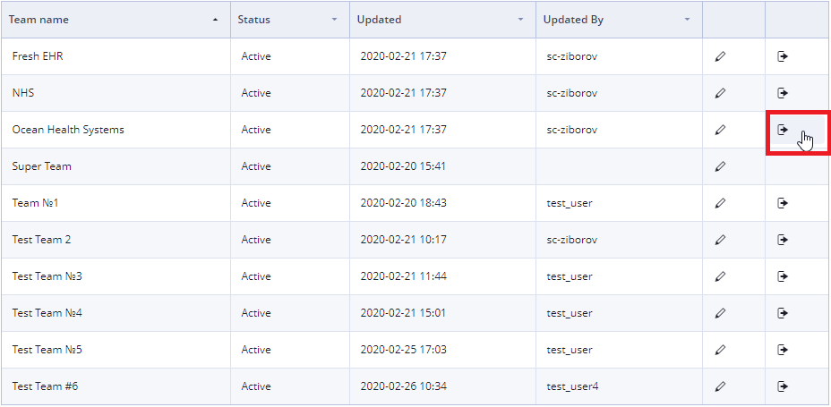

# Teams \(in detail\)

Each user has a username and password as part of the team. If one person has access to several teams, then in each team he will have his own username and password.  
The team members can only see team's forms, widgets, components, templates, terminology, releases and the list of users.

After entering the login and password, the system checks whether the entered data is suitable for any team:

* If only for one, then the user immediately login into his team;
* If for several, then the user will see the drop-down menu with the list of the teams.

If User has several teams available, then he will be able to switch between them without leaving the system \(both login and password must match\). 

The concept of “super-team” is introduced, Administrator belonging to the super-team is called "super-admin" and can create new teams and have access to any team.

**Teams Tab**

Teams section making it easy for teams to collaborate and manage content, using various functions, such as:

/\*&lt;!\[CDATA\[\*/  
div.rbtoc1607432806261 {padding: 0px;}  
div.rbtoc1607432806261 ul {list-style: disc;margin-left: 0px;}  
div.rbtoc1607432806261 li {margin-left: 0px;padding-left: 0px;}  
  
/\*\]\]&gt;\*/

* [Teams List](ehr-forms-teams-in-detail.md#Teams%28indetail%29-TeamsList)
* [Team Search](ehr-forms-teams-in-detail.md#Teams%28indetail%29-TeamSearch)
* [Adding new team](ehr-forms-teams-in-detail.md#Teams%28indetail%29-Addingnewteam)
* [Editing team](ehr-forms-teams-in-detail.md#Teams%28indetail%29-Editingteam)
* [Changing team](ehr-forms-teams-in-detail.md#Teams%28indetail%29-Changingteam)
* [Entering to another team as a team member](ehr-forms-teams-in-detail.md#Teams%28indetail%29-Enteringtoanotherteamasateammember)

## Teams List 

At the start there the is a list of teams available.

* Available actions - adding new team, searching team, editing team, change current team. 

## Team Search 

User may search teams by several properties and their combinations

* By team name - search starts after one symbol;
* By team state - team may be active or inactive.

All searches work by "and" operator.

"Clear" button clears all currently applied filters.

## Adding new team 

To create a new team User needs to click 

* In the **Team Name**, type the name for new team. Name must be unique.
* Click toggle switch to activate new team.
* Click 

## Editing **team** 

To edit existing team User needs to click opposite the selected team

The team edit panel will open \(see picture below\)

* In the **Team Name**, type the new name for your team.
* Click toggle switch to activate or deactivate team.
* Click 

## Changing team 

To change user's current team User needs to do the following:

* Click  button near user's profile

* Click 

* After that, the System will go to the authentication page where User will be able to select new team from the list of available teams

## Entering to another team as a team member 

To change existing team to certain team from the list User needs to click opposite the selected team

