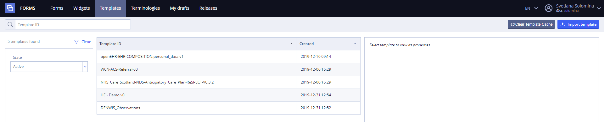
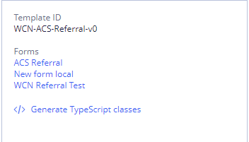

# Templates \(User uploaded\) \(in detail\)

In **EHR Forms** context **openEHR Template** is a composition of **openEHR Archetypes** represented as a single **OPT file** converted to JSON \(simplified template\).

**Form** can be associated with one or multiple openEHR **templates**, this feature allows user to create single form with multiple **Compositions** or dynamic forms like messengers with templates can be loaded at runtime.

The tab is intended for viewing the list of templates available within the team, searching, viewing the structure of the template, importing opt templates and viewing the list of forms connected with the template.

Template list is intended for the following:

/\*&lt;!\[CDATA\[\*/  
div.rbtoc1607432802607 {padding: 0px;}  
div.rbtoc1607432802607 ul {list-style: disc;margin-left: 0px;}  
div.rbtoc1607432802607 li {margin-left: 0px;padding-left: 0px;}  
  
/\*\]\]&gt;\*/

* [Template list](./#Templates%28Useruploaded%29%28indetail%29-Templatelist)
* [Template search](./#Templates%28Useruploaded%29%28indetail%29-Templatesearch)
* [Template import](./#Templates%28Useruploaded%29%28indetail%29-Templateimport)
* [Template description](./#Templates%28Useruploaded%29%28indetail%29-Templatedescription)
* 

**Templates tab view**

## Template list 

User can view the list of templates available within the team, searching, viewing the structure of the template, importing opt templates and viewing the list of forms connected with the template.

At the start there is the list of templates available for your team with parameters.

* Available actions - import and generate classes. 

## Template search 

User may search widgets by several criteria and their combinations:

* **By template ID** - search starts after one symbol;
* **By state** - template may be active or inactive, so it is possible to view template in any state or all at once;

All searches are performed by "and" operator.

"Clear" button clears all currently applied filters.

## Template import 

User can import new _**OPT template format**_ templates by clicking  

For more details see [Template import](ehr-forms-template-import.md)

## Template description 

##  

To see template description User need to select template from the list. Description will be shown in the right panel.

It contains:

* **Template ID** - template name
* **Forms** - list of forms, where template is used. Clickable link opens form in Editor.

