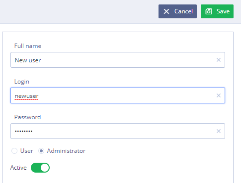
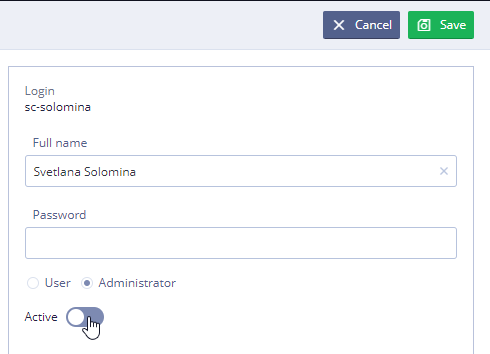

# Users \(in detail\)

This section explains how to create and manage user accounts. 

To see this section User must have the **Administrator role**

**Users tab**

## Logging into the Users section 

The Users section is used for managing user accounts.

To access the Users section, use the URL [http://ehr.solutions/](http://ehr.solutions/)

For the first time log in with the default user name “admin” and the password that you specified for the “admin” account during the installation process.

## Working with User roles 

Each user **role** is associated with a set of user rights that determine the privileges of users assigned to the **role**.

When you create a new user account, it automatically inherits all the user rights associated with the **role** under which it was created.

All of the configured roles are displayed in the main area of the **Users** section.

Roles can be assigned to individual user accounts, for team work User can use [Teams](ehr-forms-teams-in-detail.md) tab.

_**The pre-configured user roles are:**_

<table>
  <thead>
    <tr>
      <th style="text-align:left">User role</th>
      <th style="text-align:left">Description</th>
    </tr>
  </thead>
  <tbody>
    <tr>
      <td style="text-align:left">Administrator</td>
      <td style="text-align:left">
        
User that has access to all functionality of the tool. The administration
          account should never be used for day-to-day tasks.

        
Instead, it should only be used when you need to access advanced functionality
          (as described in the relevant sections of this manual).

      </td>
    </tr>
    <tr>
      <td style="text-align:left">User</td>
      <td style="text-align:left">Content editors. These users can add, modify and delete content.</td>
    </tr>
  </tbody>
</table>

## Creating user account 

Login and password are case-sensitive

To create a new user account User should click 

* In the **Full Name**, type the Full name including First name, Surname and Second name \(if necessary\)
* In the **Login**, type the unique username for new user account
* In the **Password**, type unique password for new user account
* Select user role from the list: User or Administrator
* Use toggle switch to activate new user account
* Click 

## Disabling user account 

To disable a user account:

* Log in to the Administrator Interface
* Select user account that should be disabled and click 
* Use toggle switch to deactivate user account
* Click 

