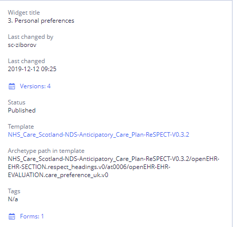

# Widgets \(in detail\)

**Widget** is a reusable part of a form which is associated with single archetype or a composition of archetypes.

Widgets and archetypes are associated with **Widget class** representation. **Widget class** is a projection of archetypes and archetype slots. **Widget classes** allow to implement a search algorithm which is used to find widgets for a selected archetype and reuse widgets in a form building process.

Widget list is intended for the following:

/\*&lt;!\[CDATA\[\*/  
div.rbtoc1607432789915 {padding: 0px;}  
div.rbtoc1607432789915 ul {list-style: disc;margin-left: 0px;}  
div.rbtoc1607432789915 li {margin-left: 0px;padding-left: 0px;}  
  
/\*\]\]&gt;\*/

* [The Widgets tab overview](./#Widgets%28indetail%29-TheWidgetstaboverview)
* [Widget list](./#Widgets%28indetail%29-Widgetlist)
* [Widget search](./#Widgets%28indetail%29-Widgetsearch)
* [Widget import and export](./#Widgets%28indetail%29-Widgetimportandexport)
  * [Import](./#Widgets%28indetail%29-Import)
  * [Export](./#Widgets%28indetail%29-Export)
* [Widget creation](./#Widgets%28indetail%29-Widgetcreation)
* [Widget editing](./#Widgets%28indetail%29-Widgetediting)
* [Widget description](./#Widgets%28indetail%29-Widgetdescription)
* * [Widget version control](./#Widgets%28indetail%29-Widgetversioncontrol)

**Widgets tab view**

## The Widgets tab overview 

|  | **Option \(field, icon or button\)** | **Description** |
| :--- | :--- | :--- |
| 1 | Search Box | Here User can type the widget name \(or any part of the name\) to filter by |
| 2 | Reused \(checkbox\) | If checked, only reused widgets are included to the filtered list |
| 3 | Filter by State | Here User can select the widget state you want to filter by \(All, Active, or Non-active\) |
| 4 | Filter by Tag | Here User can select the widget tag\(s\) you want to filter by |
| 5 | Filter by Widget Class | Here User can select an openEHR template and then a data class you want to filter by |
| 6 | Clear | Clears all currently applied filters |
| 7 | Export the latest version to a file \(icon\) | Exports the latest version of the widget to a file |
| 8 | Open in Builder \(icon\) | Goes to the Form Builder, where you can view or edit the widget \(add or edit fields, configure field settings, and widget properties\) |
| 9 | Open in Builder \(button\) | See above |
| 10 | Create New Widget | Creates a new widget and instantly opens it in the Form Builder so User can start building the widget |
| 11 | Import Widgets from a File | Allows to select an external file that contains the widget\(s\) to be imported |
| 12 | Widget Properties | This section is where you can view properties that apply to your entire widget |

## Widget list 

At the start there is the list of widgets available for your team with parameters.

* Available actions - export and editing \(last version\). Editing opens widget in Editor;

## Widget search 

User may search widgets by several criteria and their combinations:

* **By name** - search starts after one symbol;
* **By status** - widget may be active or inactive, so it is possible to view widget in any state or all at once;
* **By tags** - selecting one or several tags;
* **By template** - to get all widgets based on specific template;

All searches are performed by "and" operator.

"Clear" button clears all currently applied filters.

## Widget import and export 

### Import 

User can import new widgets by clicking 

### Export 

 User can export widgets two different ways:

*  Export a pack of widgets by selecting desirable and clicking "Export Widget"
* By clicking on Export icon on one widget

For more details see [Widget export and import](ehr-forms-widget-export-and-import.md)

## Widget creation 

To create a new widget User should click 

* In the **Widget Name**, type the name for new widget.
* Click **Select Template\(s\)**.
* From the list, select one openEHR template and click **Check** icon**.** User can use the search box as a filter;
* Click **Continue**.

For more details see [Widget creation](ehr-forms-widget-creation.md)

## Widget editing 

To start editing widget User should select desirable widget in the list and click 

For more details see [Widget editing](ehr-forms-widget-editing.md)

## Widget description 

##  

To see widget description User need to select widget from the widget list. Description will be shown in the right panel.

It contains:

* **Title** - widget name
* **Last changed** - date of the latest applied changes
* **Last changed by** - last user who changed the widget
* **Versions** - version control table, containing  Author, number of version and creation date-time. By clicking on date of the change User can open the selected version in Editor
* **Status** - current widget status, may be active, inactive, published and etc.
* **Templates** - list of templates currently used in widget. By clicking on template User can open its description in Templates tab
* **Tags** - list of widget tags
* **Forms** - list of forms, where widget is used. Clickable link opens form in Editor

## Widget version control 

For more details see [Widget version control](https://wiki.solit-clouds.ru/display/EHR/Widget+version+control)

