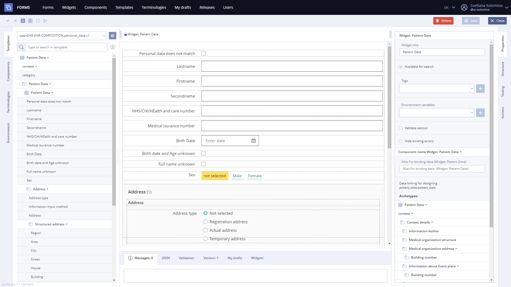
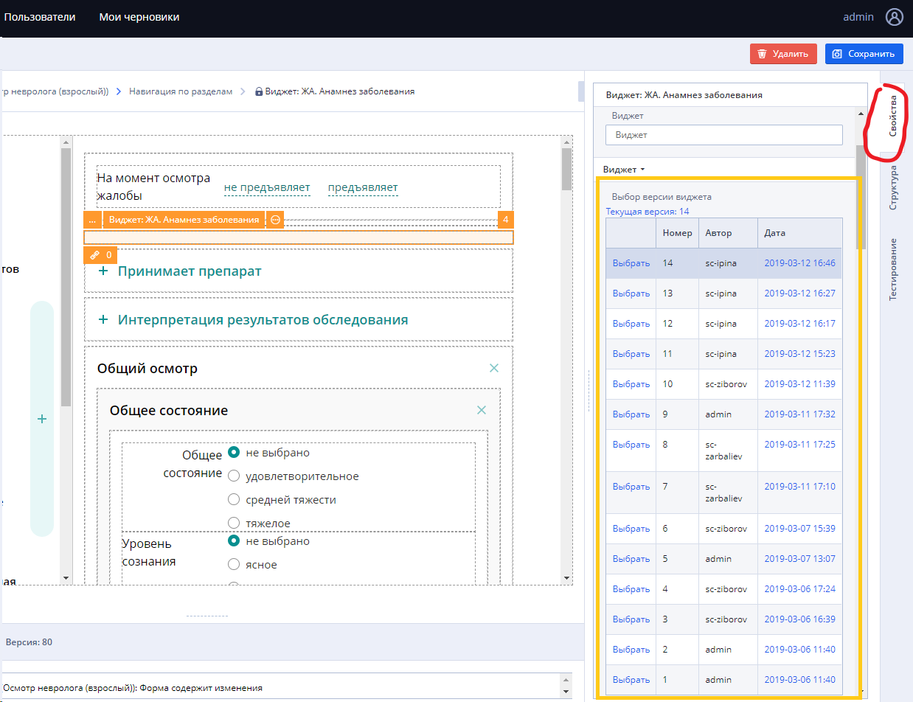
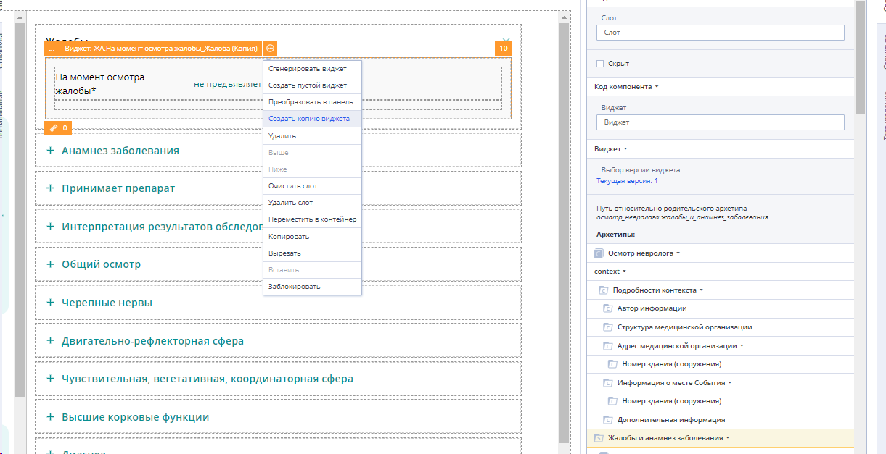

# Widget editing

This page is under construction

In the **Widget Editor** User can:

/\*&lt;!\[CDATA\[\*/  
div.rbtoc1607432790389 {padding: 0px;}  
div.rbtoc1607432790389 ul {list-style: disc;margin-left: 0px;}  
div.rbtoc1607432790389 li {margin-left: 0px;padding-left: 0px;}  
  
/\*\]\]&gt;\*/

* [Converting Panel into Widget](ehr-forms-widget-editing.md#Widgetediting-ConvertingPanelintoWidget)
* [Adding custom reusable widget ](ehr-forms-widget-editing.md#Widgetediting-Addingcustomreusablewidget)
* [Widget cloning ](ehr-forms-widget-editing.md#Widgetediting-Widgetcloning)
* [Converting Widget into Panel](ehr-forms-widget-editing.md#Widgetediting-ConvertingWidgetintoPanel)

General view

Widget has four main panels in edit mode \(same as form\):

* [Source panel](../ehr-forms-forms-in-detail/ehr-forms-form-editing/ehr-forms-source-panel.md) - templates, component libraries, terminologies and environment variables
* [Editor panel](../ehr-forms-forms-in-detail/ehr-forms-form-editing/ehr-forms-editor-panel.md) - data representation area where editor itself take place
* [Settings panel](../ehr-forms-forms-in-detail/ehr-forms-form-editing/ehr-forms-settings-panel.md) - properties of the selected widget, form structure in tree representation, testing and actions
* [Developer tools panel](../ehr-forms-forms-in-detail/ehr-forms-form-editing/ehr-forms-developer-tools-panel.md)- panel with tabs of messages \(like warnings and alerts\), json code and etc.

## Converting Panel into Widget 

User can convert panel into a widget:

* Select **Convert into widget** in the drop-down menu

Do not convert navigation sections into widgets! Try to choose a common slot inside the navigation slot.

Avoid embedding the widget into the widget when creating.

* In the properties of the widget, select the archetype that is responsible for this widget
* Name the widget and make it searchable

## Adding custom reusable widget  

* Add widget to the component slot in the required section

* An unbound component "Widget" will appear offering to use available widgets where the necessary custom widget is selected.

On the right in the structure you need to select the appropriate section, otherwise there will be no hint with reusable widgets

* When you select a widget, it becomes available for viewing its version.

## Widget cloning  

The widget clone option creates a full copy of it in the place of the selected widget.

The widget name and tags will be from the source, but with "\(Copy\)" in the widget name.

The action should be applied if there is a need to create a different widget, but also reused in the future

## Converting Widget into Panel 

The option "convert to panel" removes the "widget" property of the object making it a panel.

The option is necessary for cases when it is necessary to use the widget as the basis of the component, but with significant changes, the new component will not be reused in the future.

Otherwise, it is advisable to use the widget copy option.

